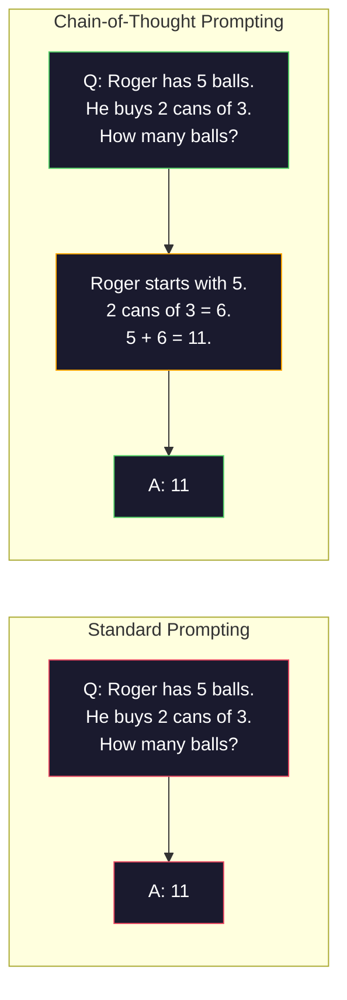
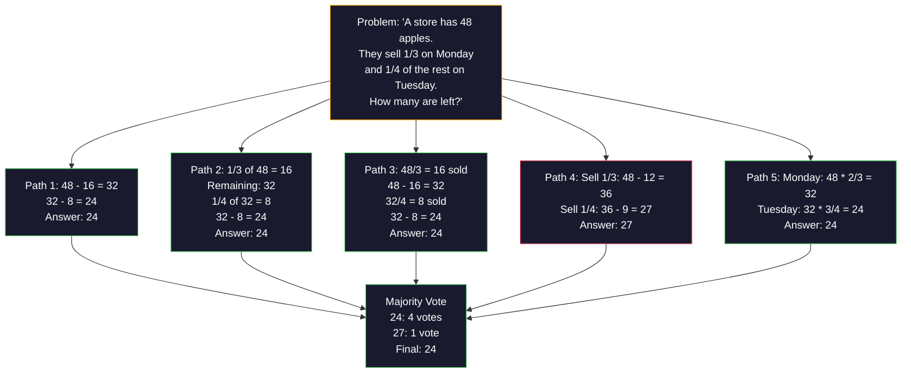
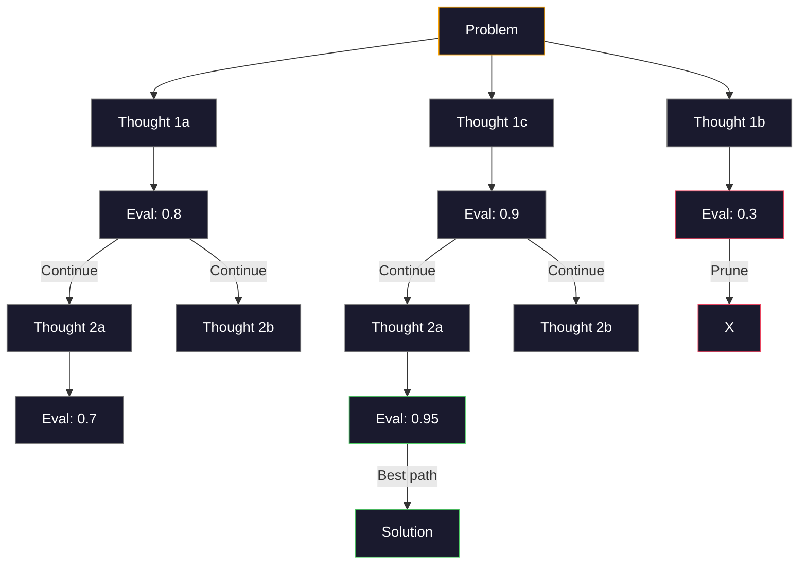

# Few-Shot、Chain-of-Thought、Tree-of-Thought

> 告诉模型该做什么叫做提示词。展示给它如何思考叫做工程。同一模型、同一任务、同一数据上，准确率从 78% 提升到 91%，靠的不是更好的模型，而是更好的推理策略。

**Type:** Build
**Languages:** Python
**Prerequisites:** Lesson 11.01 (Prompt Engineering)
**Time:** ~45 minutes

## Learning Objectives

- 通过选择和格式化示例演示来实现 few-shot prompting，以最大化任务准确率
- 应用 chain-of-thought (CoT) 推理来提升多步问题（如数学应用题）的准确率
- 构建 tree-of-thought 提示词，探索多条推理路径并选择最优解
- 测量 zero-shot、few-shot 和 CoT 在标准基准测试上的准确率提升

## The Problem

你开发了一个数学辅导应用。你的提示词写着："解这道应用题。" GPT-5 在 GSM8K（标准小学数学基准测试）上的正确率是 94%。你以为已经到顶了。并没有——chain-of-thought 还能再提升 3-4 个百分点。

加上五个字——"Let's think step by step"——准确率跃升至 91%。再加几个带解题过程的示例，达到 95%。同一模型。同一 temperature。同一 API 成本。唯一的区别是你给了模型草稿纸。

这不是什么技巧。这就是推理的本质。人类不会一步跃过多步问题。Transformer 也不会。当你强制模型生成中间 token 时，这些 token 会成为下一个 token 的上下文。每一步推理都喂养下一步。模型字面意义上是计算着走向答案的。

但 "think step by step" 只是起点，不是终点。如果采样五条推理路径然后多数投票呢？如果让模型探索一棵可能性之树，评估并剪枝呢？如果让推理与工具使用交错进行呢？这些不是假设。它们是已发表的技术，有实测的提升数据，你将在本课中全部实现。

## The Concept

### Zero-Shot vs Few-Shot：何时示例胜过指令

Zero-shot prompting 只给模型任务，不给其他内容。Few-shot prompting 先给它示例。

Wei 等人（2022）在 8 个基准测试上测量了这一点。对于情感分类等简单任务，zero-shot 和 few-shot 的表现相差在 2% 以内。对于多步算术和符号推理等复杂任务，few-shot 将准确率提升了 10-25%。

直觉是：示例是压缩的指令。与其描述输出格式，不如展示它。与其解释推理过程，不如演示它。模型在示例上的模式匹配比解释抽象指令更可靠。


**Few-shot 胜出的场景：** 格式敏感型任务、分类、结构化提取、领域特定术语，以及任何需要模型匹配特定模式的任务。

**Zero-shot 胜出的场景：** 简单事实性问题、创意任务（示例会限制创意）、寻找好的示例比写出好的指令更难的任务。

### 示例选择：相似性胜过随机性

并非所有示例都平等。选择与目标输入相似的示例，在分类任务上比随机选择高出 5-15%（Liu 等人，2022）。三个原则：

1. **语义相似性**：在 embedding 空间中挑选最接近输入的示例
2. **标签多样性**：示例覆盖所有输出类别
3. **难度匹配**：匹配目标问题的复杂程度

大多数任务的最佳示例数量是 3-5 个。低于 3 个，模型没有足够信号提取模式。高于 5 个，收益递减并浪费上下文窗口 token。对于多标签分类，每个标签使用一个示例。

### Chain-of-Thought：给模型草稿纸

Chain-of-Thought (CoT) prompting 由 Wei 等人（2022）在 Google Brain 提出。思路很简单：与其让模型直接给出答案，不如让它先展示推理步骤。



为什么这在机制上有效？Transformer 生成的每个 token 都会成为下一个 token 的上下文。没有 CoT 时，模型必须将所有推理压缩到单次前向传播的隐藏状态中。有了 CoT，模型将中间计算外化为 token。每个推理 token 扩展了有效的计算深度。

**GSM8K 基准测试（小学数学，8.5K 道题）：**

| Model | Zero-Shot | Zero-Shot CoT | Few-Shot CoT |
|-------|-----------|---------------|--------------|
| GPT-4o | 78% | 91% | 95% |
| GPT-5 | 94% | 97% | 98% |
| o4-mini (reasoning) | 97% | — | — |
| Claude Opus 4.7 | 93% | 97% | 98% |
| Gemini 3 Pro | 92% | 96% | 98% |
| Llama 4 70B | 80% | 89% | 94% |
| DeepSeek-V3.1 | 89% | 94% | 96% |

**关于推理模型的说明。** OpenAI 的 o 系列（o3、o4-mini）和 DeepSeek-R1 等模型在输出答案前会在内部运行 chain-of-thought。对推理模型添加 "Let's think step by step" 是多余的，有时甚至适得其反——它们已经做过了。

CoT 的两种变体：

**Zero-shot CoT**：在提示词末尾追加 "Let's think step by step"。不需要示例。Kojima 等人（2022）表明这一句话就能提升算术、常识和符号推理任务的准确率。

**Few-shot CoT**：提供包含推理步骤的示例。比 zero-shot CoT 更有效，因为模型能看到你期望的确切推理格式。

**CoT 适得其反的场景：** 简单事实回忆（"法国的首都是什么？"）、单步分类、速度比准确率更重要的任务。CoT 每次查询增加 50-200 个推理 token 的开销。对于高吞吐量、低复杂度的任务，这是浪费的成本。

### Self-Consistency：多次采样，一次投票

Wang 等人（2023）提出了 self-consistency。核心洞察：单条 CoT 路径可能包含推理错误。但如果你采样 N 条独立的推理路径（使用 temperature > 0）并对最终答案进行多数投票，错误会相互抵消。



在原始 PaLM 540B 实验中，self-consistency 将 GSM8K 准确率从 56.5%（单次 CoT）提升到 N=40 时的 74.4%。在 GPT-5 上提升很小（97% 到 98%），因为基础准确率已经饱和。该技术在基础 CoT 准确率为 60-85% 的模型上表现最佳——这是单路径错误频繁但非系统性的甜蜜点。对于推理模型（o 系列、R1），self-consistency 已被内置的内部采样所涵盖。

权衡：N 个样本意味着 N 倍的 API 成本和延迟。实践中，N=5 捕获了大部分收益。N=3 是有意义投票的最小值。N > 10 对大多数任务收益递减。

### Tree-of-Thought：分支探索

Yao 等人（2023）提出了 Tree-of-Thought (ToT)。CoT 遵循一条线性推理路径，而 ToT 探索多个分支并在继续之前评估哪些最有希望。



ToT 有三个组成部分：

1. **Thought generation**：生成多个候选下一步
2. **State evaluation**：评分每个候选（可以使用 LLM 自身作为评估器）
3. **Search algorithm**：BFS 或 DFS 遍历树，剪枝低分分支

在 Game of 24 任务（用四个数字通过算术得到 24）上，GPT-4 使用标准提示词解决 7.3% 的问题。使用 CoT，4.0%（CoT 在这里反而有害，因为搜索空间很宽）。使用 ToT，74%。

ToT 很昂贵。树中的每个节点都需要一次 LLM 调用。一棵分支因子为 3、深度为 3 的树最多需要 39 次 LLM 调用。仅用于搜索空间大但可评估的问题——规划、解谜、带约束的创意问题解决。

### ReAct：思考 + 行动

Yao 等人（2022）将推理轨迹与行动结合起来。模型在思考（生成推理）和行动（调用工具、搜索、计算）之间交替。

```mermaid
graph LR
    Q["Question:\nWhat is the\npopulation of the\ncountry where\nthe Eiffel Tower\nis located?"]
    T1["Thought: I need to\nfind which country\nhas the Eiffel Tower"]
    A1["Action: search\n'Eiffel Tower location'"]
    O1["Observation:\nParis, France"]
    T2["Thought: Now I need\nFrance's population"]
    A2["Action: search\n'France population 2024'"]
    O2["Observation:\n68.4 million"]
    T3["Thought: I have\nthe answer"]
    F["Answer:\n68.4 million"]

    Q --> T1 --> A1 --> O1 --> T2 --> A2 --> O2 --> T3 --> F

    style Q fill:#1a1a2e,stroke:#ffa500,color:#fff
    style T1 fill:#1a1a2e,stroke:#51cf66,color:#fff
    style A1 fill:#1a1a2e,stroke:#e94560,color:#fff
    style O1 fill:#1a1a2e,stroke:#808080,color:#fff
    style T2 fill:#1a1a2e,stroke:#51cf66,color:#fff
    style A2 fill:#1a1a2e,stroke:#e94560,color:#fff
    style O2 fill:#1a1a2e,stroke:#808080,color:#fff
    style T3 fill:#1a1a2e,stroke:#51cf66,color:#fff
    style F fill:#1a1a2e,stroke:#51cf66,color:#fff
```



ReAct 在知识密集型任务上胜过纯 CoT，因为它可以将推理建立在真实数据中。在 HotpotQA（多跳问答）上，使用 GPT-4 的 ReAct 达到 35.1% 的精确匹配，而 CoT 单独只有 29.4%。真正的威力在于推理错误会被观察纠正——模型可以在执行过程中更新计划。

ReAct 是现代 AI Agent 的基础。每个 Agent 框架（LangChain、CrewAI、AutoGen）都实现了某种 Thought-Action-Observation 循环的变体。你将在 Phase 14 构建完整的 Agent。本课涵盖提示词模式。

### Structured Prompting：XML 标签、分隔符、标题

随着提示词变得复杂，结构可以防止模型混淆各个部分。三种方法：

**XML 标签**（Claude 效果最好，其他地方也适用）：
```
<context>
You are reviewing a pull request.
The codebase uses TypeScript and React.
</context>

<task>
Review the following diff for bugs, security issues, and style violations.
</task>

<diff>
{diff_content}
</diff>

<output_format>
List each issue with: file, line, severity (critical/warning/info), description.
</output_format>
```

**Markdown 标题**（通用）：
```
## Role
Senior security engineer at a fintech company.

## Task
Analyze this API endpoint for vulnerabilities.

## Input
{api_code}

## Rules
- Focus on OWASP Top 10
- Rate each finding: critical, high, medium, low
- Include remediation steps
```

**分隔符**（极简但有效）：
```
---INPUT---
{user_text}
---END INPUT---

---INSTRUCTIONS---
Summarize the above in 3 bullet points.
---END INSTRUCTIONS---
```

### Prompt Chaining：顺序分解

有些任务对单个提示词来说太复杂。Prompt chaining 将它们分解为步骤，一个提示词的输出成为下一个提示词的输入。


Chaining 胜过单提示词，原因有三：

1. **每一步更简单**：模型处理一个聚焦的任务，而不是同时兼顾所有事情
2. **中间输出可检查**：你可以在步骤之间验证和纠正
3. **不同步骤可以使用不同模型**：用便宜的模型做提取，用昂贵的模型做推理

### Performance Comparison

| Technique | Best For | GSM8K Accuracy (GPT-5) | API Calls | Token Overhead | Complexity |
|-----------|----------|------------------------|-----------|----------------|------------|
| Zero-Shot | Simple tasks | 94% | 1 | None | Trivial |
| Few-Shot | Format matching | 96% | 1 | 200-500 tokens | Low |
| Zero-Shot CoT | Quick reasoning boost | 97% | 1 | 50-200 tokens | Trivial |
| Few-Shot CoT | Maximum single-call accuracy | 98% | 1 | 300-600 tokens | Low |
| Self-Consistency (N=5) | High-stakes reasoning | 98.5% | 5 | 5x token cost | Medium |
| Reasoning model (o4-mini) | Drop-in CoT replacement | 97% | 1 | hidden (2-10x internal) | Trivial |
| Tree-of-Thought | Search/planning problems | N/A (74% on Game of 24) | 10-40+ | 10-40x token cost | High |
| ReAct | Knowledge-grounded reasoning | N/A (35.1% on HotpotQA) | 3-10+ | Variable | High |
| Prompt Chaining | Complex multi-step tasks | 96% (pipeline) | 2-5 | 2-5x token cost | Medium |

正确的技术取决于三个因素：准确率要求、延迟预算和成本容忍度。对于大多数生产系统，few-shot CoT 配合 3 样本 self-consistency 后备可以覆盖 90% 的用例。

## Build It

我们将构建一个数学问题求解器，将 few-shot prompting、chain-of-thought 推理和 self-consistency 投票组合成单一管道。然后为难题添加 tree-of-thought。

完整实现在 `code/advanced_prompting.py` 中。以下是关键组件。

### Step 1: Few-Shot Example Store

第一个组件管理 few-shot 示例，并为给定问题选择最相关的示例。

```python
GSM8K_EXAMPLES = [
    {
        "question": "Janet's ducks lay 16 eggs per day. She eats three for breakfast every morning and bakes muffins for her friends every day with four. She sells every egg at the farmers' market for $2. How much does she make every day at the farmers' market?",
        "reasoning": "Janet's ducks lay 16 eggs per day. She eats 3 and bakes 4, using 3 + 4 = 7 eggs. So she has 16 - 7 = 9 eggs left. She sells each for $2, so she makes 9 * 2 = $18 per day.",
        "answer": "18"
    },
    ...
]
```

每个示例有三个部分：问题、推理链和最终答案。推理链是将普通 few-shot 示例转变为 CoT few-shot 示例的关键。

### Step 2: Chain-of-Thought Prompt Builder

提示词构建器将系统消息、带推理链的 few-shot 示例和目标问题组装成单个提示词。

```python
def build_cot_prompt(question, examples, num_examples=3):
    system = (
        "You are a math problem solver. "
        "For each problem, show your step-by-step reasoning, "
        "then give the final numerical answer on the last line "
        "in the format: 'The answer is [number]'."
    )

    example_text = ""
    for ex in examples[:num_examples]:
        example_text += f"Q: {ex['question']}\n"
        example_text += f"A: {ex['reasoning']} The answer is {ex['answer']}.\n\n"

    user = f"{example_text}Q: {question}\nA:"
    return system, user
```

格式约束（"The answer is [number]"）至关重要。没有它，self-consistency 无法跨样本提取和比较答案。

### Step 3: Self-Consistency Voting

采样 N 条推理路径并对多数答案进行投票。

```python
def self_consistency_solve(question, examples, client, model, n_samples=5):
    system, user = build_cot_prompt(question, examples)

    answers = []
    reasonings = []
    for _ in range(n_samples):
        response = client.chat.completions.create(
            model=model,
            messages=[
                {"role": "system", "content": system},
                {"role": "user", "content": user}
            ],
            temperature=0.7
        )
        text = response.choices[0].message.content
        reasonings.append(text)
        answer = extract_answer(text)
        if answer is not None:
            answers.append(answer)

    vote_counts = Counter(answers)
    best_answer = vote_counts.most_common(1)[0][0] if vote_counts else None
    confidence = vote_counts[best_answer] / len(answers) if best_answer else 0

    return best_answer, confidence, reasonings, vote_counts
```

Temperature 0.7 很重要。在 temperature 0.0 时，所有 N 个样本都会相同， defeats the purpose。你需要足够的随机性来产生多样化的推理路径，但不要太多以至于模型产生胡言乱语。

### Step 4: Tree-of-Thought Solver

对于线性推理失效的问题，ToT 探索多种方法并评估哪个方向最有希望。

```python
def tree_of_thought_solve(question, client, model, breadth=3, depth=3):
    thoughts = generate_initial_thoughts(question, client, model, breadth)
    scored = [(t, evaluate_thought(t, question, client, model)) for t in thoughts]
    scored.sort(key=lambda x: x[1], reverse=True)

    for current_depth in range(1, depth):
        next_thoughts = []
        for thought, score in scored[:2]:
            extensions = extend_thought(thought, question, client, model, breadth)
            for ext in extensions:
                ext_score = evaluate_thought(ext, question, client, model)
                next_thoughts.append((ext, ext_score))
        scored = sorted(next_thoughts, key=lambda x: x[1], reverse=True)

    best_thought = scored[0][0] if scored else ""
    return extract_answer(best_thought), best_thought
```

评估器本身就是一次 LLM 调用。你问模型："On a scale of 0.0 to 1.0, how promising is this reasoning path for solving the problem?" 这是 ToT 的关键洞察——模型评估自己的部分解。

### Step 5: Full Pipeline

管道将所有技术与升级策略结合起来。

```python
def solve_with_escalation(question, examples, client, model):
    system, user = build_cot_prompt(question, examples)
    single_response = call_llm(client, model, system, user, temperature=0.0)
    single_answer = extract_answer(single_response)

    sc_answer, confidence, _, _ = self_consistency_solve(
        question, examples, client, model, n_samples=5
    )

    if confidence >= 0.8:
        return sc_answer, "self_consistency", confidence

    tot_answer, _ = tree_of_thought_solve(question, client, model)
    return tot_answer, "tree_of_thought", None
```

升级逻辑：先尝试便宜的（单次 CoT）。如果 self-consistency 的置信度低于 0.8（少于 4/5 的样本达成一致），升级到 ToT。这平衡了成本和准确率——大多数问题被便宜地解决，难题获得更多计算资源。

## Use It

### With LangChain

LangChain 提供对提示词模板和输出解析的内置支持，简化了 few-shot 和 CoT 模式：

```python
from langchain_core.prompts import FewShotPromptTemplate, PromptTemplate
from langchain_openai import ChatOpenAI

example_prompt = PromptTemplate(
    input_variables=["question", "reasoning", "answer"],
    template="Q: {question}\nA: {reasoning} The answer is {answer}."
)

few_shot_prompt = FewShotPromptTemplate(
    examples=examples,
    example_prompt=example_prompt,
    suffix="Q: {input}\nA: Let's think step by step.",
    input_variables=["input"]
)

llm = ChatOpenAI(model="gpt-4o", temperature=0.7)
chain = few_shot_prompt | llm
result = chain.invoke({"input": "If a train travels 120 km in 2 hours..."})
```

LangChain 还有用于语义相似性选择的 `ExampleSelector` 类：

```python
from langchain_core.example_selectors import SemanticSimilarityExampleSelector
from langchain_openai import OpenAIEmbeddings

selector = SemanticSimilarityExampleSelector.from_examples(
    examples,
    OpenAIEmbeddings(),
    k=3
)
```

### With DSPy

DSPy 将提示策略视为可优化模块。与其手工制作 CoT 提示词，不如定义一个签名并让 DSPy 优化提示词：

```python
import dspy

dspy.configure(lm=dspy.LM("openai/gpt-4o", temperature=0.7))

class MathSolver(dspy.Module):
    def __init__(self):
        self.solve = dspy.ChainOfThought("question -> answer")

    def forward(self, question):
        return self.solve(question=question)

solver = MathSolver()
result = solver(question="Janet's ducks lay 16 eggs per day...")
```

DSPy 的 `ChainOfThought` 自动添加推理轨迹。`dspy.majority` 实现 self-consistency：

```python
result = dspy.majority(
    [solver(question=q) for _ in range(5)],
    field="answer"
)
```

### Comparison: From-Scratch vs Frameworks

| Feature | From-Scratch (this lesson) | LangChain | DSPy |
|---------|--------------------------|-----------|------|
| Control over prompt format | Full | Template-based | Automatic |
| Self-consistency | Manual voting | Manual | Built-in (`dspy.majority`) |
| Example selection | Custom logic | `ExampleSelector` | `dspy.BootstrapFewShot` |
| Tree-of-Thought | Custom tree search | Community chains | Not built-in |
| Prompt optimization | Manual iteration | Manual | Automatic compilation |
| Best for | Learning, custom pipelines | Standard workflows | Research, optimization |

## Ship It

本课产生两个产物。

**1. Reasoning Chain Prompt** (`outputs/prompt-reasoning-chain.md`)：一个生产就绪的 few-shot CoT 提示词模板，支持 self-consistency。插入你的示例和问题领域即可使用。

**2. CoT Pattern Selection Skill** (`outputs/skill-cot-patterns.md`)：一个决策框架，根据任务类型、准确率要求和成本约束选择正确的推理技术。

## Exercises

1. **Measure the gap**：取 10 道 GSM8K 题目。分别用 zero-shot、few-shot、zero-shot CoT 和 few-shot CoT 求解。记录每种技术的准确率。哪种技术在你的模型上提升最大？

2. **Example selection experiment**：对同样的 10 道题，比较随机示例选择 vs 手工挑选的相似示例。测量准确率差异。在什么点上，示例质量比数量更重要？

3. **Self-consistency cost curve**：在 20 道 GSM8K 题目上运行 self-consistency，N=1, 3, 5, 7, 10。绘制准确率 vs 成本（总 token）曲线。你的模型的拐点在哪里？

4. **Build a ReAct loop**：用计算器工具扩展管道。当模型生成数学表达式时，用 Python 的 `eval()`（在沙箱中）执行并将结果反馈回去。测量工具 grounded 推理是否胜过纯 CoT。

5. **ToT for creative tasks**：将 Tree-of-Thought 求解器适配到创意写作任务："Write a 6-word story that is both funny and sad." 使用 LLM 作为评估器。分支探索是否比单次生成产生更好的创意输出？

## Key Terms

| Term | What people say | What it actually means |
|------|----------------|----------------------|
| Few-shot prompting | "Give it some examples" | Including input-output demonstrations in the prompt to anchor the model's output format and behavior |
| Chain-of-Thought | "Make it think step by step" | Eliciting intermediate reasoning tokens that extend the model's effective computation before producing a final answer |
| Self-Consistency | "Run it multiple times" | Sampling N diverse reasoning paths at temperature > 0 and selecting the most common final answer by majority vote |
| Tree-of-Thought | "Let it explore options" | Structured search over reasoning branches where each partial solution is evaluated and only promising paths are expanded |
| ReAct | "Thinking + tool use" | Interleaving reasoning traces with external actions (search, compute, API calls) in a Thought-Action-Observation loop |
| Prompt chaining | "Break it into steps" | Decomposing a complex task into sequential prompts where each output feeds the next input |
| Zero-shot CoT | "Just add 'think step by step'" | Appending a reasoning trigger phrase to a prompt without any examples, relying on the model's latent reasoning capability |

## Further Reading

- [Chain-of-Thought Prompting Elicits Reasoning in Large Language Models](https://arxiv.org/abs/2201.11903) -- Wei et al. 2022. The original CoT paper from Google Brain. Read sections 2-3 for the core results.
- [Self-Consistency Improves Chain of Thought Reasoning in Language Models](https://arxiv.org/abs/2203.11171) -- Wang et al. 2023. The self-consistency paper. Table 1 has all the numbers you need.
- [Tree of Thoughts: Deliberate Problem Solving with Large Language Models](https://arxiv.org/abs/2305.10601) -- Yao et al. 2023. ToT paper. The Game of 24 results in section 4 are the highlight.
- [ReAct: Synergizing Reasoning and Acting in Language Models](https://arxiv.org/abs/2210.03629) -- Yao et al. 2022. The foundation of modern AI agents. Section 3 explains the Thought-Action-Observation loop.
- [Large Language Models are Zero-Shot Reasoners](https://arxiv.org/abs/2205.11916) -- Kojima et al. 2022. The "Let's think step by step" paper. Surprisingly effective for how simple it is.
- [DSPy: Compiling Declarative Language Model Calls into Self-Improving Pipelines](https://arxiv.org/abs/2310.03714) -- Khattab et al. 2023. Treats prompting as a compilation problem. Read if you want to move beyond manual prompt engineering.
- [OpenAI — Reasoning models guide](https://platform.openai.com/docs/guides/reasoning) -- vendor guidance on when chain-of-thought becomes an internal, priced-per-token "reasoning" mode versus a prompt-level trick.
- [Lightman et al., "Let's Verify Step by Step" (2023)](https://arxiv.org/abs/2305.20050) -- process reward models (PRM) that grade each step of a chain; the reasoning supervision signal that succeeds outcome-only rewards.
- [Snell et al., "Scaling LLM Test-Time Compute Optimally" (2024)](https://arxiv.org/abs/2408.03314) -- systematic study of CoT length, self-consistency sampling, and MCTS; where "think step by step" goes when accuracy matters more than latency.
