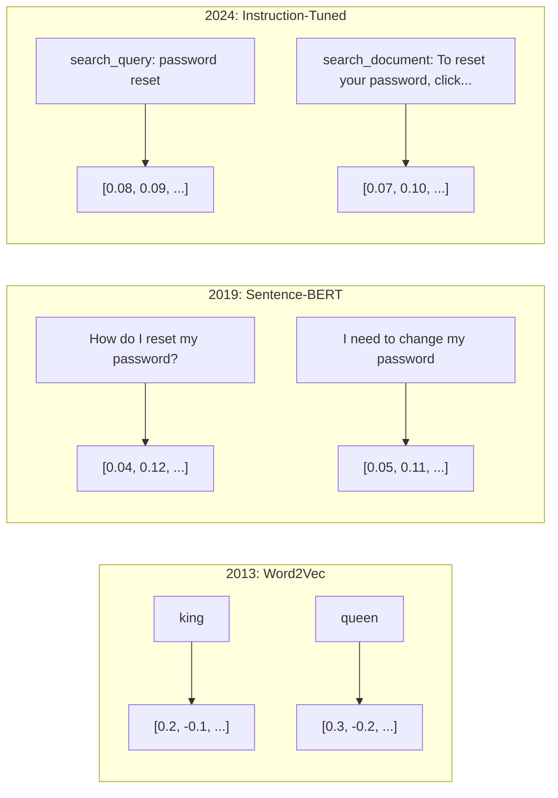
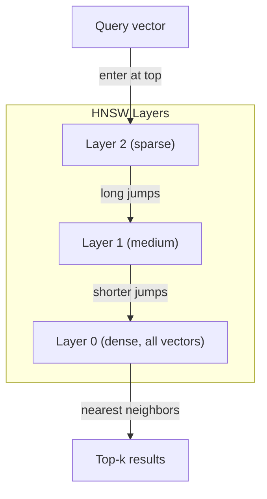
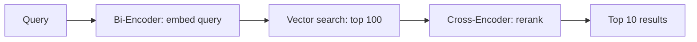

# Embeddings & Vector Representations（嵌入与向量表示）

> 文本是离散的。数学是连续的。每次你要求 LLM 查找"相似"的文档、比较含义或进行超越关键词的搜索时，你都依赖于连接这两个世界的桥梁。那座桥梁就是 embedding（嵌入）。如果你不理解 embedding，你就不理解现代 AI。你只是在使用它。

**Type:** Build
**Languages:** Python
**Prerequisites:** Phase 11, Lesson 01 (Prompt Engineering)
**Time:** ~75 minutes
**Related:** Phase 5 · 22 (Embedding Models Deep Dive) 涵盖 dense vs sparse vs multi-vector、Matryoshka 截断和按轴模型选择。本课聚焦生产流水线（向量数据库、HNSW、相似度数学）。在挑选模型之前，请先阅读 Phase 5 · 22。

## Learning Objectives

- 使用 API 提供商和开源模型生成文本 embedding，并计算它们之间的 cosine similarity（余弦相似度）
- 解释为什么 embedding 能解决关键词搜索无法处理的词汇不匹配问题
- 构建一个语义搜索索引，通过含义而非精确关键词匹配来检索文档
- 使用检索基准（precision@k、recall）评估 embedding 质量，并为你的任务选择合适的 embedding 模型

## The Problem

你有 10,000 张支持工单。一位客户写道"my payment didn't go through"。你需要找到类似的过往工单。关键词搜索找到包含"payment"和"didn't go through"的工单。它错过了"transaction failed"、"charge was declined"和"billing error"。这些工单用完全不同的单词描述了完全相同的问题。

这就是词汇不匹配问题。人类语言有几十种方式表达同一件事。关键词搜索将每个单词视为没有意义的独立符号。它无法知道"declined"和"didn't go through"指的是同一个概念。

你需要一种文本表示，其中相似性由含义而非拼写决定。你需要一种方法，将"my payment didn't go through"和"transaction was declined"放置在某个数学空间中彼此靠近，同时将"my payment arrived on time"推远，尽管它们共享"payment"这个词。

这种表示就是 embedding（嵌入）。

## The Concept

### What Is an Embedding?

Embedding 是一个密集的浮点数向量，代表文本的含义。"密集"这个词很重要——每个维度都携带信息，不像稀疏表示（词袋、TF-IDF）中大多数维度为零。

"The cat sat on the mat" 变成了类似 `[0.023, -0.041, 0.087, ..., 0.012]` 的东西——一个包含 768 到 3072 个数字的列表，具体取决于模型。这些数字编码了含义。你永远不会直接检查它们。你比较它们。

### The Word2Vec Breakthrough

2013 年，Tomas Mikolov 及其同事在 Google 发表了 Word2Vec。核心洞察：训练神经网络从相邻词预测一个词（或从一词预测相邻词），隐藏层权重就变成了有意义的向量表示。

著名的结果：

```
king - man + woman = queen
```

对 word embedding 进行向量运算可以捕获语义关系。从"man"到"woman"的方向大致与从"king"到"queen"的方向相同。这一刻，该领域意识到几何可以编码含义。

Word2Vec 产生了 300 维向量。每个单词无论上下文如何都获得一个向量。"river bank"和"bank account"中的"bank"具有相同的 embedding。这一局限性推动了接下来十年的研究。

### From Words to Sentences

Word embedding 表示单个 token。生产系统需要嵌入整个句子、段落或文档。出现了四种方法：

**Averaging（平均）**：取句子中所有 word vector 的均值。便宜、有损耗、对于短文本出奇地不错。完全丢失词序——"dog bites man"和"man bites dog"获得相同的 embedding。

**CLS token**：transformer 模型（BERT，2018）输出一个特殊的 [CLS] token embedding，代表整个输入。比平均更好，但 [CLS] token 是为下一句预测训练的，而非相似度。

**Contrastive learning（对比学习）**：明确训练模型将相似对推近、将不相似对推远。Sentence-BERT（Reimers & Gurevych, 2019）使用了这种方法，并成为现代 embedding 模型的基础。给定"How do I reset my password?"和"I need to change my password"，模型学习这些应该具有几乎相同的向量。

**Instruction-tuned embeddings（指令微调 embedding）**：最新方法。E5 和 GTE 等模型接受任务前缀（"search_query:"、"search_document:"），告诉模型生成哪种 embedding。这让一个模型可以服务多种任务。



### Modern Embedding Models

市场已经稳定在少数几个生产级选项上（截至 2026 年初的 MTEB 分数，MTEB v2）：

| Model | Provider | Dimensions | MTEB | Context | Cost / 1M tokens |
|-------|----------|-----------|------|---------|------------------|
| Gemini Embedding 2 | Google | 3072 (Matryoshka) | 67.7 (retrieval) | 8192 | $0.15 |
| embed-v4 | Cohere | 1024 (Matryoshka) | 65.2 | 128K | $0.12 |
| voyage-4 | Voyage AI | 1024/2048 (Matryoshka) | 66.8 | 32K | $0.12 |
| text-embedding-3-large | OpenAI | 3072 (Matryoshka) | 64.6 | 8192 | $0.13 |
| text-embedding-3-small | OpenAI | 1536 (Matryoshka) | 62.3 | 8192 | $0.02 |
| BGE-M3 | BAAI | 1024 (dense+sparse+ColBERT) | 63.0 multilingual | 8192 | Open-weight |
| Qwen3-Embedding | Alibaba | 4096 (Matryoshka) | 66.9 | 32K | Open-weight |
| Nomic-embed-v2 | Nomic | 768 (Matryoshka) | 63.1 | 8192 | Open-weight |

MTEB (Massive Text Embedding Benchmark) v2 涵盖检索、分类、聚类、重排序和摘要等 100 多项任务。越高越好。到 2026 年，开源权重模型（Qwen3-Embedding、BGE-M3）在大多数维度上达到或超过闭源托管模型。Gemini Embedding 2 在纯检索方面领先；Voyage/Cohere 在特定领域（金融、法律、代码）领先。在投入之前，始终在你自己的查询上进行基准测试。

### Similarity Metrics

给定两个 embedding 向量，有三种方法衡量它们的相似程度：

**Cosine similarity（余弦相似度）**：两个向量之间夹角的余弦。范围从 -1（相反）到 1（相同方向）。忽略幅度——一个 10 词句子和一个 500 词文档如果指向相同方向，可以得分为 1.0。这是 90% 用例的默认选择。

```
cosine_sim(a, b) = dot(a, b) / (||a|| * ||b||)
```

**Dot product（点积）**：两个向量的原始内积。当向量归一化（单位长度）时与 cosine similarity 相同。计算更快。OpenAI 的 embedding 是归一化的，因此点积和余弦给出相同的排名。

```
dot(a, b) = sum(a_i * b_i)
```

**Euclidean (L2) distance（欧几里得距离）**：向量空间中的直线距离。越小 = 越相似。对幅度差异敏感。当绝对位置重要而非仅方向时使用。

```
L2(a, b) = sqrt(sum((a_i - b_i)^2))
```

何时使用哪种：

| Metric | 何时使用 | 何时避免 |
|--------|----------|------------|
| Cosine similarity | 比较不同长度的文本；大多数检索任务 | 幅度携带信息时 |
| Dot product | Embedding 已归一化；追求最大速度 | 向量具有不同幅度时 |
| Euclidean distance | 聚类；空间最近邻问题 | 比较长度 wildly 不同的文档时 |

### Vector Databases and HNSW

暴力相似度搜索将查询与每个存储的向量进行比较。对于 100 万个 1536 维向量，每次查询就是 15 亿次乘加运算。太慢了。

向量数据库通过 Approximate Nearest Neighbor (ANN) 算法解决这一问题。主导算法是 HNSW (Hierarchical Navigable Small World)：

1. 构建多层向量图
2. 顶层稀疏——远距离簇之间的长程连接
3. 底层密集——邻近向量之间的细粒度连接
4. 搜索从顶层开始，贪婪下降以细化
5. 以 O(log n) 时间返回近似 top-k 结果，而非 O(n)

HNSW 以较小的准确率损失（通常为 95-99% 召回率）换取巨大的速度提升。对于 1000 万向量，暴力搜索需要秒级，HNSW 需要毫秒级。



生产选项：

| Database | Type | Best for | Max scale |
|----------|------|----------|-----------|
| Pinecone | Managed SaaS | Zero-ops production | Billions |
| Weaviate | Open source | Self-hosted, hybrid search | 100M+ |
| Qdrant | Open source | High performance, filtering | 100M+ |
| ChromaDB | Embedded | Prototyping, local dev | 1M |
| pgvector | Postgres extension | Already using Postgres | 10M |
| FAISS | Library | In-process, research | 1B+ |

### Chunking Strategies

文档太长，无法作为单个向量嵌入。一份 50 页的 PDF 涵盖数十个主题——它的 embedding 变成所有内容的平均值，与任何具体内容都不相似。你将文档分块，并嵌入每一块。

**Fixed-size chunking（固定大小分块）**：每 N 个 token 分割一次，重叠 M 个 token。简单且可预测。当文档没有清晰结构时效果良好。512 token 分块，50 token 重叠：块 1 是 token 0-511，块 2 是 token 462-973。

**Sentence-based chunking（基于句子的分块）**：在句子边界处分割，将句子分组直到达到 token 限制。每个块至少是一个完整句子。比固定大小更好，因为你不会把一个想法切成两半。

**Recursive chunking（递归分块）**：首先尝试在最大边界处分割（章节标题）。如果仍然太大，尝试段落边界。然后是句子边界。然后是字符限制。这是 LangChain 的 `RecursiveCharacterTextSplitter`，对于混合格式语料库效果良好。

**Semantic chunking（语义分块）**：嵌入每个句子，然后对 embedding 相似的连续句子进行分组。当 embedding 相似度低于阈值时，开始新块。昂贵（需要单独嵌入每个句子）但产生最连贯的块。

| Strategy | Complexity | Quality | Best for |
|----------|-----------|---------|----------|
| Fixed-size | Low | Decent | Unstructured text, logs |
| Sentence-based | Low | Good | Articles, emails |
| Recursive | Medium | Good | Markdown, HTML, mixed docs |
| Semantic | High | Best | Critical retrieval quality |

大多数系统的最佳平衡点：256-512 token 分块，50 token 重叠。

### Bi-Encoders vs Cross-Encoders

Bi-encoder（双编码器）独立嵌入查询和文档，然后比较向量。快速——你嵌入查询一次，与预计算的文档 embedding 比较。这是你用于检索的方式。

Cross-encoder（交叉编码器）将查询和文档作为单个输入，输出相关性分数。慢速——它将每个查询-文档对通过完整模型处理。但准确得多，因为它可以同时关注查询和文档 token。

生产模式：bi-encoder 检索前 100 个候选，cross-encoder 将它们重排序至前 10 个。这就是 retrieve-then-rerank（检索-然后-重排序）流水线。



重排序模型：Cohere Rerank 3.5（每 1000 次查询 $2）、BGE-reranker-v2（免费，开源）、Jina Reranker v2（免费，开源）。

### Matryoshka Embeddings

传统 embedding 是全有或全无的。一个 1536 维向量使用 1536 个浮点数。如果不重新训练，你无法截断到 256 维。

Matryoshka Representation Learning（Kusupati et al., 2022）解决了这个问题。模型被训练成前 N 个维度捕获最重要的信息，就像俄罗斯套娃一样。将 1536-d Matryoshka embedding 截断到 256 维会损失一些准确率，但仍然可用。

OpenAI 的 text-embedding-3-small 和 text-embedding-3-large 通过 `dimensions` 参数支持 Matryoshka 截断。请求 256 维而非 1536 维可将存储减少 6 倍，在 MTEB 基准上大约损失 3-5% 的准确率。

### Binary Quantization

一个 float32 存储的 1536 维 embedding 使用 6,144 字节。乘以 1000 万份文档：仅向量就 61 GB。

二值量化将每个浮点数转换为单个位：正值变为 1，负值变为 0。存储从 6,144 字节降至 192 字节——减少 32 倍。相似度使用 Hamming distance（计算不同的位）计算，CPU 可以单条指令完成。

准确率损失约为检索召回率的 5-10%。常见模式：对数百万向量进行第一遍二值量化搜索，然后使用全精度向量对前 1000 个结果重新评分。这在 32 倍内存减少的情况下获得了 95%+ 的全精度准确率。

## Build It

我们从零构建一个语义搜索引擎。没有向量数据库。没有外部 embedding API。纯 Python，使用 numpy 进行数学计算。

### Step 1: Text Chunking

```python
def chunk_text(text, chunk_size=200, overlap=50):
    words = text.split()
    chunks = []
    start = 0
    while start < len(words):
        end = start + chunk_size
        chunk = " ".join(words[start:end])
        chunks.append(chunk)
        start += chunk_size - overlap
    return chunks


def chunk_by_sentences(text, max_chunk_tokens=200):
    sentences = text.replace("\n", " ").split(".")
    sentences = [s.strip() + "." for s in sentences if s.strip()]
    chunks = []
    current_chunk = []
    current_length = 0
    for sentence in sentences:
        sentence_length = len(sentence.split())
        if current_length + sentence_length > max_chunk_tokens and current_chunk:
            chunks.append(" ".join(current_chunk))
            current_chunk = []
            current_length = 0
        current_chunk.append(sentence)
        current_length += sentence_length
    if current_chunk:
        chunks.append(" ".join(current_chunk))
    return chunks
```

### Step 2: Building Embeddings from Scratch

我们使用带 L2 归一化的 TF-IDF 实现一个简单的 dense embedding。这不是神经 embedding，但遵循相同的契约：文本输入，固定大小向量输出，相似文本产生相似向量。

```python
import math
import numpy as np
from collections import Counter

class SimpleEmbedder:
    def __init__(self):
        self.vocab = []
        self.idf = []
        self.word_to_idx = {}

    def fit(self, documents):
        vocab_set = set()
        for doc in documents:
            vocab_set.update(doc.lower().split())
        self.vocab = sorted(vocab_set)
        self.word_to_idx = {w: i for i, w in enumerate(self.vocab)}
        n = len(documents)
        self.idf = np.zeros(len(self.vocab))
        for i, word in enumerate(self.vocab):
            doc_count = sum(1 for doc in documents if word in doc.lower().split())
            self.idf[i] = math.log((n + 1) / (doc_count + 1)) + 1

    def embed(self, text):
        words = text.lower().split()
        count = Counter(words)
        total = len(words) if words else 1
        vec = np.zeros(len(self.vocab))
        for word, freq in count.items():
            if word in self.word_to_idx:
                tf = freq / total
                vec[self.word_to_idx[word]] = tf * self.idf[self.word_to_idx[word]]
        norm = np.linalg.norm(vec)
        if norm > 0:
            vec = vec / norm
        return vec
```

### Step 3: Similarity Functions

```python
def cosine_similarity(a, b):
    dot = np.dot(a, b)
    norm_a = np.linalg.norm(a)
    norm_b = np.linalg.norm(b)
    if norm_a == 0 or norm_b == 0:
        return 0.0
    return float(dot / (norm_a * norm_b))


def dot_product(a, b):
    return float(np.dot(a, b))


def euclidean_distance(a, b):
    return float(np.linalg.norm(a - b))
```

### Step 4: Vector Index with Brute-Force Search

```python
class VectorIndex:
    def __init__(self):
        self.vectors = []
        self.texts = []
        self.metadata = []

    def add(self, vector, text, meta=None):
        self.vectors.append(vector)
        self.texts.append(text)
        self.metadata.append(meta or {})

    def search(self, query_vector, top_k=5, metric="cosine"):
        scores = []
        for i, vec in enumerate(self.vectors):
            if metric == "cosine":
                score = cosine_similarity(query_vector, vec)
            elif metric == "dot":
                score = dot_product(query_vector, vec)
            elif metric == "euclidean":
                score = -euclidean_distance(query_vector, vec)
            else:
                raise ValueError(f"Unknown metric: {metric}")
            scores.append((i, score))
        scores.sort(key=lambda x: x[1], reverse=True)
        results = []
        for idx, score in scores[:top_k]:
            results.append({
                "text": self.texts[idx],
                "score": score,
                "metadata": self.metadata[idx],
                "index": idx
            })
        return results

    def size(self):
        return len(self.vectors)
```

### Step 5: The Semantic Search Engine

```python
class SemanticSearchEngine:
    def __init__(self, chunk_size=200, overlap=50):
        self.embedder = SimpleEmbedder()
        self.index = VectorIndex()
        self.chunk_size = chunk_size
        self.overlap = overlap

    def index_documents(self, documents, source_names=None):
        all_chunks = []
        all_sources = []
        for i, doc in enumerate(documents):
            chunks = chunk_text(doc, self.chunk_size, self.overlap)
            all_chunks.extend(chunks)
            name = source_names[i] if source_names else f"doc_{i}"
            all_sources.extend([name] * len(chunks))
        self.embedder.fit(all_chunks)
        for chunk, source in zip(all_chunks, all_sources):
            vec = self.embedder.embed(chunk)
            self.index.add(vec, chunk, {"source": source})
        return len(all_chunks)

    def search(self, query, top_k=5, metric="cosine"):
        query_vec = self.embedder.embed(query)
        return self.index.search(query_vec, top_k, metric)

    def search_with_scores(self, query, top_k=5):
        results = self.search(query, top_k)
        return [
            {
                "text": r["text"][:200],
                "source": r["metadata"].get("source", "unknown"),
                "score": round(r["score"], 4)
            }
            for r in results
        ]
```

### Step 6: Comparing Similarity Metrics

```python
def compare_metrics(engine, query, top_k=3):
    results = {}
    for metric in ["cosine", "dot", "euclidean"]:
        hits = engine.search(query, top_k=top_k, metric=metric)
        results[metric] = [
            {"score": round(h["score"], 4), "preview": h["text"][:80]}
            for h in hits
        ]
    return results
```

## Use It

使用生产 embedding API 时，架构保持不变。只有 embedder 发生变化：

```python
from openai import OpenAI

client = OpenAI()

def openai_embed(texts, model="text-embedding-3-small", dimensions=None):
    kwargs = {"model": model, "input": texts}
    if dimensions:
        kwargs["dimensions"] = dimensions
    response = client.embeddings.create(**kwargs)
    return [item.embedding for item in response.data]
```

使用 OpenAI 进行 Matryoshka 截断——相同模型，更少维度，更低存储：

```python
full = openai_embed(["semantic search query"], dimensions=1536)
compact = openai_embed(["semantic search query"], dimensions=256)
```

256-d 向量使用 6 倍更少存储。对于 1000 万份文档，这就是 10 GB vs 61 GB。准确率损失约为标准基准的 3-5%。

使用 Cohere 进行重排序：

```python
import cohere

co = cohere.ClientV2()

results = co.rerank(
    model="rerank-v3.5",
    query="What is the refund policy?",
    documents=["Full refund within 30 days...", "No refunds after 90 days..."],
    top_n=3
)
```

用于本地 embedding，无 API 依赖：

```python
from sentence_transformers import SentenceTransformer

model = SentenceTransformer("BAAI/bge-small-en-v1.5")
embeddings = model.encode(["semantic search query", "another document"])
```

我们构建中的 VectorIndex 类适用于以上任何一种。替换 embedding 函数，保留搜索逻辑。

## Ship It

本课产出：
- `outputs/prompt-embedding-advisor.md` — 一个用于为特定用例选择 embedding 模型和策略的 prompt
- `outputs/skill-embedding-patterns.md` — 一个教授 agent 如何在生产中有效使用 embedding 的 skill

## Exercises

1. **Metric comparison**：使用 cosine similarity、dot product 和 euclidean distance 对样本文档运行相同的 5 个查询。记录每种方法的 top-3 结果。对于哪些查询，度量结果不一致？为什么？

2. **Chunk size experiment**：使用 50、100、200 和 500 词的分块大小索引样本文档。对每个大小运行 5 个查询并记录 top-1 相似度分数。绘制分块大小与检索质量之间的关系。找到更大的分块开始损害结果的拐点。

3. **Matryoshka simulation**：构建一个产生 500-d 向量的 SimpleEmbedder。截断至 50、100、200 和 500 维。测量每次截断时检索召回率的下降。这在不需要真实训练技巧的情况下模拟了 Matryoshka 行为。

4. **Binary quantization**：获取搜索引擎中的 embedding，转换为二值（正数为 1，负数为 0），并实现 Hamming distance 搜索。将 top-10 结果与全精度 cosine similarity 进行比较。测量重叠百分比。

5. **Sentence-based chunking**：将固定大小分块替换为 `chunk_by_sentences`。运行相同的查询并比较检索分数。尊重句子边界是否改善了结果？

## Key Terms

| Term | 人们怎么说 | 实际含义 |
|------|----------|----------|
| Embedding | "Text to numbers" | 一个 dense vector，其中几何邻近性编码语义相似性 |
| Word2Vec | "The OG embedding" | 2013 年模型，通过预测上下文词学习词向量；证明向量运算可以编码含义 |
| Cosine similarity | "How similar are two vectors" | 向量之间夹角的余弦；1 = 相同方向，0 = 正交，-1 = 相反 |
| HNSW | "Fast vector search" | Hierarchical Navigable Small World 图——多层结构，实现 O(log n) 近似最近邻搜索 |
| Bi-encoder | "Embed separately, compare fast" | 独立编码查询和文档为向量；支持预计算和快速检索 |
| Cross-encoder | "Slow but accurate reranker" | 通过完整模型联合处理查询-文档对；准确率更高，无法预计算 |
| Matryoshka embeddings | "Truncatable vectors" | 经过训练的 embedding，前 N 个维度捕获最重要的信息，支持可变大小存储 |
| Binary quantization | "1-bit embeddings" | 将浮点向量转换为二值（仅符号位）以实现 32 倍存储减少，使用 Hamming distance 搜索 |
| Chunking | "Split docs for embedding" | 将文档分成 256-512 token 的段，以便每个段可以独立嵌入和检索 |
| Vector database | "Search engine for embeddings" | 优化用于存储向量和执行大规模近似最近邻搜索的数据存储 |
| Contrastive learning | "Train by comparison" | 通过将相似对 embedding 推近、将不相似对推远来训练的方法 |
| MTEB | "The embedding benchmark" | Massive Text Embedding Benchmark——8 项任务 56 个数据集；比较 embedding 模型的标准 |

## Further Reading

- Mikolov et al., "Efficient Estimation of Word Representations in Vector Space" (2013) — 开启 embedding 革命的 Word2Vec 论文，包含 king-queen 类比
- Reimers & Gurevych, "Sentence-BERT: Sentence Embeddings using Siamese BERT-Networks" (2019) — 如何训练 bi-encoder 进行句子级相似度计算，现代 embedding 模型的基础
- Kusupati et al., "Matryoshka Representation Learning" (2022) — OpenAI 为 text-embedding-3 采用的 variable-dimension embedding 技术
- Malkov & Yashunin, "Efficient and Robust Approximate Nearest Neighbor using Hierarchical Navigable Small World Graphs" (2018) — HNSW 论文，大多数生产向量搜索背后的算法
- OpenAI Embeddings Guide (platform.openai.com/docs/guides/embeddings) — text-embedding-3 模型的实用参考，包括 Matryoshka 维度缩减
- MTEB Leaderboard (huggingface.co/spaces/mteb/leaderboard) — 跨任务和语言比较所有 embedding 模型的实时基准
- Muennighoff et al., "MTEB: Massive Text Embedding Benchmark" (EACL 2023) — 定义排行榜报告的 8 项任务类别（分类、聚类、成对分类、重排序、检索、STS、摘要、双文本挖掘）的基准；在信任任何单一 MTEB 分数之前先阅读。
- Sentence Transformers documentation (https://www.sbert.net/) — bi-encoder vs cross-encoder、池化策略以及本课实现的 ingest-split-embed-store RAG 流程的权威参考。
