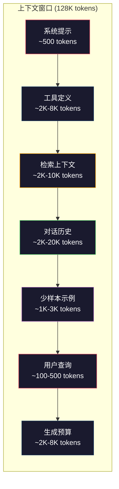
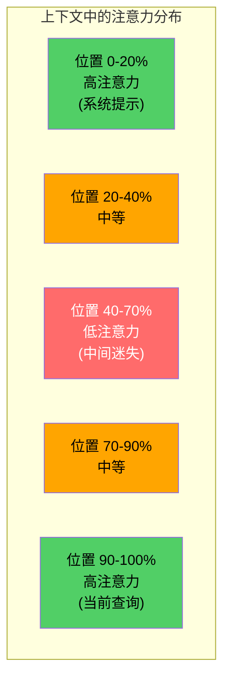
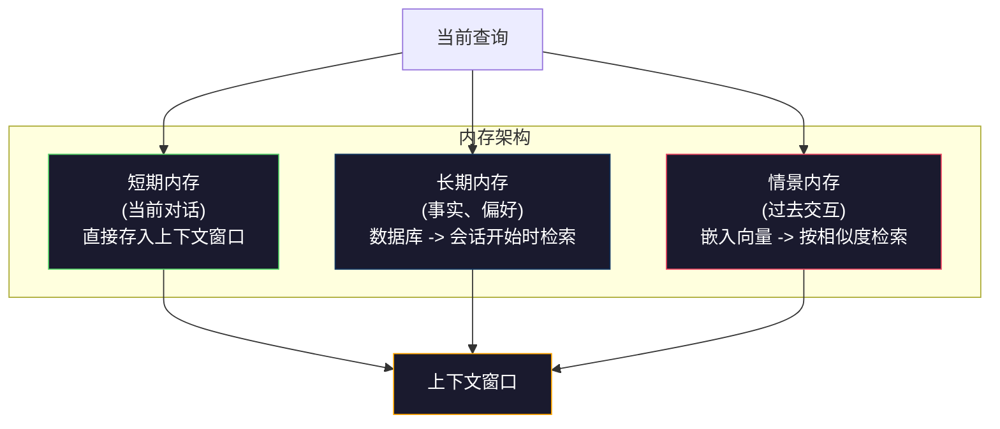

# 上下文工程（Context Engineering）：窗口、预算、内存与检索

> 提示工程（prompt engineering）只是子集。上下文工程才是全局。提示是你输入的字符串；上下文是进入模型窗口的一切：系统指令、检索文档、工具定义、对话历史、少样本示例，以及提示本身。2026 年最优秀的 AI 工程师都是上下文工程师。他们决定什么该放入、什么该排除、以什么顺序放入。

**类型：** Build
**语言：** Python
**前置知识：** Phase 10（从零开始构建 LLM），Phase 11 第 01-02 课
**时间：** ~90 分钟
**相关：** Phase 11 · 15（提示缓存）—— 缓存友好的布局是上下文工程的延伸。Phase 5 · 28（长上下文评估）介绍如何用 NIAH/RULER 衡量 lost-in-the-middle。

## 学习目标

- 计算上下文窗口各组件的 token 预算（系统提示、工具、历史、检索文档、生成余量）
- 实现上下文窗口管理策略：截断、摘要、滑动窗口对话历史
- 对上下文组件进行优先级排序，以最大化模型对最相关信息的注意力
- 构建一个上下文组装器（context assembler），根据查询类型和可用窗口空间动态分配 token

## 问题背景

Claude Opus 4.7 拥有 200K token 的上下文窗口（beta 版 1M）。GPT-5 拥有 400K。Gemini 3 Pro 拥有 2M。Llama 4 宣称 10M。这些数字听起来巨大，直到你把它们填满。

以下是一个真实编程助手的拆解。系统提示：500 tokens。50 个工具的定义：8,000 tokens。检索到的文档：4,000 tokens。对话历史（10 轮）：6,000 tokens。当前用户查询：200 tokens。生成预算（最大输出）：4,000 tokens。总计：22,700 tokens。这仅占 128K 窗口的 18%。

但注意力并不会随上下文长度线性扩展。一个拥有 128K token 上下文的模型需要付出二次方的注意力成本（在普通 transformer 中为 O(n^2)，尽管大多数生产模型使用高效注意力变体）。更重要的是，检索准确率会下降。"大海捞针"（Needle in a Haystack）测试表明，模型难以找到放在长上下文中间位置的信息。Liu 等人（2023）的研究显示，LLM 对上下文开头和结尾的信息检索准确率接近完美，但对放在中间位置（上下文的 40-70% 处）的信息，准确率会下降 10-20%。这种 "lost-in-the-middle" 效应因模型而异，但影响所有当前架构。

实际教训：拥有 200K token 的可用空间，并不意味着使用 200K token 就是有效的。一个精心筛选的 10K token 上下文通常优于随意堆叠的 100K token 上下文。上下文工程是一门在上下文窗口内最大化信噪比的学科。

你放入窗口的每一个 token，都会挤占一个可能携带更相关信息的 token。每一个不相关的工具定义、每一个陈旧的对话轮次、每一段不能回答问题的检索文本 —— 每一个都会让模型在任务上表现稍差。

## 核心概念

### 上下文窗口是稀缺资源

把上下文窗口当作 RAM，而不是磁盘。它快速且可直接访问，但容量有限。你无法塞下所有东西，必须做出选择。



每个组件都在争夺空间。增加更多工具定义意味着对话历史的余地更少。增加更多检索上下文意味着少样本示例的空间更少。上下文工程就是分配这一预算以最大化任务表现的艺术。

### Lost-in-the-Middle（中间迷失）

上下文工程中最关键的实证发现。模型对上下文开头和结尾的信息注意力更好。中间位置的信息获得更低的注意力分数，更可能被忽略。

Liu 等人（2023）系统地测试了这一点。他们将一个相关文档放在 20 个不相关文档中的不同位置，并测量回答准确率。当相关文档位于首位或末位时，准确率为 85-90%。当它位于中间位置（20 个中的第 10 个）时，准确率下降到 60-70%。

这带来了直接的工程启示：

- 将最重要的信息放在最前面（系统提示、关键指令）
- 将当前查询和最相关的上下文放在最后面（近因偏见有帮助）
- 将上下文的中间部分视为最低优先级区域
- 如果必须在中间包含信息，在末尾重复关键要点



### 上下文组件

**系统提示（System prompt）**：设定角色、约束和行为规则。这放在最前面，并在每轮对话中保持不变。Claude Code 的系统提示（包括工具定义和行为指令）大约使用 6,000 tokens。保持精简。系统提示中的每一个字都会在每次 API 调用时重复。

**工具定义（Tool definitions）**：每个工具增加 50-200 tokens（名称、描述、参数模式）。50 个工具，每个 150 tokens，在任何对话发生前就是 7,500 tokens。动态工具选择 —— 只包含与当前查询相关的工具 —— 可以减少 60-80%。

**检索上下文（Retrieved context）**：来自向量数据库的文档、搜索结果、文件内容。检索质量直接决定响应质量。糟糕的检索比没有检索更糟 —— 它用噪声填满窗口，并主动误导模型。

**对话历史（Conversation history）**：每一条先前的用户消息和助手回复。随对话长度线性增长。50 轮对话，每轮 200 tokens，就是 10,000 tokens 的历史。其中大部分与当前查询无关。

**少样本示例（Few-shot examples）**：展示期望行为的输入/输出对。两三个精心挑选的示例通常比数千 tokens 的指令更能提升输出质量。但它们占用空间。

**生成预算（Generation budget）**：为模型响应预留的 token。如果你把窗口塞满，模型就没有回答的空间。至少预留 2,000-4,000 tokens 用于生成。

### 上下文压缩策略

**历史摘要（History summarization）**：不必逐字保留所有先前的轮次，而是定期总结对话。"我们讨论了 X，决定了 Y，用户想要 Z" 用 100 tokens 替代了占用 2,000 tokens 的 10 轮对话。当历史超过阈值（例如 5,000 tokens）时运行摘要。

**相关性过滤（Relevance filtering）**：对每个检索到的文档与当前查询进行评分，丢弃低于阈值的文档。如果你检索到 10 个 chunk 但只有 3 个相关，丢掉另外 7 个。3 个高度相关的 chunk 优于 10 个平庸的 chunk。

**工具剪枝（Tool pruning）**：对用户查询意图进行分类，只包含与该意图相关的工具。代码问题不需要日历工具。排程问题不需要文件系统工具。这可以将工具定义从 8,000 tokens 减少到 1,000。

**递归摘要（Recursive summarization）**：对于非常长的文档，分阶段摘要。先摘要每个章节，再对摘要进行摘要。一份 50 页的文档变成 500 token 的摘要，捕捉关键要点。

### 内存系统

上下文工程跨越三个时间尺度。

**短期内存（Short-term memory）**：当前对话。直接存储在上下文窗口中。随每轮增长。通过摘要和截断管理。

**长期内存（Long-term memory）**：跨对话持续存在的事实和偏好。"用户偏好 TypeScript。""项目使用 PostgreSQL。"存储在数据库中，在会话开始时检索。Claude Code 将其存储在 CLAUDE.md 文件中。ChatGPT 存储在其记忆功能中。

**情景内存（Episodic memory）**：可能相关的特定过去交互。"上周我们在认证模块调试了一个类似的问题。"存储为嵌入向量，在当前对话与过去场景匹配时检索。



### 动态上下文组装

关键洞察：不同的查询需要不同的上下文。静态系统提示 + 静态工具 + 静态历史是浪费的。最好的系统为每个查询动态组装上下文。

1. 分类查询意图
2. 选择相关工具（不是所有工具）
3. 检索相关文档（不是固定集合）
4. 包含相关历史轮次（不是所有历史）
5. 添加与任务类型匹配的少样本示例
6. 按重要性排序：关键信息在前，重要信息在后，可选信息放中间

这就是优秀 AI 应用与卓越 AI 应用之间的区别。模型是一样的。上下文才是差异化因素。

## 动手实现

### 步骤 1：Token 计数器

你无法预算无法衡量的东西。构建一个简单的 token 计数器（使用空格分割的近似方法，因为精确计数取决于分词器）。

```python
import json
import numpy as np
from collections import OrderedDict

def count_tokens(text):
    if not text:
        return 0
    return int(len(text.split()) * 1.3)

def count_tokens_json(obj):
    return count_tokens(json.dumps(obj))
```

### 步骤 2：上下文预算管理器

核心抽象。预算管理器跟踪每个组件使用多少 token，并强制执行限制。

```python
class ContextBudget:
    def __init__(self, max_tokens=128000, generation_reserve=4000):
        self.max_tokens = max_tokens
        self.generation_reserve = generation_reserve
        self.available = max_tokens - generation_reserve
        self.allocations = OrderedDict()

    def allocate(self, component, content, max_tokens=None):
        tokens = count_tokens(content)
        if max_tokens and tokens > max_tokens:
            words = content.split()
            target_words = int(max_tokens / 1.3)
            content = " ".join(words[:target_words])
            tokens = count_tokens(content)

        used = sum(self.allocations.values())
        if used + tokens > self.available:
            allowed = self.available - used
            if allowed <= 0:
                return None, 0
            words = content.split()
            target_words = int(allowed / 1.3)
            content = " ".join(words[:target_words])
            tokens = count_tokens(content)

        self.allocations[component] = tokens
        return content, tokens

    def remaining(self):
        used = sum(self.allocations.values())
        return self.available - used

    def utilization(self):
        used = sum(self.allocations.values())
        return used / self.max_tokens

    def report(self):
        total_used = sum(self.allocations.values())
        lines = []
        lines.append(f"Context Budget Report ({self.max_tokens:,} token window)")
        lines.append("-" * 50)
        for component, tokens in self.allocations.items():
            pct = tokens / self.max_tokens * 100
            bar = "#" * int(pct / 2)
            lines.append(f"  {component:<25} {tokens:>6} tokens ({pct:>5.1f}%) {bar}")
        lines.append("-" * 50)
        lines.append(f"  {'Used':<25} {total_used:>6} tokens ({total_used/self.max_tokens*100:.1f}%)")
        lines.append(f"  {'Generation reserve':<25} {self.generation_reserve:>6} tokens")
        lines.append(f"  {'Remaining':<25} {self.remaining():>6} tokens")
        return "\n".join(lines)
```

### 步骤 3：Lost-in-the-Middle 重排序

实现重排序策略：最重要的项目放在最前和最后，最不重要的放中间。

```python
def reorder_lost_in_middle(items, scores):
    paired = sorted(zip(scores, items), reverse=True)
    sorted_items = [item for _, item in paired]

    if len(sorted_items) <= 2:
        return sorted_items

    first_half = sorted_items[::2]
    second_half = sorted_items[1::2]
    second_half.reverse()

    return first_half + second_half

def score_relevance(query, documents):
    query_words = set(query.lower().split())
    scores = []
    for doc in documents:
        doc_words = set(doc.lower().split())
        if not query_words:
            scores.append(0.0)
            continue
        overlap = len(query_words & doc_words) / len(query_words)
        scores.append(round(overlap, 3))
    return scores
```

### 步骤 4：对话历史压缩器

总结旧的对话轮次以回收 token 预算。

```python
class ConversationManager:
    def __init__(self, max_history_tokens=5000):
        self.turns = []
        self.summaries = []
        self.max_history_tokens = max_history_tokens

    def add_turn(self, role, content):
        self.turns.append({"role": role, "content": content})
        self._compress_if_needed()

    def _compress_if_needed(self):
        total = sum(count_tokens(t["content"]) for t in self.turns)
        if total <= self.max_history_tokens:
            return

        while total > self.max_history_tokens and len(self.turns) > 4:
            old_turns = self.turns[:2]
            summary = self._summarize_turns(old_turns)
            self.summaries.append(summary)
            self.turns = self.turns[2:]
            total = sum(count_tokens(t["content"]) for t in self.turns)

    def _summarize_turns(self, turns):
        parts = []
        for t in turns:
            content = t["content"]
            if len(content) > 100:
                content = content[:100] + "..."
            parts.append(f"{t['role']}: {content}")
        return "Previous: " + " | ".join(parts)

    def get_context(self):
        parts = []
        if self.summaries:
            parts.append("[Conversation Summary]")
            for s in self.summaries:
                parts.append(s)
        parts.append("[Recent Conversation]")
        for t in self.turns:
            parts.append(f"{t['role']}: {t['content']}")
        return "\n".join(parts)

    def token_count(self):
        return count_tokens(self.get_context())
```

### 步骤 5：动态工具选择器

只包含与当前查询相关的工具。分类意图，然后过滤。

```python
TOOL_REGISTRY = {
    "read_file": {
        "description": "Read contents of a file",
        "tokens": 120,
        "categories": ["code", "files"],
    },
    "write_file": {
        "description": "Write content to a file",
        "tokens": 150,
        "categories": ["code", "files"],
    },
    "search_code": {
        "description": "Search for patterns in codebase",
        "tokens": 130,
        "categories": ["code"],
    },
    "run_command": {
        "description": "Execute a shell command",
        "tokens": 140,
        "categories": ["code", "system"],
    },
    "create_calendar_event": {
        "description": "Create a new calendar event",
        "tokens": 180,
        "categories": ["calendar"],
    },
    "list_emails": {
        "description": "List recent emails",
        "tokens": 160,
        "categories": ["email"],
    },
    "send_email": {
        "description": "Send an email message",
        "tokens": 200,
        "categories": ["email"],
    },
    "web_search": {
        "description": "Search the web for information",
        "tokens": 140,
        "categories": ["research"],
    },
    "query_database": {
        "description": "Run a SQL query on the database",
        "tokens": 170,
        "categories": ["code", "data"],
    },
    "generate_chart": {
        "description": "Generate a chart from data",
        "tokens": 190,
        "categories": ["data", "visualization"],
    },
}

def classify_intent(query):
    query_lower = query.lower()

    intent_keywords = {
        "code": ["code", "function", "bug", "error", "file", "implement", "refactor", "debug", "test"],
        "calendar": ["meeting", "schedule", "calendar", "appointment", "event"],
        "email": ["email", "mail", "send", "inbox", "message"],
        "research": ["search", "find", "what is", "how does", "explain", "look up"],
        "data": ["data", "query", "database", "chart", "graph", "analytics", "sql"],
    }

    scores = {}
    for intent, keywords in intent_keywords.items():
        score = sum(1 for kw in keywords if kw in query_lower)
        if score > 0:
            scores[intent] = score

    if not scores:
        return ["code"]

    max_score = max(scores.values())
    return [intent for intent, score in scores.items() if score >= max_score * 0.5]

def select_tools(query, token_budget=2000):
    intents = classify_intent(query)
    relevant = {}
    total_tokens = 0

    for name, tool in TOOL_REGISTRY.items():
        if any(cat in intents for cat in tool["categories"]):
            if total_tokens + tool["tokens"] <= token_budget:
                relevant[name] = tool
                total_tokens += tool["tokens"]

    return relevant, total_tokens
```

### 步骤 6：完整上下文组装流水线

将所有内容串联起来。给定一个查询，动态组装最优上下文。

```python
class ContextEngine:
    def __init__(self, max_tokens=128000, generation_reserve=4000):
        self.budget = ContextBudget(max_tokens, generation_reserve)
        self.conversation = ConversationManager(max_history_tokens=5000)
        self.system_prompt = (
            "You are a helpful AI assistant. You have access to tools for "
            "code editing, file management, web search, and data analysis. "
            "Use the appropriate tools for each task. Be concise and accurate."
        )
        self.knowledge_base = [
            "Python 3.12 introduced type parameter syntax for generic classes using bracket notation.",
            "The project uses PostgreSQL 16 with pgvector for embedding storage.",
            "Authentication is handled by Supabase Auth with JWT tokens.",
            "The frontend is built with Next.js 15 using the App Router.",
            "API rate limits are set to 100 requests per minute per user.",
            "The deployment pipeline uses GitHub Actions with Docker multi-stage builds.",
            "Test coverage must be above 80% for all new modules.",
            "The codebase follows the repository pattern for data access.",
        ]

    def assemble(self, query):
        self.budget = ContextBudget(self.budget.max_tokens, self.budget.generation_reserve)

        system_content, _ = self.budget.allocate("system_prompt", self.system_prompt, max_tokens=1000)

        tools, tool_tokens = select_tools(query, token_budget=2000)
        tool_text = json.dumps(list(tools.keys()))
        tool_content, _ = self.budget.allocate("tools", tool_text, max_tokens=2000)

        relevance = score_relevance(query, self.knowledge_base)
        threshold = 0.1
        relevant_docs = [
            doc for doc, score in zip(self.knowledge_base, relevance)
            if score >= threshold
        ]

        if relevant_docs:
            doc_scores = [s for s in relevance if s >= threshold]
            reordered = reorder_lost_in_middle(relevant_docs, doc_scores)
            doc_text = "\n".join(reordered)
            doc_content, _ = self.budget.allocate("retrieved_context", doc_text, max_tokens=3000)

        history_text = self.conversation.get_context()
        if history_text.strip():
            history_content, _ = self.budget.allocate("conversation_history", history_text, max_tokens=5000)

        query_content, _ = self.budget.allocate("user_query", query, max_tokens=500)

        return self.budget

    def chat(self, query):
        self.conversation.add_turn("user", query)
        budget = self.assemble(query)
        response = f"[Response to: {query[:50]}...]"
        self.conversation.add_turn("assistant", response)
        return budget


def run_demo():
    print("=" * 60)
    print("  Context Engineering Pipeline Demo")
    print("=" * 60)

    engine = ContextEngine(max_tokens=128000, generation_reserve=4000)

    print("\n--- Query 1: Code task ---")
    budget = engine.chat("Fix the bug in the authentication module where JWT tokens expire too early")
    print(budget.report())

    print("\n--- Query 2: Research task ---")
    budget = engine.chat("What is the best approach for implementing vector search in PostgreSQL?")
    print(budget.report())

    print("\n--- Query 3: After conversation history builds up ---")
    for i in range(8):
        engine.conversation.add_turn("user", f"Follow-up question number {i+1} about the implementation details of the system")
        engine.conversation.add_turn("assistant", f"Here is the response to follow-up {i+1} with technical details about the architecture")

    budget = engine.chat("Now implement the changes we discussed")
    print(budget.report())

    print("\n--- Tool Selection Examples ---")
    test_queries = [
        "Fix the bug in auth.py",
        "Schedule a meeting with the team for Tuesday",
        "Show me the database query performance stats",
        "Search for best practices on error handling",
    ]

    for q in test_queries:
        tools, tokens = select_tools(q)
        intents = classify_intent(q)
        print(f"\n  Query: {q}")
        print(f"  Intents: {intents}")
        print(f"  Tools: {list(tools.keys())} ({tokens} tokens)")

    print("\n--- Lost-in-the-Middle Reordering ---")
    docs = ["Doc A (most relevant)", "Doc B (somewhat relevant)", "Doc C (least relevant)",
            "Doc D (relevant)", "Doc E (moderately relevant)"]
    scores = [0.95, 0.60, 0.20, 0.80, 0.50]
    reordered = reorder_lost_in_middle(docs, scores)
    print(f"  Original order: {docs}")
    print(f"  Scores:         {scores}")
    print(f"  Reordered:      {reordered}")
    print(f"  (Most relevant at start and end, least relevant in middle)")
```

## 实际应用

### Claude Code 的上下文策略

Claude Code 采用分层方法管理上下文。系统提示包含行为规则和工具定义（约 6K tokens）。当你打开文件时，其内容作为上下文注入。当你搜索时，结果被添加。旧的对话轮次被摘要。CLAUDE.md 提供跨会话的长期内存。

关键的工程决策：Claude Code 不会将整个代码库倾倒进上下文。它按需检索相关文件。这就是上下文工程的实践。

### Cursor 的动态上下文加载

Cursor 将整个代码库索引为嵌入向量。当你输入查询时，它使用向量相似度检索最相关的文件和代码块。只有这些片段进入上下文窗口。一个 50 万行的代码库被压缩为 5-10 个最相关的代码块。

这就是模式：嵌入一切，按需检索，只包含重要的内容。

### ChatGPT 记忆

ChatGPT 将用户偏好和事实存储为长期内存。每次对话开始时，相关记忆被检索并包含在系统提示中。"用户偏好 Python" 花费 5 个 token，但节省了跨对话的数百个重复指令 token。

### RAG 作为上下文工程

检索增强生成（Retrieval-Augmented Generation, RAG）是上下文工程的正式化。不是将知识塞入模型的权重（训练）或系统提示（静态上下文），而是在查询时检索相关文档并注入上下文窗口。整个 RAG 流水线 —— 分块、嵌入、检索、重排序 —— 存在的目的是解决一个问题：将正确的信息放入上下文窗口。

## 产出物

本课产出 `outputs/prompt-context-optimizer.md` —— 一个可复用的提示，用于审计上下文组装策略并推荐优化。向它提供你的系统提示、工具数量、平均历史长度和检索策略，它会识别 token 浪费并建议改进。

它还产出 `outputs/skill-context-engineering.md` —— 一个决策框架，用于根据任务类型、上下文窗口大小和延迟预算设计上下文组装流水线。

## 练习

1. 为 ContextBudget 类添加一个 "token 浪费检测器"。它应该标记使用超过预算 30% 的组件，并为每种组件类型建议特定的压缩策略（总结历史、剪枝工具、重排序文档）。

2. 为检索上下文实现语义去重。如果两个检索到的文档相似度超过 80%（通过词重叠或嵌入余弦相似度），只保留分数较高的一个。测量这回收了多少 token 预算。

3. 构建一个 "上下文回放" 工具。给定一个对话记录，通过 ContextEngine 逐轮回放，并可视化预算分配如何随轮次变化。绘制每个组件的 token 使用量随时间的变化。识别上下文开始被压缩的轮次。

4. 实现一个基于优先级的工具选择器。不是二元的包含/排除，而是为每个工具分配与当前查询的相关性分数。按相关性降序包含工具，直到工具预算耗尽。比较包含 5、10、20 和 50 个工具时的任务表现。

5. 构建一个多策略上下文压缩器。实现三种压缩策略（截断、摘要、关键句提取），并在 20 份文档的集合上对其进行基准测试。测量压缩比与信息保留之间的权衡（压缩版本是否仍包含问题的答案？）。

## 关键术语

| 术语 | 人们怎么说 | 实际含义 |
|------|-----------|---------|
| Context window（上下文窗口） | "模型能读多少" | 模型在单次前向传播中处理的最大 token 数（输入 + 输出）—— GPT-5 为 400K，Claude Opus 4.7 为 200K（beta 1M），Gemini 3 Pro 为 2M |
| Context engineering（上下文工程） | "高级提示工程" | 决定什么进入上下文窗口、以什么顺序、什么优先级的学科 —— 涵盖检索、压缩、工具选择和内存管理 |
| Lost-in-the-middle（中间迷失） | "模型会忘记中间的内容" | 实证发现 LLM 对上下文开头和结尾的注意力更好，中间位置的信息准确率下降 10-20% |
| Token budget（token 预算） | "还剩多少 token" | 对上下文窗口容量在各组件（系统提示、工具、历史、检索、生成）之间的显式分配，每个组件有独立限制 |
| Dynamic context（动态上下文） | "动态加载内容" | 根据意图分类、相关工具选择和检索结果，为每个查询不同地组装上下文窗口 |
| History summarization（历史摘要） | "压缩对话" | 用简洁摘要替代逐字的老对话轮次，降低 token 成本同时保留关键信息 |
| Tool pruning（工具剪枝） | "只包含相关工具" | 对查询意图进行分类，只包含匹配的工具定义，减少 60-80% 的工具 token 成本 |
| Long-term memory（长期内存） | "跨会话记忆" | 存储在数据库中并在会话开始时检索的事实和偏好 —— CLAUDE.md、ChatGPT 记忆等系统 |
| Episodic memory（情景内存） | "记住特定的过去事件" | 存储为嵌入向量的过去交互，在当前查询与过去对话相似时检索 |
| Generation budget（生成预算） | "回答的空间" | 为模型输出预留的 token —— 如果上下文填满窗口，模型就没有响应空间 |

## 延伸阅读

- [Liu et al., 2023 -- "Lost in the Middle: How Language Models Use Long Contexts"](https://arxiv.org/abs/2307.03172) -- 关于位置依赖注意力的权威研究，显示模型难以处理长上下文中间位置的信息
- [Anthropic's Contextual Retrieval blog post](https://www.anthropic.com/news/contextual-retrieval) -- Anthropic 如何处理上下文感知 chunk 检索，将检索失败率降低 49%
- [Simon Willison's "Context Engineering"](https://simonwillison.net/2025/Jun/27/context-engineering/) -- 命名这一学科并将其与提示工程区分开来的博客文章
- [LangChain documentation on RAG](https://python.langchain.com/docs/tutorials/rag/) -- 检索增强生成作为上下文工程模式的实践实现
- [Greg Kamradt's Needle in a Haystack test](https://github.com/gkamradt/LLMTest_NeedleInAHaystack) -- 揭示所有主要模型位置依赖检索失败的基准测试
- [Pope et al., "Efficiently Scaling Transformer Inference" (2022)](https://arxiv.org/abs/2211.05102) -- 为什么上下文长度驱动内存和延迟，以及 KV cache、MQA 和 GQA 如何改变预算计算
- [Agrawal et al., "SARATHI: Efficient LLM Inference by Piggybacking Decodes with Chunked Prefills" (2023)](https://arxiv.org/abs/2308.16369) -- 使长提示在 TTFT 上昂贵但在 TPOT 上便宜的两个推理阶段；上下文打包权衡背后的真相
- [Ainslie et al., "GQA: Training Generalized Multi-Query Transformer Models from Multi-Head Checkpoints" (EMNLP 2023)](https://arxiv.org/abs/2305.13245) -- 将生产解码器的 KV 内存减少 8 倍而不损失质量的 grouped-query attention 论文
