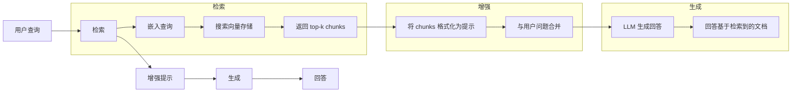
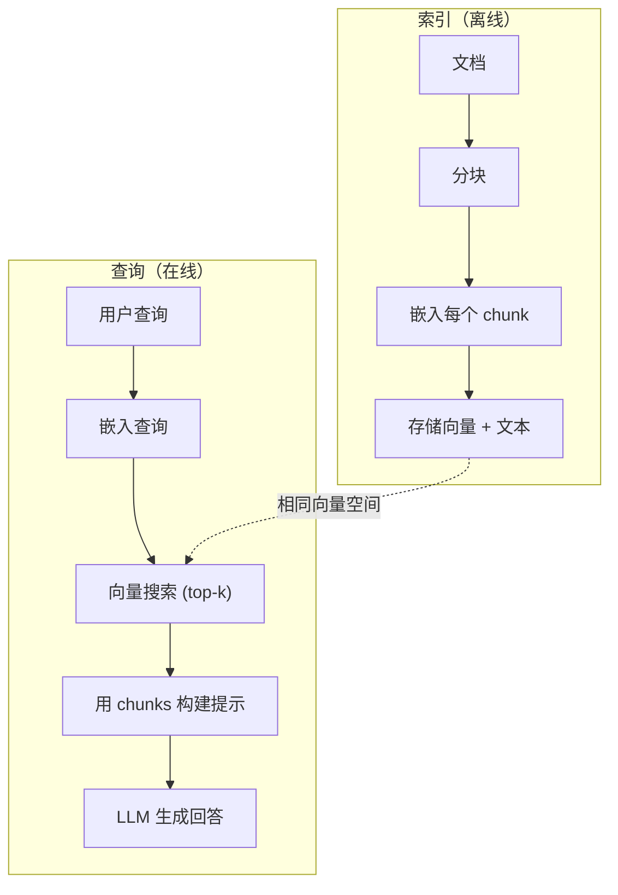

# RAG（检索增强生成，Retrieval-Augmented Generation）

> 你的 LLM 知道训练截止前的所有知识。它对你公司的文档、你的代码库、上周的会议纪要么一无所知。RAG 通过检索相关文档并将其塞入提示来解决这个问题。它是生产环境 AI 中部署最广泛的范式。如果从这个课程中只构建一样东西，那就构建一个 RAG 流水线。

**类型：** Build
**语言：** Python
**前置知识：** Phase 10（从零开始构建 LLM），Phase 11 第 01-05 课
**时间：** ~90 分钟
**相关：** Phase 5 · 23（RAG 的分块策略）介绍六种分块算法及各自适用场景。Phase 5 · 22（嵌入模型深入解析）介绍如何选择嵌入器。Phase 11 · 07（高级 RAG）介绍混合搜索、重排序和查询转换。

## 学习目标

- 构建完整的 RAG 流水线：文档加载、分块、嵌入、向量存储、检索和生成
- 使用向量数据库（ChromaDB、FAISS 或 Pinecone）实现语义搜索并进行正确的索引
- 解释为什么 RAG 优于微调（fine-tuning）用于知识 grounding 应用（成本、时效性、可溯源性）
- 使用检索指标（精确率、召回率）和生成指标（忠实度、相关性）评估 RAG 质量

## 问题背景

你为公司构建了一个聊天机器人。客户问："企业版的退款政策是什么？" LLM 回答了一个关于典型 SaaS 退款政策的通用答案。实际政策埋在一本 200 页的内部 wiki 中，上面写着企业客户有 60 天的窗口期，按比例退款。LLM 从未见过这份文档。它不可能知道训练数据中没有的东西。

微调是一种解决方案。拿 LLM，用你的内部文档训练它，然后部署更新后的模型。这可行，但有严重问题。微调每次训练运行花费数千美元计算资源。模型在文档变更的那一刻就过时了。你无法知道模型从哪个来源获取信息。如果公司下个月收购另一条产品线，你又得重新微调。

RAG 是另一种解决方案。不动模型。当问题进来时，搜索你的文档存储中的相关段落，在问题之前将它们粘贴到提示中，让模型使用这些段落作为上下文来回答。文档存储可以在几分钟内更新。你可以确切看到检索到了哪些文档。模型本身从不改变。这就是 RAG 是生产环境主导范式的原因：它更便宜、更新鲜、更可审计，且适用于任何 LLM。

## 核心概念

### RAG 范式

整个范式可以概括为四个步骤：



查询 -> 检索 -> 增强提示 -> 生成。每个 RAG 系统都遵循这一范式。生产环境 RAG 系统之间的差异在于每个步骤的细节：如何分块、如何嵌入、如何搜索、如何构建提示。

### 为什么 RAG 优于微调

| 关注点 | 微调 | RAG |
|---------|------------|-----|
| 成本 | $1,000-$100,000+ 每次训练 | $0.01-$0.10 每次查询（嵌入 + LLM） |
| 时效性 | 直到重新训练前都是过时的 | 通过重新索引文档在几分钟内更新 |
| 可审计性 | 无法追溯回答到来源 | 可以展示确切的检索段落 |
| 幻觉 | 仍然自由幻觉 | 基于检索到的文档 |
| 数据隐私 | 训练数据 baked 进权重 | 文档保留在你的向量存储中 |

微调永久改变模型的权重。RAG 临时改变模型的上下文。对于大多数应用，临时上下文才是你想要的。

微调唯一获胜的情况：当你需要模型采用特定的风格、语气或推理模式，而这些无法通过提示单独实现时。对于 factual 知识检索，RAG 每次都赢。

### 嵌入模型

嵌入模型将文本转换为密集向量。相似的文本在这个高维空间中产生彼此接近的向量。"How do I reset my password?" 和 "I need to change my password" 尽管共享很少的词，却产生几乎相同的向量。"The cat sat on the mat" 产生一个非常不同的向量。

常见嵌入模型（2026 阵容 —— 完整分析见 Phase 5 · 22）：

| 模型 | 维度 | 提供商 | 备注 |
|-------|-----------|----------|-------|
| text-embedding-3-small | 1536 (Matryoshka) | OpenAI | 大多数用例的最佳性价比 |
| text-embedding-3-large | 3072 (Matryoshka) | OpenAI | 更高准确率，可截断至 256/512/1024 |
| Gemini Embedding 2 | 3072 (Matryoshka) | Google | MTEB 检索榜首；8K 上下文 |
| voyage-4 | 1024/2048 (Matryoshka) | Voyage AI | 领域变体（代码、金融、法律） |
| Cohere embed-v4 | 1024 (Matryoshka) | Cohere | 强多语言，128K 上下文 |
| BGE-M3 | 1024 (dense + sparse + ColBERT) | BAAI (开源权重) | 一个模型三种视角 |
| Qwen3-Embedding | 4096 (Matryoshka) | Alibaba (开源权重) | 开源权重检索分数榜首 |
| all-MiniLM-L6-v2 | 384 | 开源权重 (Sentence Transformers) | 原型基线 |

本课中，我们使用 TF-IDF 构建自己的简单嵌入。不是因为 TF-IDF 是生产系统使用的，而是因为它让概念具体化：文本进去，向量出来，相似文本产生相似向量。

### 向量相似度

给定两个向量，如何衡量相似度？三种选择：

**余弦相似度（Cosine similarity）**：两个向量之间夹角的余弦。范围从 -1（相反）到 1（相同）。忽略幅度，只关心方向。这是 RAG 的默认选择。

```
cosine_sim(a, b) = dot(a, b) / (||a|| * ||b||)
```

**点积（Dot product）**：原始内积。更大的向量获得更高分数。当幅度携带信息时有用（更长的文档可能更相关）。

```
dot(a, b) = sum(a_i * b_i)
```

**L2（欧几里得）距离**：向量空间中的直线距离。距离越小 = 越相似。对幅度差异敏感。

```
L2(a, b) = sqrt(sum((a_i - b_i)^2))
```

余弦相似度是标准。它优雅地处理不同长度的文档，因为它按幅度归一化。当有人说"向量搜索"时，他们几乎总是指余弦相似度。

### 分块策略

文档太长，无法作为单个向量嵌入。一份 50 页的 PDF 可能产生糟糕的嵌入，因为它包含数十个主题。相反，你将文档分成 chunk，每个 chunk 单独嵌入。

**固定大小分块（Fixed-size chunking）**：每 N 个 token 分割一次。简单且可预测。512 token 的 chunk，50 token 重叠意味着 chunk 1 是 token 0-511，chunk 2 是 token 462-973，依此类推。重叠确保你不会在不幸的边界处分割句子。

**语义分块（Semantic chunking）**：在自然边界处分割。段落、章节或 markdown 标题。每个 chunk 是一个连贯的意义单元。实现更复杂，但产生更好的检索效果。

**递归分块（Recursive chunking）**：首先尝试在最大边界处分割（章节标题）。如果章节仍然太大，在段落边界处分割。如果段落仍然太大，在句子边界处分割。这是 LangChain RecursiveCharacterTextSplitter 的方法，在实践中效果很好。

Chunk 大小比人们想象的更重要：

- 太小（64-128 tokens）：每个 chunk 缺乏上下文。"It increased 15% last quarter" 在没有知道"it"指什么的情况下毫无意义。
- 太大（2048+ tokens）：每个 chunk 覆盖多个主题，稀释相关性。当你搜索收入数据时，你得到一个 10% 关于收入、90% 关于员工数量的 chunk。
- 最佳点（256-512 tokens）：足够自包含，足够聚焦以相关。

大多数生产 RAG 系统使用 256-512 token 的 chunk，50 token 重叠。Anthropic 的 RAG 指南推荐这个范围。

### 向量数据库

有了嵌入后，你需要一个地方来存储和搜索它们。选项：

| 数据库 | 类型 | 最适合 |
|----------|------|----------|
| FAISS | 库（进程内） | 原型设计、小到中型数据集 |
| Chroma | 轻量级数据库 | 本地开发、小型部署 |
| Pinecone | 托管服务 | 无需运维开销的生产环境 |
| Weaviate | 开源数据库 | 自托管生产环境 |
| pgvector | Postgres 扩展 | 已经在使用 Postgres |
| Qdrant | 开源数据库 | 高性能自托管 |

本课中，我们构建一个简单的内存向量存储。它将向量存储在列表中，并进行暴力余弦相似度搜索。这等价于 FAISS 的 flat index。在变慢之前，它可以扩展到大约 100,000 个向量。生产系统使用近似最近邻（ANN）算法如 HNSW，在毫秒内搜索数百万个向量。

### 完整流水线



索引阶段每个文档运行一次（或文档更新时）。查询阶段在每个用户请求时运行。在生产环境中，索引可能处理数百万份文档，耗时数小时。查询必须在不到一秒内响应。

### 真实数据

大多数生产 RAG 系统使用这些参数：

- **k = 5 到 10** 每个查询检索的 chunk
- **Chunk 大小 = 256 到 512 tokens**，50 token 重叠
- **上下文预算**：每个查询 2,500-5,000 tokens 的检索内容
- **总提示**：~8,000-16,000 tokens（系统提示 + 检索 chunk + 对话历史 + 用户查询）
- **嵌入维度**：384-3072，取决于模型
- **索引吞吐量**：使用 API 嵌入时每秒 100-1,000 份文档
- **查询延迟**：检索 50-200ms，生成 500-3000ms

## 动手实现

### 步骤 1：文档分块

```python
def chunk_text(text, chunk_size=200, overlap=50):
    words = text.split()
    chunks = []
    start = 0
    while start < len(words):
        end = start + chunk_size
        chunk = " ".join(words[start:end])
        chunks.append(chunk)
        start += chunk_size - overlap
    return chunks
```

### 步骤 2：TF-IDF 嵌入

我们构建一个简单的嵌入函数。TF-IDF（词频-逆文档频率）不是神经嵌入，但它以捕捉词重要性的方式将文本转换为向量。文档中的高频词获得更高的 TF。语料库中的稀有词获得更高的 IDF。乘积给出一个向量，其中重要、有区分度的词具有高值。

```python
import math
from collections import Counter

def build_vocabulary(documents):
    vocab = set()
    for doc in documents:
        vocab.update(doc.lower().split())
    return sorted(vocab)

def compute_tf(text, vocab):
    words = text.lower().split()
    count = Counter(words)
    total = len(words)
    return [count.get(word, 0) / total for word in vocab]

def compute_idf(documents, vocab):
    n = len(documents)
    idf = []
    for word in vocab:
        doc_count = sum(1 for doc in documents if word in doc.lower().split())
        idf.append(math.log((n + 1) / (doc_count + 1)) + 1)
    return idf

def tfidf_embed(text, vocab, idf):
    tf = compute_tf(text, vocab)
    return [t * i for t, i in zip(tf, idf)]
```

### 步骤 3：余弦相似度搜索

```python
def cosine_similarity(a, b):
    dot = sum(x * y for x, y in zip(a, b))
    norm_a = math.sqrt(sum(x * x for x in a))
    norm_b = math.sqrt(sum(x * x for x in b))
    if norm_a == 0 or norm_b == 0:
        return 0.0
    return dot / (norm_a * norm_b)

def search(query_embedding, stored_embeddings, top_k=5):
    scores = []
    for i, emb in enumerate(stored_embeddings):
        sim = cosine_similarity(query_embedding, emb)
        scores.append((i, sim))
    scores.sort(key=lambda x: x[1], reverse=True)
    return scores[:top_k]
```

### 步骤 4：提示构建

这就是 RAG 中"增强"的部分。取检索到的 chunk，将它们格式化为提示，并要求 LLM 基于提供的上下文回答。

```python
def build_rag_prompt(query, retrieved_chunks):
    context = "\n\n---\n\n".join(
        f"[Source {i+1}]\n{chunk}"
        for i, chunk in enumerate(retrieved_chunks)
    )
    return f"""Answer the question based ONLY on the following context.
If the context doesn't contain enough information, say "I don't have enough information to answer that."

Context:
{context}

Question: {query}

Answer:"""
```

### 步骤 5：完整 RAG 流水线

```python
class RAGPipeline:
    def __init__(self):
        self.chunks = []
        self.embeddings = []
        self.vocab = []
        self.idf = []

    def index(self, documents):
        all_chunks = []
        for doc in documents:
            all_chunks.extend(chunk_text(doc))
        self.chunks = all_chunks
        self.vocab = build_vocabulary(all_chunks)
        self.idf = compute_idf(all_chunks, self.vocab)
        self.embeddings = [
            tfidf_embed(chunk, self.vocab, self.idf)
            for chunk in all_chunks
        ]

    def query(self, question, top_k=5):
        query_emb = tfidf_embed(question, self.vocab, self.idf)
        results = search(query_emb, self.embeddings, top_k)
        retrieved = [(self.chunks[i], score) for i, score in results]
        prompt = build_rag_prompt(
            question, [chunk for chunk, _ in retrieved]
        )
        return prompt, retrieved
```

### 步骤 6：生成（模拟）

在生产环境中，这里是你调用 LLM API 的地方。本课中，我们通过从检索到的上下文中提取最相关的句子来模拟生成。

```python
def simple_generate(prompt, retrieved_chunks):
    query_words = set(prompt.lower().split("question:")[-1].split())
    best_sentence = ""
    best_score = 0
    for chunk in retrieved_chunks:
        for sentence in chunk.split("."):
            sentence = sentence.strip()
            if not sentence:
                continue
            words = set(sentence.lower().split())
            overlap = len(query_words & words)
            if overlap > best_score:
                best_score = overlap
                best_sentence = sentence
    return best_sentence if best_sentence else "I don't have enough information."
```

## 实际应用

使用真实的嵌入模型和 LLM，代码几乎不变：

```python
from openai import OpenAI

client = OpenAI()

def embed(text):
    response = client.embeddings.create(
        model="text-embedding-3-small",
        input=text
    )
    return response.data[0].embedding

def generate(prompt):
    response = client.chat.completions.create(
        model="gpt-4o-mini",
        messages=[{"role": "user", "content": prompt}],
        temperature=0
    )
    return response.choices[0].message.content
```

或使用 Anthropic：

```python
import anthropic

client = anthropic.Anthropic()

def generate(prompt):
    response = client.messages.create(
        model="claude-sonnet-4-20250514",
        max_tokens=1024,
        messages=[{"role": "user", "content": prompt}]
    )
    return response.content[0].text
```

流水线是相同的。替换嵌入函数。替换生成函数。检索逻辑、分块、提示构建 —— 无论你使用哪个模型，这些都完全相同。

对于大规模向量存储，将暴力搜索替换为合适的向量数据库：

```python
import chromadb

client = chromadb.Client()
collection = client.create_collection("my_docs")

collection.add(
    documents=chunks,
    ids=[f"chunk_{i}" for i in range(len(chunks))]
)

results = collection.query(
    query_texts=["What is the refund policy?"],
    n_results=5
)
```

Chroma 内部处理嵌入（默认使用 all-MiniLM-L6-v2）并将向量存储在本地数据库中。相同的范式，不同的底层实现。

## 产出物

本课产出：
- `outputs/prompt-rag-architect.md` —— 一个用于为特定用例设计 RAG 系统的提示
- `outputs/skill-rag-pipeline.md` —— 一个教授智能体如何构建和调试 RAG 流水线的技能

## 练习

1. 将 TF-IDF 嵌入替换为简单的词袋方法（二元：词存在为 1，不存在为 0）。在样本文档上比较检索质量。TF-IDF 应该表现更好，因为它对稀有词权重更高。

2. 实验 chunk 大小：在相同的文档集上尝试 50、100、200 和 500 词。对每个大小，运行相同的 5 个查询，并统计有多少在 top-3 中返回相关 chunk。找到检索质量达到峰值的最佳点。

3. 为每个 chunk 添加元数据（源文档名称、chunk 位置）。修改提示模板以包含来源归属，使 LLM 引用其来源。

4. 实现一个简单的评估：给定 10 个问答对，将每个问题通过 RAG 流水线运行，并测量检索到的 chunk 中包含答案的百分比。这就是 Recall@k。

5. 构建一个对话感知的 RAG 流水线：维护最近 3 轮交换的历史，并将其与检索到的 chunk 一起包含在提示中。用跟进问题测试，如在询问定价后问"企业版呢？"

## 关键术语

| 术语 | 人们怎么说 | 实际含义 |
|------|-----------|---------|
| RAG | "能读文档的 AI" | 检索相关文档，将其粘贴到提示中，并基于这些文档生成 grounded 的回答 |
| Embedding（嵌入） | "把文本变成数字" | 文本的密集向量表示，其中相似的含义产生相似的向量 |
| Vector database（向量数据库） | "AI 的搜索引擎" | 优化存储向量并通过相似度找到最近邻的数据存储 |
| Chunking（分块） | "把文档切成碎片" | 将文档分成更小的段落（通常 256-512 tokens），以便每个可以独立嵌入和检索 |
| Cosine similarity（余弦相似度） | "两个向量有多相似" | 两个向量之间夹角的余弦；1 = 相同方向，0 = 正交，-1 = 相反 |
| Top-k retrieval（Top-k 检索） | "获取 k 个最佳匹配" | 从向量存储中返回与查询最相似的 k 个 chunk |
| Context window（上下文窗口） | "LLM 能看到多少文本" | LLM 在单次请求中能处理的最大 token 数；检索到的 chunk 必须适配其中 |
| Augmented generation（增强生成） | "基于给定上下文回答" | 使用检索到的文档作为上下文生成响应，而非仅依赖训练知识 |
| TF-IDF | "词重要性评分" | 词频乘以逆文档频率；按词在语料库中的区分度加权 |
| Indexing（索引） | "为搜索准备文档" | 分块、嵌入和存储文档的离线过程，以便在查询时搜索 |

## 延伸阅读

- Lewis et al., "Retrieval-Augmented Generation for Knowledge-Intensive NLP Tasks" (2020) -- Facebook AI Research 的原始 RAG 论文，将 retrieve-then-generate 范式形式化
- Anthropic's RAG documentation (docs.anthropic.com) -- 关于 chunk 大小、提示构建和评估的实践指南
- Pinecone Learning Center, "What is RAG?" -- 带有生产环境考量的 RAG 流水线清晰视觉解释
- Sentence-BERT: Reimers & Gurevych (2019) -- all-MiniLM 嵌入模型背后的论文，展示如何训练双编码器进行语义相似度
- [Karpukhin et al., "Dense Passage Retrieval for Open-Domain Question Answering" (EMNLP 2020)](https://arxiv.org/abs/2004.04906) -- DPR 论文，证明密集双编码器检索在开放域 QA 上击败 BM25，并为现代 RAG 检索器设定了模式
- [LlamaIndex High-Level Concepts](https://docs.llamaindex.ai/en/stable/getting_started/concepts.html) -- 构建 RAG 流水线时需要了解的主要概念：数据加载器、节点解析器、索引、检索器、响应合成器
- [LangChain RAG tutorial](https://python.langchain.com/docs/tutorials/rag/) -- 另一种风格的编排器；相同的 retrieve-then-generate 范式的 runnable 链视图
