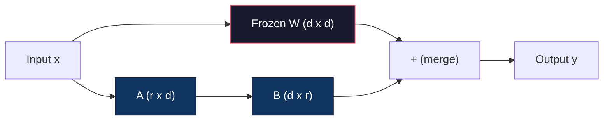
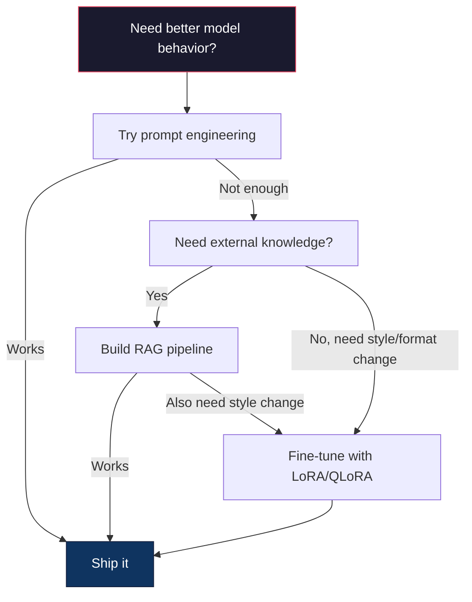

# 使用 LoRA & QLoRA 进行 Fine-Tuning (微调)

> Full fine-tuning (全量微调) 一个 7B 模型需要 56GB 显存。你没有。大多数公司也没有。LoRA (Low-Rank Adaptation，低秩适配) 让你在 6GB 显存中 fine-tune 同一个模型，只训练不到 1% 的参数。这不是妥协——它在大多数任务上都能匹配 full fine-tuning 的质量。整个开源 fine-tuning 生态都建立在这个技巧之上。

**Type:** Build
**Languages:** Python
**Prerequisites:** Phase 10, Lesson 06 (Instruction Tuning / SFT，指令微调 / 监督微调)
**Time:** ~75 minutes
**Related:** Phase 10 涵盖了从零开始的 SFT/DPO 循环。本课将这些接入 2026 年的 PEFT (Parameter-Efficient Fine-Tuning，参数高效微调) 工具链（PEFT、TRL、Unsloth、Axolotl、LLaMA-Factory）。

## Learning Objectives (学习目标)

- 通过向预训练模型的 attention (注意力) 层注入低秩 adapter 矩阵（A 和 B）来实现 LoRA
- 计算 LoRA 相比 full fine-tuning 的参数节省：rank r 配合 d_model 维度训练 2*r*d 个参数，而不是 d^2
- 使用 QLoRA（4-bit 量化 base + LoRA adapter）在消费级 GPU 显存内 fine-tune 模型
- 将 LoRA 权重合并回 base 模型进行部署，并对比有/无 adapter 的 inference (推理) 速度

## The Problem (问题)

你有一个 base model (基础模型)。Llama 3 8B。你希望它用你公司的口吻回答客户支持工单。SFT (Supervised Fine-Tuning，监督微调) 是答案。但 SFT 有一个成本问题。

Full fine-tuning 更新模型中的每个参数。Llama 3 8B 有 80 亿参数。在 fp16 中，每个参数占 2 字节。仅加载权重就需要 16GB。训练期间，你还需要 gradients (梯度)（16GB）、Adam 的 optimizer states (优化器状态)（momentum + variance 共 32GB）以及 activations (激活值)。总计：单个 8B 模型大约需要 56GB 显存。

一块 A100 80GB 刚好能放下。两块 A100 在云厂商每小时花费 $3-4。在 50,000 个样本上训练 3 个 epoch (轮次) 需要 6-10 小时。每次实验 $30-40。运行 10 次实验来调整超参数，在部署任何东西之前你就已经花了 $400。

扩展到 Llama 3 70B，数字变得荒谬。仅权重就需要 140GB。你需要一个集群。每次实验 $100+。

还有一个更深层的问题。Full fine-tuning 修改模型中的每个权重。如果你在客户支持数据上 fine-tune，可能会降低模型的通用能力。这叫做 catastrophic forgetting (灾难性遗忘)。模型在你的任务上变得更好，在其他所有事情上变得更差。

你需要一种训练更少参数、使用更少显存、且不破坏模型已有知识的方法。

## The Concept (概念)

### LoRA: Low-Rank Adaptation (低秩适配)

微软的 Edward Hu 及其同事于 2021 年 6 月发表了 LoRA 论文。论文的洞察：fine-tuning 期间的权重更新具有低内在秩 (low intrinsic rank)。你不需要更新 4096x4096 权重矩阵中的所有 1670 万参数。更新中的有用信息可以被一个秩为 16 或 32 的矩阵捕捉。

数学原理如下。一个标准 linear 层计算：

```
y = Wx
```

其中 W 是一个 d_out x d_in 矩阵。对于 4096x4096 的 attention projection (注意力投影)，那是 16,777,216 个参数。

LoRA 冻结 W 并添加一个低秩分解：

```
y = Wx + BAx
```

其中 B 是 (d_out x r)，A 是 (r x d_in)。秩 r 远小于 d——通常是 8、16 或 32。

对于 4096x4096 层上的 r=16：
- 原始参数：4096 x 4096 = 16,777,216
- LoRA 参数：(4096 x 16) + (16 x 4096) = 65,536 + 65,536 = 131,072
- 缩减：131,072 / 16,777,216 = 0.78%

你只训练 0.78% 的参数，就能获得 95-100% 的质量。



A 用随机高斯初始化。B 初始化为零。这意味着 LoRA 贡献从零开始——模型从原始行为开始训练，并逐渐学习适配。

### 缩放因子：Alpha

LoRA 引入一个缩放因子 alpha，控制低秩更新对输出的影响程度：

```
y = Wx + (alpha / r) * BAx
```

当 alpha = r 时，缩放为 1x。当 alpha = 2r（常见默认值）时，缩放为 2x。这个超参数独立控制 LoRA 路径的学习率。

实践指导：
- alpha = 2 * rank 是一个常见的社区惯例（原论文在大多数实验中使用 alpha = rank）
- alpha = rank 给出 1x 缩放，保守但稳定
- 更高的 alpha 意味着每步更大的更新，可以加速收敛或导致不稳定

### 在哪里应用 LoRA

Transformer 有很多 linear 层。你不需要给所有层都加 LoRA。原论文测试了不同组合：

| Target Layers (目标层) | Trainable Params (7B) | Quality (质量) |
|--------------|----------------------|---------|
| q_proj only | 4.7M | Good (良好) |
| q_proj + v_proj | 9.4M | Better (更好) |
| q_proj + k_proj + v_proj + o_proj | 18.9M | Best for attention (attention 最佳) |
| All linear (attention + MLP) | 37.7M | Marginal gain, 2x params (边际收益，2 倍参数) |

大多数任务的甜点：q_proj + v_proj。这针对 self-attention (自注意力) 中的 query (查询) 和 value (值) 投影，控制模型关注什么以及提取什么信息。为代码生成等复杂任务添加 MLP 层有帮助，但对简单任务收益递减且参数翻倍。

### Rank 选择

Rank r 控制适配的表达能力：

| Rank | Trainable Params (每层) | Best For (最适合) |
|------|---------------------------|----------|
| 4 | 32,768 | 简单分类、情感分析 |
| 8 | 65,536 | 单领域 Q&A、摘要 |
| 16 | 131,072 | 多领域任务、指令跟随 |
| 32 | 262,144 | 复杂推理、代码生成 |
| 64 | 524,288 | 大多数任务收益递减 |
| 128 | 1,048,576 | 很少有必要 |

Hu 等人证明，对于简单任务，r=4 已经能捕捉大部分适配。r=8 和 r=16 是实践中最常见的选择。超过 r=64 很少提升质量，并且开始失去 LoRA 的显存优势。

### QLoRA: 4-Bit Quantization (量化) + LoRA

华盛顿大学的 Tim Dettmers 及其同事于 2023 年 5 月发表了 QLoRA。思路：将冻结的 base 模型量化到 4-bit 精度，然后在上面附加 fp16 的 LoRA adapter。

这极大地改变了显存方程：

| Method (方法) | Weight Memory (7B) | Training Memory (7B) | GPU Required |
|--------|-------------------|---------------------|-------------|
| Full fine-tune (fp16) | 14GB | ~56GB | 1x A100 80GB |
| LoRA (fp16 base) | 14GB | ~18GB | 1x A100 40GB |
| QLoRA (4-bit base) | 3.5GB | ~6GB | 1x RTX 3090 24GB |

QLoRA 做出了三项技术贡献：

**NF4 (Normal Float 4-bit，正态浮点 4 位)**：一种专门为神经网络权重设计的新数据类型。神经网络权重大致遵循正态分布。NF4 将其 16 个量化级别放在标准正态分布的分位数上。这在信息论上对正态分布数据是最优的。它比均匀 4-bit 量化（INT4）或标准 Float4 损失更少信息。

**Double quantization (双重量化)**：量化常数本身也占显存。每 64 个权重的块需要一个 fp32 缩放因子（4 字节）。对于 7B 模型，这是额外的 0.4GB。双重量化将这些常数量化到 fp8，将开销降低到 0.1GB。虽小但积少成多。

**Paged optimizers (分页优化器)**：训练期间，optimizer states（Adam 的 momentum 和 variance）在长序列上可能超过 GPU 显存。分页优化器使用 NVIDIA 的统一显存，在 GPU 显存耗尽时自动将 optimizer states 分页到 CPU 内存，需要时再分页回来。这以一些吞吐量为代价防止了 OOM 崩溃。

### 质量问题

减少参数或量化 base 会损害质量吗？多篇论文的结果：

| Method (方法) | MMLU (5-shot) | MT-Bench | HumanEval |
|--------|--------------|----------|-----------|
| Full fine-tune (Llama 2 7B) | 48.3 | 6.72 | 14.6 |
| LoRA r=16 | 47.9 | 6.68 | 14.0 |
| QLoRA r=16 (NF4) | 47.5 | 6.61 | 13.4 |
| QLoRA r=64 (NF4) | 48.1 | 6.70 | 14.2 |

r=16 的 LoRA 在大多数基准测试上距 full fine-tuning 不到 1%。r=16 的 QLoRA 再损失零点几个百分点。r=64 的 QLoRA 在显存减少 90% 的情况下基本匹配 full fine-tuning。

### 实际成本

在 50,000 个样本上 fine-tune Llama 3 8B（3 个 epoch）：

| Method (方法) | GPU | Time | Cost |
|--------|-----|------|------|
| Full fine-tune | 2x A100 80GB | 8 小时 | ~$32 |
| LoRA r=16 | 1x A100 40GB | 4 小时 | ~$8 |
| QLoRA r=16 | 1x RTX 4090 24GB | 6 小时 | ~$5 |
| QLoRA r=16 (Unsloth) | 1x RTX 4090 24GB | 2.5 小时 | ~$2 |
| QLoRA r=16 | 1x T4 16GB | 12 小时 | ~$4 |

在单张消费级 GPU 上运行 QLoRA 的花费不到一顿午餐。这就是 2023 年开源权重 fine-tuning 社区爆发的原因，也是下面每个训练框架在 2026 年默认提供 QLoRA 的原因。

### 2026 年的 PEFT 技术栈

| Framework (框架) | What it is (是什么) | Pick when (何时选择) |
|-----------|-----------|-----------|
| **Hugging Face PEFT** |  canonical LoRA/QLoRA/DoRA/IA3 库 | 你想要原始控制，且训练循环已经在 `transformers.Trainer` 上 |
| **TRL** | HF 的基于反馈的强化训练器（SFT、DPO、GRPO、PPO、ORPO） | 你需要 SFT 之后的 DPO/GRPO；构建在 PEFT 之上 |
| **Unsloth** | 重写 forward/backward pass 的 Triton kernel | 你想要 2-5 倍加速 + 减半显存且无损精度；Llama/Mistral/Qwen 家族 |
| **Axolotl** | 基于 PEFT + TRL + DeepSpeed + Unsloth 的 YAML 配置包装器 | 你想要可复现、版本控制的训练运行 |
| **LLaMA-Factory** | PEFT + TRL 的 GUI/CLI/API | 你想要零代码 fine-tuning；支持 100+ 模型家族 |
| **torchtune** | 原生 PyTorch recipes，无 `transformers` 依赖 | 你想要最小依赖，且你的组织已标准化 PyTorch |

经验法则：研究使用或一次性实验 → PEFT。可复现的生产流水线 → 启用 Unsloth kernel 的 Axolotl。随手原型设计 → LLaMA-Factory。

### 合并 Adapter

训练后，你有两样东西：冻结的 base 模型和一个小的 LoRA adapter（通常 10-100MB）。你可以：

1. **保持分离**：加载 base 模型，在上面加载 adapter。为不同任务交换 adapter。这就是你从一个 base 模型服务多个 fine-tuned 变体的方式。

2. **永久合并**：计算 W' = W + (alpha/r) * BA 并将结果保存为新的完整模型。合并后的模型与原始模型大小相同。没有 inference 开销。没有 adapter 需要管理。

对于服务多个任务（客户支持 adapter、代码 adapter、翻译 adapter），保持分离。对于部署单个专用模型，合并。

合并多个 adapter 的高级技术：

- **TIES-Merging** (Yadav 等人，2023)：裁剪小幅值参数，解决符号冲突，然后合并。减少 adapter 之间的干扰。
- **DARE** (Yu 等人，2023)：随机丢弃 adapter 参数再合并并重新缩放其余参数。在组合能力上出奇有效。
- **Task arithmetic (任务算术)**：简单加减 adapter 权重。将 "代码" adapter 和 "数学" adapter 相加通常会产生一个两者都擅长的模型。

### 何时不 Fine-Tune

Fine-tuning 是第三选择，不是第一选择。

**第一：prompt engineering (提示工程)。** 写一个更好的 system prompt。添加 few-shot examples。使用 chain-of-thought (思维链)。这不需要花钱，只需几分钟。如果 prompting 能让你达到 80% 的目标，你可能不需要 fine-tune。

**第二：RAG。** 如果模型需要了解你的特定数据（文档、知识库、产品目录），检索比将其烘焙到权重中更便宜且更易维护。参见 Lesson 06。

**第三：fine-tuning。** 当你需要模型采用 prompting 无法实现的特定风格、格式或推理模式时使用。当你需要一致的结构化输出时。当你需要将更大的模型蒸馏到更小的模型时。当延迟很重要且你无法承受 few-shot prompting 的额外 token 时。



## Build It

我们在纯 PyTorch 中从零实现 LoRA。没有库。没有魔法。你将构建 LoRA 层，将其注入模型，训练它，然后将权重合并回去。

### Step 1: The LoRA Layer

```python
import torch
import torch.nn as nn
import math

class LoRALayer(nn.Module):
    def __init__(self, in_features, out_features, rank=8, alpha=16):
        super().__init__()
        self.rank = rank
        self.alpha = alpha
        self.scaling = alpha / rank

        self.A = nn.Parameter(torch.randn(in_features, rank) * (1 / math.sqrt(rank)))
        self.B = nn.Parameter(torch.zeros(rank, out_features))

    def forward(self, x):
        return (x @ self.A @ self.B) * self.scaling
```

A 用缩放后的随机值初始化。B 初始化为零。BA 的乘积从零开始，所以模型从其原始行为开始。

### Step 2: LoRA-Wrapped Linear Layer

```python
class LinearWithLoRA(nn.Module):
    def __init__(self, linear, rank=8, alpha=16):
        super().__init__()
        self.linear = linear
        self.lora = LoRALayer(
            linear.in_features, linear.out_features, rank, alpha
        )

        for param in self.linear.parameters():
            param.requires_grad = False

    def forward(self, x):
        return self.linear(x) + self.lora(x)
```

原始的 linear 层被冻结。只有 LoRA 参数（A 和 B）是可训练的。

### Step 3: Inject LoRA into a Model

```python
def inject_lora(model, target_modules, rank=8, alpha=16):
    for param in model.parameters():
        param.requires_grad = False

    lora_layers = {}
    for name, module in model.named_modules():
        if isinstance(module, nn.Linear):
            if any(t in name for t in target_modules):
                parent_name = ".".join(name.split(".")[:-1])
                child_name = name.split(".")[-1]
                parent = dict(model.named_modules())[parent_name]
                lora_linear = LinearWithLoRA(module, rank, alpha)
                setattr(parent, child_name, lora_linear)
                lora_layers[name] = lora_linear
    return lora_layers
```

首先，冻结模型中的每个参数。然后遍历模型树，找到匹配你目标名称的 linear 层，并将它们替换为 LoRA 包装版本。LoRA A 和 B 矩阵是整个模型中唯一可训练的参数。

### Step 4: Count Parameters

```python
def count_parameters(model):
    total = sum(p.numel() for p in model.parameters())
    trainable = sum(p.numel() for p in model.parameters() if p.requires_grad)
    frozen = total - trainable
    return {
        "total": total,
        "trainable": trainable,
        "frozen": frozen,
        "trainable_pct": 100 * trainable / total if total > 0 else 0
    }
```

### Step 5: Merge Weights Back

```python
def merge_lora_weights(model):
    for name, module in model.named_modules():
        if isinstance(module, LinearWithLoRA):
            with torch.no_grad():
                merged = (
                    module.lora.A @ module.lora.B
                ) * module.lora.scaling
                module.linear.weight.data += merged.T
            parent_name = ".".join(name.split(".")[:-1])
            child_name = name.split(".")[-1]
            if parent_name:
                parent = dict(model.named_modules())[parent_name]
            else:
                parent = model
            setattr(parent, child_name, module.linear)
```

合并后，LoRA 层消失。模型与原始模型大小相同，适配被烘焙到权重中。没有 inference 开销。

### Step 6: Simulated QLoRA Quantization

```python
def quantize_to_nf4(tensor, block_size=64):
    blocks = tensor.reshape(-1, block_size)
    scales = blocks.abs().max(dim=1, keepdim=True).values / 7.0
    scales = torch.clamp(scales, min=1e-8)
    quantized = torch.round(blocks / scales).clamp(-8, 7).to(torch.int8)
    return quantized, scales

def dequantize_from_nf4(quantized, scales, original_shape):
    dequantized = quantized.float() * scales
    return dequantized.reshape(original_shape)
```

这通过将权重映射到每 64 个一组的 16 个离散级别来模拟 4-bit 量化。生产环境的 QLoRA 使用 bitsandbytes 库在 GPU 上实现真正的 NF4。

### Step 7: Training Loop

```python
def train_lora(model, data, epochs=5, lr=1e-3, batch_size=4):
    optimizer = torch.optim.AdamW(
        [p for p in model.parameters() if p.requires_grad], lr=lr
    )
    criterion = nn.MSELoss()

    losses = []
    for epoch in range(epochs):
        epoch_loss = 0.0
        n_batches = 0
        indices = torch.randperm(len(data["inputs"]))

        for i in range(0, len(indices), batch_size):
            batch_idx = indices[i:i + batch_size]
            x = data["inputs"][batch_idx]
            y = data["targets"][batch_idx]

            output = model(x)
            loss = criterion(output, y)

            optimizer.zero_grad()
            loss.backward()
            optimizer.step()

            epoch_loss += loss.item()
            n_batches += 1

        avg_loss = epoch_loss / n_batches
        losses.append(avg_loss)

    return losses
```

### Step 8: Full Demo

```python
def demo():
    torch.manual_seed(42)
    d_model = 256
    n_classes = 10

    model = nn.Sequential(
        nn.Linear(d_model, 512),
        nn.ReLU(),
        nn.Linear(512, 512),
        nn.ReLU(),
        nn.Linear(512, n_classes),
    )

    n_samples = 500
    x = torch.randn(n_samples, d_model)
    y = torch.randint(0, n_classes, (n_samples,))
    y_onehot = torch.zeros(n_samples, n_classes).scatter_(1, y.unsqueeze(1), 1.0)

    data = {"inputs": x, "targets": y_onehot}

    params_before = count_parameters(model)

    lora_layers = inject_lora(
        model, target_modules=["0", "2"], rank=8, alpha=16
    )

    params_after = count_parameters(model)

    losses = train_lora(model, data, epochs=20, lr=1e-3)

    merge_lora_weights(model)
    params_merged = count_parameters(model)

    return {
        "params_before": params_before,
        "params_after": params_after,
        "params_merged": params_merged,
        "losses": losses,
    }
```

Demo 创建一个小模型，向两层注入 LoRA，训练它，然后将权重合并回去。参数计数从完全可训练到 LoRA 训练期间约 1% 可训练，合并后回到原始架构。

## Use It

使用 Hugging Face 生态，在真实模型上做 LoRA 大约需要 20 行：

```python
from transformers import AutoModelForCausalLM, AutoTokenizer
from peft import LoraConfig, get_peft_model, TaskType

model = AutoModelForCausalLM.from_pretrained("meta-llama/Llama-3.1-8B")
tokenizer = AutoTokenizer.from_pretrained("meta-llama/Llama-3.1-8B")

lora_config = LoraConfig(
    task_type=TaskType.CAUSAL_LM,
    r=16,
    lora_alpha=32,
    lora_dropout=0.05,
    target_modules=["q_proj", "v_proj"],
)

model = get_peft_model(model, lora_config)
model.print_trainable_parameters()
```

对于 QLoRA，添加 bitsandbytes 量化：

```python
from transformers import BitsAndBytesConfig

bnb_config = BitsAndBytesConfig(
    load_in_4bit=True,
    bnb_4bit_quant_type="nf4",
    bnb_4bit_compute_dtype=torch.bfloat16,
    bnb_4bit_use_double_quant=True,
)

model = AutoModelForCausalLM.from_pretrained(
    "meta-llama/Llama-3.1-8B",
    quantization_config=bnb_config,
    device_map="auto",
)

model = get_peft_model(model, lora_config)
```

就是这样。相同的训练循环。相同的数据流水线。Base 模型现在以 4-bit 存在，LoRA adapter 以 fp16 训练，整个东西能放进 6GB。

使用 Hugging Face Trainer 训练：

```python
from transformers import TrainingArguments, Trainer
from datasets import load_dataset

dataset = load_dataset("tatsu-lab/alpaca", split="train[:5000]")

training_args = TrainingArguments(
    output_dir="./lora-llama",
    num_train_epochs=3,
    per_device_train_batch_size=4,
    gradient_accumulation_steps=4,
    learning_rate=2e-4,
    fp16=True,
    logging_steps=10,
    save_strategy="epoch",
    optim="paged_adamw_8bit",
)

trainer = Trainer(
    model=model,
    args=training_args,
    train_dataset=dataset,
)

trainer.train()

model.save_pretrained("./lora-adapter")
```

保存的 adapter 是 10-100MB。Base 模型保持不变。你可以在 Hugging Face Hub 上共享 adapter，无需重新分发完整模型。

## Ship It

本课产出：
- `outputs/prompt-lora-advisor.md` — 一个帮助你为特定任务决策 LoRA rank、目标模块和超参数的 prompt
- `outputs/skill-fine-tuning-guide.md` — 一个教授 agent fine-tuning 决策树的 skill

## Exercises (练习)

1. **Rank 消融研究。** 用 rank 2、4、8、16、32、64 运行 demo。绘制最终 loss 与 rank 的关系。找到收益递减点——翻倍 rank 不再减半 loss。对于 256 维特征上的简单分类任务，这个点应该在 r=8-16 左右。

2. **Target module 对比。** 修改 inject_lora，仅针对 layer "0"、仅 layer "2"、仅 layer "4" 和所有三层。每个变体训练 20 个 epoch。对比收敛速度和最终 loss。这镜像了真实决策：针对 q_proj 还是 v_proj 还是所有 linear 层。

3. **量化误差分析。** 取训练好的模型权重矩阵，在 quantize_to_nf4 / dequantize_from_nf4 前后计算。计算均方误差、最大绝对误差以及原始与重建权重之间的相关性。用 block_size 值 32、64、128、256 做实验。

4. **多 adapter 服务。** 在不同数据子集（偶数索引 vs 奇数索引）上训练两个 LoRA adapter。保存两个 adapter。加载一次 base 模型，然后交换 adapter 并验证每个在相同输入上产生不同输出。这就是生产系统从一个 base 服务多个 fine-tuned 模型的方式。

5. **合并 vs 未合并 inference。** 在相同的 100 个输入上对比 merge_lora_weights 前后的 LoRA 模型输出。验证输出相同（在浮点容差 1e-5 内）。然后对两者进行 inference 速度基准测试——合并的应该稍快，因为它是单个矩阵乘法而不是两个。

## Key Terms (关键术语)

| Term (术语) | What people say (人们怎么说) | What it actually means (实际含义) |
|------|----------------|----------------------|
| LoRA | "Efficient fine-tuning" | Low-Rank Adaptation：冻结 base 权重，训练两个小矩阵 A 和 B，其乘积近似完整权重更新 |
| QLoRA | "Fine-tune on a laptop" | Quantized LoRA：以 4-bit NF4 加载 base 模型，在上面以 fp16 训练 LoRA adapter，使 7B fine-tuning 能在 6GB 显存中进行 |
| Rank (r) | "How much the model can learn" | A 和 B 矩阵的内维度；控制表达能力 vs 参数数量 |
| Alpha | "LoRA learning rate" | 应用于 LoRA 输出的缩放因子；alpha/r 缩放适配对最终输出的贡献 |
| NF4 | "4-bit quantization" | Normal Float 4：一种 4-bit 数据类型，量化级别位于正态分布分位数，对神经网络权重最优 |
| Adapter | "The small trained part" | 保存为单独文件（10-100MB）的 LoRA A 和 B 矩阵，可在任何 base 模型副本上加载 |
| Target modules | "Which layers to LoRA" | 注入 LoRA adapter 的特定 linear 层（q_proj、v_proj 等） |
| Merging | "Bake it in" | 计算 W + (alpha/r) * BA 并替换原始权重，消除 inference 时的 adapter 开销 |
| Paged optimizers | "Don't OOM during training" | 当 GPU 显存耗尽时将 optimizer states（Adam momentum、variance）卸载到 CPU |
| Catastrophic forgetting | "Fine-tuning broke everything else" | 更新所有权重导致模型丢失先前学到的能力 |

## Further Reading (延伸阅读)

- Hu et al., "LoRA: Low-Rank Adaptation of Large Language Models" (2021) — 引入低秩分解方法的原始论文，在 GPT-3 175B 上测试了低至 rank 4
- Dettmers et al., "QLoRA: Efficient Finetuning of Quantized Language Models" (2023) — 引入 NF4、double quantization 和 paged optimizers，使单张 48GB GPU 能 fine-tune 65B 模型
- PEFT library documentation (huggingface.co/docs/peft) — Hugging Face 生态中 LoRA、QLoRA 和其他参数高效方法的标准库
- Yadav et al., "TIES-Merging: Resolving Interference When Merging Models" (2023) — 在不降低质量的情况下组合多个 LoRA adapter 的技术
- [Rafailov et al., "Direct Preference Optimization: Your Language Model is Secretly a Reward Model" (NeurIPS 2023)](https://arxiv.org/abs/2305.18290) — DPO 推导；SFT 之后的偏好微调阶段，无需奖励模型
- [TRL documentation](https://huggingface.co/docs/trl/) — `SFTTrainer`、`DPOTrainer`、`KTOTrainer` 的官方参考，以及与 PEFT/bitsandbytes/Unsloth 的集成接口
- [Unsloth documentation](https://docs.unsloth.ai/) — 融合 kernel，fine-tuning 吞吐量翻倍、显存减半；TRL 下的性能层
- [Axolotl documentation](https://axolotl-ai-cloud.github.io/axolotl/) — YAML 配置的多 GPU SFT/DPO/QLoRA 训练器；手写脚本的配置即代码替代方案
