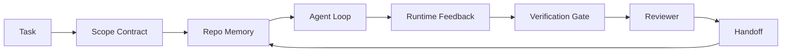

# Agent Workbench Engineering: Why Capable Models Still Fail

> 一个能力强大的模型本身并不足够。可靠的 agent 需要一个 workbench（工作台）：instructions（指令）、state（状态）、scope（范围）、feedback（反馈）、verification（验证）、review（审查）和 handoff（交接）。剥离这些之后，即使是前沿模型也会产生不安全的交付物。

**Type:** Learn + Build
**Languages:** Python (stdlib)
**Prerequisites:** Phase 14 · 01 (Agent Loop), Phase 14 · 26 (Failure Modes)
**Time:** ~45 分钟

## Learning Objectives

- 将模型能力与执行可靠性区分开。
- 命名决定 agent 是否能交付的七个 workbench surface（工作台表面）。
- 在小型仓库任务上对比 prompt-only（仅提示词）运行与 workbench-guided（工作台引导）运行。
- 生成一份 failure-mode report（故障模式报告），将每个缺失的 surface 映射到它导致的症状。

## The Problem

你将一个前沿模型放入真实仓库，要求它添加 input validation（输入验证）。它打开了四个文件，编写了看似合理的代码，宣布成功，然后停止。你运行测试，两个失败。第三个被修改的文件与验证毫无关系。没有任何记录说明 agent 做了什么假设、先尝试了哪些方案，或者还有什么待办事项。

模型在 Python 方面并没有错。它错在对工作的理解上。它不知道什么才算完成、哪里允许写入、哪些测试具有权威性，或者下一个 session（会话）应该如何接续。

这不是模型 bug。这是 workbench bug。agent 周围的 surface 缺失了那些将单次生成转化为可靠、可恢复工程工作的部件。

## The Concept

workbench 是在任务期间包裹模型的操作环境。它有七个 surface：

| Surface | 承载的内容 | 缺失时的故障 |
|---------|-----------|-------------|
| Instructions | 启动规则、禁止行为、完成定义 | Agent 猜测交付意味着什么 |
| State | 当前任务、已触碰文件、阻塞项、下一步行动 | 每次 session 从零重启 |
| Scope | 允许的文件、禁止的文件、验收标准 | 编辑泄漏到无关代码 |
| Feedback | 真实命令输出被捕获到循环中 | Agent 在 400 错误上宣布成功 |
| Verification | 测试、lint、smoke run、范围检查 | "看起来不错" 进入主分支 |
| Review | 以不同角色的第二次审查 | 建造者自己批改作业 |
| Handoff | 改变了什么、为什么、还有什么待办 | 下一个 session 重新发现一切 |

workbench 独立于模型。你可以更换模型而保留 surface。但你不能更换 surface 而保留可靠性。



循环闭合于 state 文件，而非 chat history（聊天历史）。Chat 是 volatile（易失的）。仓库是 system of record（记录系统）。

### Workbench versus prompt engineering

Prompting（提示工程）告诉模型这一轮你想要什么。workbench 告诉模型如何在多轮和多 session 中完成工作。大多数 agent 故障故事都是穿着 prompt-engineering（提示工程）外衣的 workbench 故障。

### Workbench versus framework

framework（框架）给你一个 runtime（运行时）（LangGraph、AutoGen、Agents SDK）。workbench 给 agent 一个在该 runtime 内部工作的地方。两者都需要。这个小 track 讨论的是后者。

### Reasoning from primitives, not from vendor taxonomies

目前关于 "harness engineering（束带工程）" 的写作很多。Addy Osmani、OpenAI、Anthropic、LangChain、Martin Fowler、MongoDB、HumanLayer、Augment Code、Thoughtworks、walkinglabs awesome list，以及 Medium 和 Hacker News 上持续不断的文章都在传播它。他们对 harness 的边界、范围和词汇存在分歧。我们不需要选边。七个 surface 是 UX 层；在每个 workbench 之下，都是支撑任何可靠后端的同一套 distributed-systems primitives（分布式系统原语）。

暂时剥离 agent 标签。一次 agent run 是跨越时间、进程和机器的计算。要使其可靠，你需要任何生产系统都需要的相同原语。

| Primitive | 它是什么 | 对 agent 承载什么 |
|-----------|---------|------------------|
| Function | 类型化 handler。尽可能纯函数。拥有自己的输入和输出。 | 一次 tool call（工具调用）、一条规则检查、一个验证步骤、一次模型调用 |
| Worker | 拥有一个或多个 function 和生命周期的长存进程 | builder（建造者）、reviewer（审查者）、verifier（验证者）、一个 MCP server |
| Trigger | 调用 function 的事件源 | Agent loop tick、HTTP 请求、队列消息、cron、文件变更、hook |
| Runtime | 决定什么在哪里运行、用什么超时和资源的边界 | Claude Code 的进程、LangGraph 的 runtime、一个 worker 容器 |
| HTTP / RPC | caller 和 worker 之间的网络连接 | Tool-call protocol、MCP request、模型 API |
| Queue | trigger 和 worker 之间的持久化缓冲；背压、重试、幂等 | 任务板、反馈日志、审查收件箱 |
| Session persistence | 在崩溃、重启、模型更换中存活的状态 | `agent_state.json`、checkpoints、KV stores、仓库本身 |
| Authorization policy | 谁可以用什么 scope 调用什么 function | 允许/禁止文件、审批边界、MCP capability lists |

现在将七个 workbench surface 映射到这些原语上。

- **Instructions** — policy + function metadata。规则是检查（functions）。路由器（`AGENTS.md`）是附加到 runtime 启动的 policy。
- **State** — session persistence（会话持久化）。一个 runtime 在每一步都读取的键值存储。文件、KV 或 DB；持久化语义重要，存储后端不重要。
- **Scope** — 每个任务的 authorization policy（授权策略）。允许/禁止 globs 是一个 ACL。需要审批的是一个权限格。
- **Feedback** — 写入队列的 invocation log（调用日志）。每次 shell 调用都是一个记录，持久化、可回放。
- **Verification** — 一个 function。对输入是确定性的。在任务关闭时触发。Fail closed（安全失败）。
- **Review** — 一个独立的 worker，对 builder 产物有 read-only authz，对 review report 有 write-only authz。
- **Handoff** — 一个由 session-end trigger 发出的持久化记录。下一个 session 的 startup trigger 读取它。

agent loop 本身是一个 worker，它消费事件（用户消息、tool result、timer tick），调用 functions（模型，然后是模型选择的 tools），写入 records（state、feedback），并发出 triggers（verify、review、handoff）。没有神秘之处；与 job processor（作业处理器）的形状相同。

### Patterns in circulation, translated to primitives

每个流行的 harness pattern 都可以归约为八个原语。翻译表。

| 厂商或社区模式 | 它实际上是什么 |
|----------------|--------------|
| Ralph Loop（Claude Code、Codex、agentic_harness 书籍）— 当 agent 试图提前停止时，将原始意图重新注入到新的 context window | 一个用干净 context 重新入队任务的 trigger；session persistence 将目标向前传递 |
| Plan / Execute / Verify（PEV） | 三个 worker，每个角色一个，通过 state 和阶段之间的 queue 通信 |
| Harness-compute separation（OpenAI Agents SDK，2026 年 4 月）— 将 control plane 与 execution plane 分离 | 重述 control-plane / data-plane。在 agent 标签出现前数十年就已存在 |
| Open Agent Passport（OAP，2026 年 3 月）— 根据声明式 policy 在每个 tool call 执行前签名和审计 | 一个由 pre-action worker 强制执行的 authorization policy，带有签名审计队列 |
| Guides and Sensors（Birgitta Böckeler / Thoughtworks）— feedforward rules + feedback observability | Authorization policy + verification functions + observability traces |
| Progressive compaction，5-stage（Claude Code 逆向工程，2026 年 4 月） | 一个 state-management worker，以类 cron 方式在 session persistence 上运行，使其保持在预算内 |
| Hooks / middleware（LangChain、Claude Code）— 拦截模型和 tool calls | 包裹 runtime 调用路径的 triggers + functions |
| Skills as Markdown with progressive disclosure（Anthropic、Flue） | 一个 function registry，function metadata 被 just-in-time（即时）加载到 context 中 |
| Sandbox agents（Codex、Sandcastle、Vercel Sandbox） | 计算平面：一个 runtime，带有隔离的文件系统、网络和生命周期 |
| MCP servers | 通过稳定 RPC 暴露 functions 的 workers，capability lists 作为 authorization |

表格中的每一项都是 agent 社区抵达了一个在分布式系统中已有名称的原语，并给它起了一个新名字。对营销来说是有用的标签；对工程词汇来说没有用处。

### What the receipts actually say

harness-over-model（束带优于模型）的论断现在有了数据支持。值得了解，因为它们也是对"只要等一个更聪明的模型"这一观点唯一诚实的反驳。

- Terminal Bench 2.0 — 相同模型，harness 改变将一个 coding agent 从前 30 名之外推升到第五名（LangChain，*Anatomy of an Agent Harness*）。
- Vercel — 删除了其 agent 80% 的 tools；成功率从 80% 跃升至 100%（MongoDB）。
- Harvey — 仅通过 harness optimization（束带优化）就将 legal agents（法律 agent）的准确率提高了一倍以上（MongoDB）。
- 88% 的企业 AI agent 项目未能投入生产。失败集中在 runtime，而非 reasoning（preprints.org，*Harness Engineering for Language Agents*，2026 年 3 月）。
- 一项 2025 年针对三个流行开源框架的 benchmark study 报告了约 50% 的任务完成率；long-context WebAgent 在长上下文条件下从 40-50% 崩溃到不足 10%，主要由于 infinite loops（无限循环）和 goal loss（目标丢失）（在 2026 年初被广泛报道）。

 takeaway 不是"harness 永远赢"。模型确实会随时间吸收 harness 技巧。 takeaway 是，今天，承载工程负载的是模型周围的结构，而非模型内部，而承载该负载的原语正是每个生产系统始终需要的那些。

### Where vendor writeups stop short

这一部分你不需要保持礼貌。

- LangChain 的 *Anatomy of an Agent Harness* 列举了十一个组件 — prompts、tools、hooks、sandboxes、orchestration、memory、skills、subagents，以及一个 runtime "dumb loop"。它没有命名 queues、作为部署单元的 workers、trigger 语义、作为独立问题的 session persistence，或 authorization policy。它将 harness 视为一个配置对象，而非一个你要部署的系统。
- Addy Osmani 的 *Agent Harness Engineering* 确立了 `Agent = Model + Harness` 的框架和 ratchet pattern（棘轮模式），但对 harness 由什么构建而成避而不谈。它读起来像一种立场，而非 spec。
- Anthropic 和 OpenAI 在 surface 上走得最深，但停留在自己的 runtime 内部。2026 年 4 月 Agents SDK 的 "harness-compute separation" 公告是第一个明确支持 control-plane / data-plane 分离的厂商文章。那是一个原语思想，而非新思想。
- agentic_harness 书籍将 harness 视为一个配置对象（Jaymin West 的 *Agentic Engineering*，第 6 章），书中最强的一句话是"harness 是 agentic system 中的主要 security boundary（安全边界）"。那只是 authorization policy，换了一种说法。
- Hacker News 上的讨论不断抵达同一个地方。2026 年 4 月的讨论 *The agent harness belongs outside the sandbox* 认为 harness 应该"更像一个 hypervisor，坐在一切之外，根据 context 和用户授权访问"。那又是 authorization policy 作为一个独立平面。

你不需要反对这些文章中的任何一篇就能注意到其中的差距。它们是在为一个已存在的系统编写 UX 描述。我们是在编写这个系统。当系统构建正确时，七个 surface 会自然从这些原语中涌现。当构建错误时，再多的 `AGENTS.md` 打磨也无法修复缺失的 queue。

所以当你在其他地方听到 "harness engineering" 时，要翻译回 primitives。Prompts 和 rules 是 policy 和 functions。Scaffolding 是 runtime。Guardrails 是 authorization + verification。Hooks 是 triggers。Memory 是 session persistence。Ralph Loop 是 requeue。Subagents 是 workers。Sandboxes 是 compute planes。词汇在变；工程不变。workbench 是 agent 面向的 UX；harness，在能熬过下一次厂商重构的意义上，是 functions、workers、triggers、runtimes、queues、persistence 和 policy 正确连接在一起。

## Build It

`code/main.py` 在一个微小仓库任务上运行两次。首先是 prompt-only，然后是将七个 surface 接入。相同模型，相同任务。脚本统计在失败运行中缺失了哪些 surface，并打印一份 failure-mode report。

仓库任务故意设置得很小：为一个单文件 FastAPI-style handler 添加 input validation 并编写一个通过的测试。

运行方式：

```
python3 code/main.py
```

输出：两次运行的 side-by-side log、一个汇总 prompt-only 运行的 `failure_modes.json`，以及 workbench 运行的一行 verdict。

agent 是一个微小的基于规则的 stub；重点在于 surface，而非模型。在本 mini-track 的其余部分，你将把每个 surface 重建为真实、可复用的 artifact。

## Use It

三个 workbench surface 已经在野外存在的地方，即使没人这样称呼它们：

- **Claude Code、Codex、Cursor。** `AGENTS.md` 和 `CLAUDE.md` 是 instructions surface。Slash commands 是 scope。Hooks 是 verification。
- **LangGraph、OpenAI Agents SDK。** Checkpoints 和 session stores 是 state surface。Handoffs 是 handoff surface。
- **真实仓库上的 CI。** Tests、lint 和 type-check 是 verification。PR template 是 handoff。CODEOWNERS 是 review。

workbench engineering 是将这些 surface 显式化和可复用的学科，而不是让每个团队重新发现它们。

## Ship It

`outputs/skill-workbench-audit.md` 是一个 portable skill（可移植技能），它审计现有仓库的七个 workbench surface，并报告哪些缺失、哪些部分存在、哪些健康。将它放在任何 agent 设置旁边；它会告诉你应该先修复什么。

## Exercises

1. 选择一个你已经在运行 agent 的仓库。给七个 surface 从 0（缺失）到 2（健康）打分。你最弱的 surface 是什么？
2. 扩展 `main.py`，使 prompt-only 运行也产生一个虚假的 "success" 声明。验证 verification gate 本应捕获它。
3. 为你的产品添加第八个 surface。论证为什么它不能归入现有的七个之一。
4. 用一个不同的 stub agent 重新运行脚本，该 agent 幻觉出一个额外的文件写入。哪个 surface 首先捕获它？
5. 将 Phase 14 · 26 中的五个行业反复出现的 failure modes 映射到七个 surface 上。哪个 mode 是每个 surface 设计来吸收的？

## Key Terms

| 术语 | 人们怎么说 | 它实际意味着什么 |
|------|----------|----------------|
| Workbench | "那个设置" | 围绕模型的 engineered surface，使工作可靠 |
| Surface | "一个文档" 或 "一个脚本" | agent 每轮读取或写入的命名、机器可读的输入 |
| System of record | "那些笔记" | 当 chat history 消失时，agent 视为真理的文件 |
| Definition of done | "验收标准" | agent 无法伪造的客观的、文件支持的 checklist |
| Workbench audit | "仓库就绪性检查" | 在七个 surface 上扫描，在工作开始前标记缺失部件 |

## Further Reading

将这些作为数据点阅读，而非权威。每一个都是一个 partial taxonomy（部分分类法）。在决定是否采用之前，将每个概念翻译回 primitive（function、worker、trigger、runtime、HTTP/RPC、queue、persistence、policy）。

Vendor framings:

- [Addy Osmani, Agent Harness Engineering](https://addyosmani.com/blog/agent-harness-engineering/) — `Agent = Model + Harness` 和 ratchet pattern；基础设施方面较薄
- [LangChain, The Anatomy of an Agent Harness](https://blog.langchain.com/the-anatomy-of-an-agent-harness/) — 十一个组件：prompts、tools、hooks、orchestration、sandboxes、memory、skills、subagents、runtime；省略了 queues、deployment、authz
- [OpenAI, Harness engineering: leveraging Codex in an agent-first world](https://openai.com/index/harness-engineering/) — Codex 团队对其 runtime 周围 surface 的看法
- [OpenAI, Unrolling the Codex agent loop](https://openai.com/index/unrolling-the-codex-agent-loop/) — agent loop 归约为 function calls 上的 `while`
- [Anthropic, Effective harnesses for long-running agents](https://www.anthropic.com/engineering/effective-harnesses-for-long-running-agents) — 特定 runtime 内的长周期 surface
- [Anthropic, Harness design for long-running application development](https://www.anthropic.com/engineering/harness-design-long-running-apps) — 应用设计笔记
- [LangChain Deep Agents harness capabilities](https://docs.langchain.com/oss/python/deepagents/harness) — runtime config surface

Practitioner pieces with usable detail:

- [Martin Fowler / Birgitta Böckeler, Harness engineering for coding agent users](https://martinfowler.com/articles/harness-engineering.html) — guides（feedforward）+ sensors（feedback）；最干净的 control-theory 框架
- [HumanLayer, Skill Issue: Harness Engineering for Coding Agents](https://www.humanlayer.dev/blog/skill-issue-harness-engineering-for-coding-agents) — "这不是模型问题，这是配置问题"
- [MongoDB, The Agent Harness: Why the LLM Is the Smallest Part of Your Agent System](https://www.mongodb.com/company/blog/technical/agent-harness-why-llm-is-smallest-part-of-your-agent-system) — 收据：Vercel 80% 到 100%，Harvey 2x 准确率，Terminal Bench 前 30 到前 5
- [Augment Code, Harness Engineering for AI Coding Agents](https://www.augmentcode.com/guides/harness-engineering-ai-coding-agents) — constraint-first 逐步指南
- [Sequoia podcast, Harrison Chase on Context Engineering Long-Horizon Agents](https://sequoiacap.com/podcast/context-engineering-our-way-to-long-horizon-agents-langchains-harrison-chase/) — runtime 关注超过模型关注

Books, papers, and reference implementations:

- [Jaymin West, Agentic Engineering — Chapter 6: Harnesses](https://www.jayminwest.com/agentic-engineering-book/6-harnesses) — 书籍长度的处理，将 harness 视为主要安全边界
- [preprints.org, Harness Engineering for Language Agents (March 2026)](https://www.preprints.org/manuscript/202603.1756) — 学术框架：control / agency / runtime
- [walkinglabs/awesome-harness-engineering](https://github.com/walkinglabs/awesome-harness-engineering) — 跨 context、evaluation、observability、orchestration 的精选阅读列表
- [ai-boost/awesome-harness-engineering](https://github.com/ai-boost/awesome-harness-engineering) — 另一个精选列表（tools、evals、memory、MCP、permissions）
- [andrewgarst/agentic_harness](https://github.com/andrewgarst/agentic_harness) — 生产级参考实现，带有 Redis-backed memory 和 eval suite
- [HKUDS/OpenHarness](https://github.com/HKUDS/OpenHarness) — 内置 personal agent 的 open agent harness

Hacker News threads worth reading for the disagreements, not the consensus:

- [HN: Effective harnesses for long-running agents](https://news.ycombinator.com/item?id=46081704)
- [HN: Improving 15 LLMs at Coding in One Afternoon. Only the Harness Changed](https://news.ycombinator.com/item?id=46988596)
- [HN: The agent harness belongs outside the sandbox](https://news.ycombinator.com/item?id=47990675) — 主张 authorization 作为一个独立平面

课程内部交叉引用：

- Phase 14 · 23 — OpenTelemetry GenAI conventions：sensor 文献指向的可观测层
- Phase 14 · 26 — Failure modes 目录了七个 surface 设计来吸收的模式
- Phase 14 · 27 — 坐在 authorization-policy primitive 上的 prompt injection 防御
- Phase 14 · 29 — Production runtimes（queue、event、cron）：本课原语在部署中的所在
