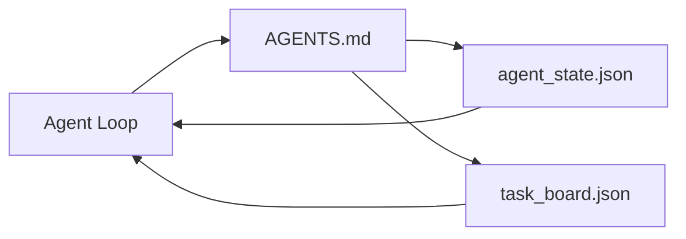

# The Minimal Agent Workbench

> 最小可用的 workbench（工作台）只需要三个文件：一个根 instructions router（指令路由器）、一个 state file（状态文件）和一个 task board（任务板）。其他一切都建立在这之上。如果一个仓库连这三个文件都承载不了，没有模型能拯救它。

**Type:** Build
**Languages:** Python (stdlib)
**Prerequisites:** Phase 14 · 31 (Why Capable Models Still Fail)
**Time:** ~45 分钟

## Learning Objectives

- 定义构成最小可用 workbench 的三个文件。
- 解释为什么一个简短的根 router 优于一份冗长的 monolithic（单体） `AGENTS.md`。
- 构建一个 agent 每轮都能读取、每轮结束都能写入的 state file。
- 构建一个无需 chat history（聊天历史）即可在 multi-session（多会话）工作中存活的 task board。

## The Problem

大多数团队构建 workbench 的方式是写一份 3000 行的 `AGENTS.md` 然后认为万事大吉。模型加载它，忽略它无法总结的部分，仍然在它一直失败的相同 surface 上失败。

你需要相反的做法。一个微小的根文件，只在相关时将 agent 路由到更深层的文件。agent 行动前读取、行动后写入的 durable（持久）state。一个说明哪些在飞、哪些被阻塞、哪些待办的任务板。

三个文件。每个都有明确职责。每个都足够 machine-readable（机器可读），以便日后演化为真正的系统。

## The Concept



### AGENTS.md 是一个 router，不是 manual

一份好的 `AGENTS.md` 很短。它指向：

- State file（你在哪里）。
- Task board（还有什么待办）。
- Deeper rules（在 `docs/agent-rules.md` 下）。
- Verification command（如何知道它生效了）。

任何更长的内容都放入更深层文档，仅在需要时加载。长 manual 会被忽略。短 router 会被遵循。

### agent_state.json 是 system of record（记录系统）

State 承载：active task id（活跃任务 ID）、touched files（已触碰文件）、assumptions made（所做假设）、blockers（阻塞项）和 next action（下一步行动）。agent 每轮都读取它。下一个 session 读取它而不是重放 chat。

State 以文件形式存在，因为 chat history 不可靠。Session 会死亡。对话会被截断。文件不会。

### task_board.json 是 queue（队列）

Task board 承载每个带有状态 `todo | in_progress | done | blocked` 的任务。它是 agent 在 state 为空时拉取的队列，也是你想知道 agent 是否正轨时阅读的队列。

Board 上的一个任务有 id、goal、owner（`builder`、`reviewer` 或 `human`）和 acceptance criteria（验收标准）。Board 故意保持小巧：当它增长到超过一屏时，你面临的是 planning problem（规划问题），而非 board problem。

### 三个文件是底线，不是天花板

后续课程会添加 scope contracts、feedback runners、verification gates、reviewer checklists 和 handoff packets。这里的三个文件是它们全部假设的基础。

## Build It

`code/main.py` 将最小 workbench 写入一个空仓库，并演示一个单 agent turn，该 turn：

1. 读取 `agent_state.json`。
2. 如果 state 为空，从 `task_board.json` 拉取下一个任务。
3. 在 scope 内触碰一个文件。
4. 写回更新后的 state。

运行方式：

```
python3 code/main.py
```

脚本在自身旁边创建 `workdir/`，放下三个文件，运行一轮，并打印 diff。重新运行它可以看到第二轮如何接续第一轮中断的地方。

## Use It

在生产 agent 产品中，相同的三个文件以不同名称出现：

- **Claude Code:** `AGENTS.md` 或 `CLAUDE.md` 作为 router，`.claude/state.json` 风格的存储作为 state，hooks 作为 board。
- **Codex / Cursor:** workspace rules 作为 router，session memory 作为 state，chat sidebar 中的 queued tasks 作为 board。
- **Custom Python agent:** 你刚刚编写的相同文件。

名称在变。形状不变。

## Production patterns in the wild

当三个模式叠加在其上时，最小 workbench 能在真实 monorepos（单体仓库）中存活。它们是独立的；根据你的仓库实际需要选择。

**Nested `AGENTS.md` with nearest-wins precedence（最近优先的嵌套 AGENTS.md）。** OpenAI 在其主仓库中放置了 88 份 `AGENTS.md`，每份子组件一份。Codex、Cursor、Claude Code 和 Copilot 都从工作文件走向仓库根目录，沿途拼接每一份找到的 `AGENTS.md`。子目录文件扩展根文件。Codex 添加了 `AGENTS.override.md` 以替换而非扩展；override 机制是 Codex 特有的，为跨工具工作应避免使用。Augment Code 的测量才是真正重要的一行：最好的 `AGENTS.md` 文件带来的质量提升相当于从 Haiku 升级到 Opus；最差的比没有文件还糟。

**即使看起来像是覆盖，也要拒绝的反模式。** 冲突的 instructions 会静默将 agent 从 interactive mode（交互模式）降级为 greedy mode（贪婪模式）（ICLR 2026 AMBIG-SWE：48.8% → 28% 解决率）；用数字优先级而不是扁平堆叠。无法验证的 style rules（如"遵循 Google Python Style Guide"）且没有 enforcement command 会让 agent 发明合规性；将每条 style rule 与精确的 lint command 配对。以 style 开头会 bury（埋没）verification path；commands 优先，style 最后。为人类而非 agent 写作会浪费 context budget；简洁是一种特性。

**Cross-tool symlinks（跨工具符号链接）。** 一个根文件配合 symlinks（`ln -s AGENTS.md CLAUDE.md`，`ln -s AGENTS.md .github/copilot-instructions.md`，`ln -s AGENTS.md .cursorrules`）让每个 coding agent 都基于相同的 source of truth（真相来源）。Nx 的 `nx ai-setup` 从单一配置自动化这一过程，覆盖 Claude Code、Cursor、Copilot、Gemini、Codex 和 OpenCode。

## Ship It

`outputs/skill-minimal-workbench.md` 为任何新仓库生成三文件 workbench：一个针对项目调优的 `AGENTS.md` router、一个带有正确 keys 的 `agent_state.json`，以及一个以当前 backlog 为种子的 `task_board.json`。

## Exercises

1. 给 `agent_state.json` 添加一个 `last_run` 时间戳。如果文件超过 24 小时，拒绝运行，除非操作员确认。
2. 给 task board 添加一个 `priority` 字段，并改变 puller 使其总是选择最高优先级的 `todo`。
3. 将 `task_board.json` 迁移到 JSON Lines，使每个任务成为一行，在版本控制中 diff 是干净的。
4. 编写一个 `lint_workbench.py`，如果 `AGENTS.md` 超过 80 行或引用了不存在的文件，则失败。
5. 决定如果丢失三个文件之一，哪个会造成最大伤害。为它辩护。

## Key Terms

| 术语 | 人们怎么说 | 它实际意味着什么 |
|------|----------|----------------|
| Router | `AGENTS.md` | 简短的根文件，指向 agent 到更深文档和文件 |
| State file | "那些笔记" | agent 所在位置的 machine-readable（机器可读）记录，每轮写入 |
| Task board | "那个 backlog" | 带有状态、owner、acceptance 的工作 JSON queue |
| System of record | "真相来源" | 当 chat 消失时，workbench 视为权威的文件 |

## Further Reading

- [agents.md — the open spec](https://agents.md/) — 被 Cursor、Codex、Claude Code、Copilot、Gemini、OpenCode 采纳
- [Augment Code, A good AGENTS.md is a model upgrade. A bad one is worse than no docs at all](https://www.augmentcode.com/blog/how-to-write-good-agents-dot-md-files) — 可测量的质量跃升
- [Blake Crosley, AGENTS.md Patterns: What Actually Changes Agent Behavior](https://blakecrosley.com/blog/agents-md-patterns) — 什么在经验上有效，什么无效
- [Datadog Frontend, Steering AI Agents in Monorepos with AGENTS.md](https://dev.to/datadog-frontend-dev/steering-ai-agents-in-monorepos-with-agentsmd-13g0) — 实践中的嵌套优先级
- [Nx Blog, Teach Your AI Agent How to Work in a Monorepo](https://nx.dev/blog/nx-ai-agent-skills) — 单一来源生成覆盖六个工具
- [The Prompt Shelf, AGENTS.md Best Practices: Structure, Scope, and Real Examples](https://thepromptshelf.dev/blog/agents-md-best-practices/) — 经得起审查的 section ordering
- [Anthropic, Claude Code subagents and session store](https://docs.anthropic.com/en/docs/agents-and-tools/claude-code/sub-agents)
- Phase 14 · 31 — 此最小 workbench 吸收的 failure modes
- Phase 14 · 34 — 此课预览的 durable state schema
