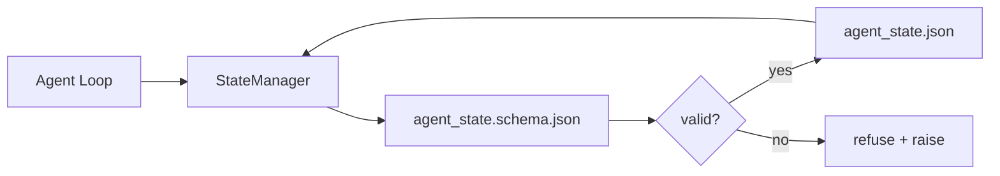

# Repo Memory and Durable State

> Chat history（聊天历史）是 volatile（易失的）。仓库是 durable（持久的）。workbench（工作台）将 agent state（代理状态）存储在版本化文件中，以便下一个 session（会话）、下一个 agent 和下一个 reviewer（审查者）都从相同的 source of truth（真相来源）读取。

**Type:** Build
**Languages:** Python (stdlib + `jsonschema` optional)
**Prerequisites:** Phase 14 · 32 (Minimal Workbench)
**Time:** ~60 分钟

## Learning Objectives

- 定义什么属于 repo memory（仓库记忆），什么属于 chat history。
- 为 `agent_state.json` 和 `task_board.json` 编写 JSON Schema。
- 构建一个 state manager（状态管理器），能够以原子方式 load（加载）、validate（验证）、mutate（变更）和 persist（持久化）state。
- 使用 schema 在坏写入 corrupt（破坏）workbench 之前拒绝它们。

## The Problem

Agent 完成了一个 session。Chat 关闭。下一个 session 打开并询问从哪里开始。模型说 "let me check the files"，读取 stale notes（过时的笔记），然后重做已经完成的工作。或者更糟，它重写了一篇已完成的文件，因为没人告诉它文件已完成。

workbench 的修复方案是 repo memory：state 以 JSON 文件形式存在于仓库中，在 schema（模式）下写入，atomically（原子地）持久化，在 code review（代码审查）中对 diff 友好。Chat 是 transient feed（瞬时信息流）；仓库是 system of record（记录系统）。

## The Concept



### 什么属于 repo memory

| 属于 | 不属于 |
|------|--------|
| Active task id | Raw chat transcripts（原始聊天记录） |
| Touched files this session | Token-level reasoning traces（令牌级推理轨迹） |
| Assumptions the agent made | "用户似乎很沮丧" |
| Open blockers（开放阻塞项） | Sampled completions（采样补全） |
| Next action | Vendor-specific model ids |

测试标准是耐久性：三个月后在 CI rerun 中这会是有用的吗？如果是，放入 repo。如果不是，放入 telemetry（遥测）。

### Schema-first state

JSON Schema 是 contract（合约）。没有它，每个 agent 都会发明新字段，每个 reviewer 都要学习新形状，每个 CI script 都必须为过去的版本做 special-case（特例处理）。有了它，bad write 就是被拒绝的 write。

Schema 涵盖：

- Required keys（必需键）。
- 允许的 `status` 值。
- Forbidden values（禁止值）（例如数组位置的 `null`）。
- Pattern constraints（模式约束）（task ids 匹配 `T-\d{3,}`）。
- Version field（版本字段）用于 migrations（迁移）。

### Atomic writes（原子写入）

State writes 需要 survived partial failures（在部分失败中存活）：写入 tempfile，fsync，rename 覆盖目标。State file 是 source of truth；一个 half-written（半写）的文件比没有文件还糟。

### Migrations（迁移）

当 schema 变化时，在 schema bump 旁边 ship 一个 migration script。State file 携带 `schema_version` 字段；manager 拒绝加载它无法 migrate 的版本的文件。

## Build It

`code/main.py` 实现：

- `agent_state.schema.json` 和 `task_board.schema.json`。
- 一个 stdlib-only validator（仅标准库验证器）（JSON Schema 的子集：required、type、enum、pattern、items）。
- `StateManager.load`、`StateManager.update`、`StateManager.commit`，带有 atomic temp-and-rename writes。
- 一个 demo，变更 state，持久化，重新加载，并证明 round-trip（往返一致性）。

运行方式：

```
python3 code/main.py
```

脚本写入 `workdir/agent_state.json` 和 `workdir/task_board.json`，在两次 turn 中变更它们，并在每一步打印验证后的 state。

## Production patterns in the wild

四个模式将本课的最小实现转化为 multi-agent monorepo（多代理单体仓库）能够存活的东西。

**Atomic temp-and-rename 不是可选的。** 2026 年 3 月 Hive 项目的一份 bug report 清晰地记录了 failure mode：`state.json` 通过 `write_text()` 写入，异常被捕获并静默处理。Partial writes 让 session 针对 corrupt state（损坏状态）恢复，没有任何信号。修复方法永远是：`tempfile.mkstemp` 在目标文件相同目录中，写入，`fsync`，`os.replace`（在 POSIX 和 Windows 上的 atomic rename）。本课的 `atomic_write` 正是这样做的。

**每次非幂等 tool call 上的 idempotency keys（幂等键）。** 如果 agent 在调用 tool 之后但在 checkpointing result（检查点记录结果）之前崩溃，恢复会重试 tool call。对读取是安全的；对发送邮件、DB inserts、文件上传是危险的。模式：在执行前将每个 tool call ID 记录到 `pending_calls.jsonl` 中。重试时，检查 ID；如果存在，跳过调用并使用缓存结果。Anthropic 和 LangChain 都在 2026 年的指南中提到这一点；LangGraph 的 checkpointer 出于相同原因持久化 pending writes。

**将大型 artifacts 与 state 分离。** 不要在 `agent_state.json` 中存储 CSV、长 transcripts 或 generated files。将 artifact 作为单独的文件保存（或上传到 object storage），只在 state 中保留 path。Checkpoints 保持小巧快速；artifacts 独立增长。

**Event sourcing for audit（审计的事件溯源），snapshots for resume（恢复的快照）。** 在每次 mutation 时追加到 event log（`state.events.jsonl`）；定期 snapshot 到 `state.json`。恢复读取 snapshot，然后 replay snapshot timestamp 之后的任何 events。这消耗更多磁盘，但让你能 verbatim（逐字）回放 agent 决策 — 在调试 long-horizon runs 时至关重要。与 Postgres 内部使用 WAL 的形状相同。

**Schema migrations or refuse to load（模式迁移或拒绝加载）。** `schema_version` 整数是 contract。当 manager 加载 unknown version 的文件时，它拒绝读取。在 schema bump 旁边 ship 一个 migration script；`tools/migrate_state.py` 在每个 startup 上幂等运行。

## Use It

在生产环境中：

- **LangGraph checkpointers。** 相同的理念，不同的存储。Checkpointer 将 graph state 持久化到 SQLite、Postgres 或自定义后端。本课教授的 schema 是当 checkpointer 死亡且你需要手动读取 state 时所需的东西。
- **Letta memory blocks。** 带有 structured schemas 的 persistent blocks（Phase 14 · 08）。相同的长久运行 persona 范围学科。
- **OpenAI Agents SDK session store。** 可插拔后端，schema-aware。本课的 state file 是 local-file backend。

## Ship It

`outputs/skill-state-schema.md` 生成 project-specific JSON Schema 对（state + board）、一个 wired to atomic writes 的 Python `StateManager`，以及一个 migration scaffold，以便下一个 schema bump 不会破坏 workbench。

## Exercises

1. 添加一个 `last_human_touch` 时间戳。拒绝在人类编辑五秒内的任何 agent 写入。
2. 扩展 validator 以支持 `oneOf`，使 task 可以是 build task 或 review task，带有不同的 required fields。
3. 添加 `schema_version` 字段并编写从 v1 到 v2 的 migration（将 `blockers` 重命名为 `risks`）。
4. 将存储后端从本地文件迁移到 SQLite。保持 `StateManager` API 不变。
5. 让两个 agent 针对同一个 state file 进行 50 ms 写入竞速。会出什么问题，atomic rename 如何拯救你？

## Key Terms

| 术语 | 人们怎么说 | 它实际意味着什么 |
|------|----------|----------------|
| Repo memory | "笔记文件" | 存储在仓库 tracked files 中、在 schema 下的 state |
| Schema-first | "验证输入" | 在 writer 之前定义 contract，拒绝 drift（漂移） |
| Atomic write | "只需重命名" | 写入 temp，fsync，rename，使 partial failures 无法 corrupt |
| Migration | "Schema bump" | 将 vN state 转换为 v(N+1) state 的脚本 |
| System of record | "真相来源" | workbench 视为权威的 artifact |

## Further Reading

- [JSON Schema specification](https://json-schema.org/specification.html)
- [LangGraph checkpointers](https://langchain-ai.github.io/langgraph/concepts/persistence/)
- [Letta memory blocks](https://docs.letta.com/concepts/memory)
- [Fast.io, AI Agent State Checkpointing: A Practical Guide](https://fast.io/resources/ai-agent-state-checkpointing/) — schema-first checkpointing with idempotency
- [Fast.io, AI Agent Workflow State Persistence: Best Practices 2026](https://fast.io/resources/ai-agent-workflow-state-persistence/) — concurrency control, TTL, event sourcing
- [Hive Issue #6263 — non-atomic state.json writes silently ignored](https://github.com/aden-hive/hive/issues/6263) — 真实项目中的 failure mode
- [eunomia, Checkpoint/Restore Systems: Evolution, Techniques, Applications](https://eunomia.dev/blog/2025/05/11/checkpointrestore-systems-evolution-techniques-and-applications-in-ai-agents/) — 从 OS 历史应用到 agent 的 CR primitives
- [Indium, 7 State Persistence Strategies for Long-Running AI Agents in 2026](https://www.indium.tech/blog/7-state-persistence-strategies-ai-agents-2026/)
- [Microsoft Agent Framework, Compaction](https://learn.microsoft.com/en-us/agent-framework/agents/conversations/compaction) — vendor checkpoint manager
- Phase 14 · 08 — memory blocks 和 sleep-time compute
- Phase 14 · 32 — 本课 schema 化的三文件最小实现
- Phase 14 · 40 — 从同一 schema 读取的 handoff packets
