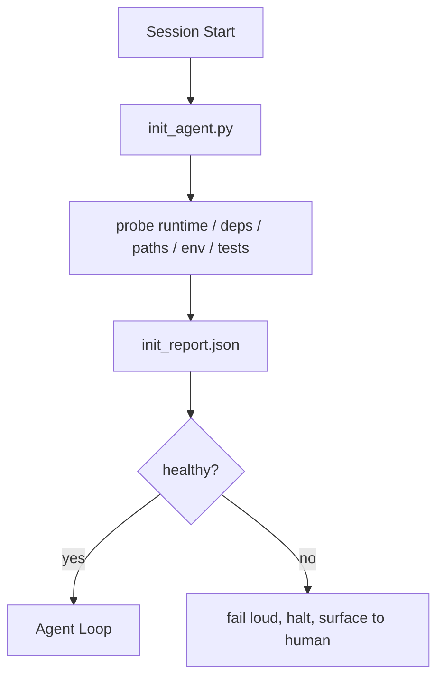

# Initialization Scripts for Agents

> 每一个 cold start（冷启动）的 session 都要缴税。Agent 读取相同的文件，重试相同的探测，重新发现相同的路径。Init script（初始化脚本）只缴一次税，并将答案写入 state。

**Type:** Build
**Languages:** Python (stdlib)
**Prerequisites:** Phase 14 · 32 (Minimal Workbench), Phase 14 · 34 (Repo Memory)
**Time:** ~45 分钟

## Learning Objectives

- 识别 agent 在每个 session 中永远不应重做的工作。
- 构建一个 deterministic init script（确定性初始化脚本），探测 runtime、dependencies 和 repo health。
- 持久化 probe result（探测结果），使 agent 读取它而不是重新运行 checks。
- 当 initialization 失败时，fail loud（大声失败）、fail fast（快速失败），并且只有一个地方需要查看。

## The Problem

打开一个 session。Agent 猜测 Python 版本。猜测 test command。五次列出仓库根目录以寻找 entry point。尝试导入一个未安装的包。询问用户 config file 在哪里。当它做出真正的编辑时，一万个 tokens 已经花在本应是一个单一脚本的 setup work 上。

修复方案是一个 initialization script，在 agent 做任何事情之前运行，并写入一个 `init_report.json`，agent 在 startup 时读取它。

## The Concept



### Init script 探测什么

| Probe | 为什么重要 |
|-------|-----------|
| Runtime versions | 错误的 Python 或 Node 版本意味着静默的错误版本 bug |
| Dependency availability | 现在捕获缺失的包的成本是之后十倍 |
| Test command | Agent 必须知道如何验证；如果命令缺失，workbench 就坏了 |
| Repo paths | Hard-coded paths 会漂移；一次性解析并 pin 住 |
| Environment variables | 缺失的 `OPENAI_API_KEY` 是一个 failure surface，不是 runtime mystery |
| State + board freshness | 来自 crashed session 的 stale state 是一个 footgun（陷阱） |
| Last-known-good commit | 为 session 结束时的 handoff diff 提供锚点 |

### Fail loud, fail fast, fail in one place

Probe failure 意味着 halt 并 surface 给人类。没有 "agent 会自己解决的"。Init 的全部意义就是当 workbench 坏了时拒绝启动。

### Idempotent（幂等）

连续运行两次。第二次运行应该是一个 no-op，除了一个 fresh timestamp。Idempotency 是让你能将脚本接入 CI、hooks 或 pre-task slash command 的原因。

### Init versus startup rules

Rules（Phase 14 · 33）描述必须为真才能行动的条件。Init 是建立这些 rules 可以被检查的脚本。没有 init 的 rules 变成 "be careful"。没有 rules 的 init 变成一个精致的失败。

## Build It

`code/main.py` 实现 `init_agent.py`：

- 五个 probes：Python version、通过 `importlib.util.find_spec` 列出的 dependencies、test command resolvability、required env vars、state file freshness。
- 每个 probe 返回 `(name, status, detail)`。
- 脚本写入 `init_report.json`，包含完整 probe set，如果任何 block-severity probe 失败则 exit non-zero。

运行方式：

```
python3 code/main.py
```

脚本打印 probes 表格，写入 `init_report.json`，在 happy path 上 exit zero，或在失败时 exit non-zero 并列出失败的 probes。

## Production patterns in the wild

三个模式将一个有用的 init script 与 ceremony（仪式）区分开。

**Last-known-good commit anchoring（最后已知良好提交锚定）。** 针对 `LKG` 文件探测当前 commit，该文件在最后一次成功 merge 时写入。如果 diff 超过 budget（默认 50 个文件），拒绝启动并要求人类 ratify（批准）新的 baseline。这就是 Cloudflare 的 AI Code Review 用来 scope reviewer agents 的方法：每个 review session 都针对相同的 last-known-good 锚定，永远不会跨 session 累积 drift。

**Lock files with TTL（带 TTL 的锁文件）。** 在第一次成功的 probe pass 后写入 `prereqs.lock`。后续运行信任该锁 N 小时（默认 24h）并跳过昂贵的 probes。Init script 首先读取锁；如果它是新鲜的且 dependency manifest hash 匹配，则 short-circuits（短路）。这与 Docker 用于 layer caches 的模式相同：idempotent probe + content hash = skip。

**Hot path 中没有网络、没有 LLM、没有惊喜。** Init probes 是 deterministic plumbing（确定性管道）。调用 LLM 来 classify failure 或访问外部服务检查 license 的 probe 不是 probe；它是一个 workflow。如果 probe 在 dry run 中耗时超过三秒，将其视为 workbench smell 并要么移出 init，要么缓存其结果。

## Use It

在生产环境中：

- **Claude Code hooks。** `pre-task` hook 调用 init script，如果失败则拒绝启动 agent。
- **GitHub Actions。** 一个 `setup-agent` job 运行 init script；agent job 依赖于它。
- **Docker entrypoint。** Agent 容器在 exec agent runtime 之前运行 init script；失败时 logs surface。

Init script 是可移植的，因为它不调用特定框架。Bash、Make 或 tasks file 都可以包装它。

## Ship It

`outputs/skill-init-script.md` 采访项目，将其 setup work 分类为 probes，并发出 project-specific `init_agent.py` 和一个 CI workflow，在任何 agent step 之前运行它。

## Exercises

1. 添加一个 probe，将当前 commit 与 last-known-good commit 进行 diff，如果超过 50 个文件变更则拒绝启动。
2. 将脚本接入写入 `prereqs.lock` 文件，如果锁超过七天则拒绝启动。
3. 添加一个 `--fix` 标志，自动安装缺失的 dev dependencies，但未经批准绝不修改 runtime dependencies。
4. 将 probes 从 hardcoded functions 移动到 YAML registry。为 trade-off 辩护。
5. 为每个 probe 添加 timing budget。耗时超过三秒的 probe 是一个 workbench smell。

## Key Terms

| 术语 | 人们怎么说 | 它实际意味着什么 |
|------|----------|----------------|
| Probe | "一个检查" | 返回 `(name, status, detail)` 的确定性 function |
| Init report | "Setup 输出" | 放在 state 旁边、带有 probe 结果的 JSON |
| Idempotent | "安全重运行" | 连续两次运行产生相同的报告，仅 timestamp 不同 |
| Fail loud | "不要吞掉" | Halt 并 surface 给人类；没有静默 fallback |
| Setup tax | "Bootstrap 成本" | Agent 每个 session 重新发现显而易见事物所花费的 tokens |

## Further Reading

- [Anthropic, Effective harnesses for long-running agents](https://www.anthropic.com/engineering/effective-harnesses-for-long-running-agents)
- [GitHub Actions, composite actions for setup](https://docs.github.com/en/actions/sharing-automations/creating-actions/creating-a-composite-action)
- [microservices.io, GenAI dev platform: guardrails](https://microservices.io/post/architecture/2026/03/09/genai-development-platform-part-1-development-guardrails.html) — pre-commit + CI checks as init
- [Augment Code, How to Build Your AGENTS.md (2026)](https://www.augmentcode.com/guides/how-to-build-agents-md) — init expectations
- [Codex Blog, Codex CLI Context Compaction](https://codex.danielvaughan.com/2026/03/31/codex-cli-context-compaction-architecture/) — session start as compaction-aware init
- Phase 14 · 33 — 此脚本启用的 rule set
- Phase 14 · 34 — 此脚本 seed 的 state file
- Phase 14 · 38 — 此脚本 feed 的 verification gate
- Phase 14 · 40 — 消费 init report 的 last-known-good 的 handoff
