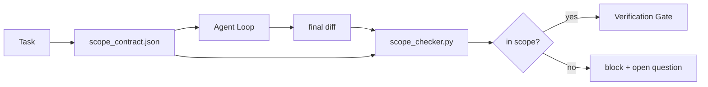

# Scope Contracts and Task Boundaries (范围契约与任务边界)

> 模型不知道工作在哪里结束。范围契约（scope contract）是一份针对单个任务的文件，说明工作从哪里开始、在哪里结束，以及如果溢出该如何回滚。契约将"保持在范围内"从一个愿望变成了一项检查。

**Type:** Build
**Languages:** Python (stdlib)
**Prerequisites:** Phase 14 · 32 (Minimal Workbench), Phase 14 · 33 (Rules as Constraints)
**Time:** ~50 分钟

## Learning Objectives (学习目标)

- 编写一个范围契约（scope contract），让智能体（agent）在任务开始时读取，验证器在任务结束时读取。
- 指定允许的文件、禁止的文件、验收标准（acceptance criteria）、回滚计划（rollback plan）和审批边界（approval boundaries）。
- 实现一个范围检查器（scope checker），将差异（diff）与契约进行对比，并标记违规项。
- 让范围蔓延（scope creep）变得可见、自动且可审查。

## The Problem (问题)

智能体会蔓延。任务是"修复登录 bug"。差异（diff）接触了登录路由、邮件助手、数据库驱动、README 和发布脚本。每一次接触在当时都有合理的理由。合在一起，它们构成了与被审查时不同的变更。

范围蔓延（scope creep）是智能体工作中最未被监控的故障模式，因为智能体诚实地叙述每一步。修复方案不是更严格的提示词，而是磁盘上的契约，说明承诺了什么，以及将结果与承诺进行对比的检查。

## The Concept (概念)



### What goes in a scope contract (范围契约包含什么)

| Field | Purpose |
|-------|---------|
| `task_id` | 链接到看板上的任务 |
| `goal` | 审查者可以验证的一句话 |
| `allowed_files` | 智能体可以写入的通配符（globs） |
| `forbidden_files` | 智能体即使意外也不能触碰的通配符 |
| `acceptance_criteria` | 证明完成的测试命令或断言行 |
| `rollback_plan` | 如果需要停止，操作员可以执行的一段文字 |
| `approvals_required` | 超出范围需要明确人工签字的行为 |

没有 `forbidden_files` 的契约是不完整的。负面空间（negative space）是契约的一半。

### Globs, not raw paths (通配符，而非原始路径)

真实的仓库会移动文件。将契约锁定到通配符（`app/**/*.py`、`tests/test_signup*.py`），这样会话之间的重构不会使契约失效。

### Rollback is part of scope (回滚是范围的一部分)

列出如何回滚会迫使契约作者思考可能出错的地方。一个你无法从中回滚的契约，是一个不应该被批准的契约。

### Scope check is a diff check (范围检查是差异检查)

智能体写下一个差异（diff）。检查器读取差异、允许的通配符、禁止的通配符，以及任何运行的验收命令列表。每个违规都是验证门（verification gate）可以拒绝的标记发现。

### Two altitudes of scope: the feature list and the task contract (两种范围高度：功能列表和任务契约)

范围契约限定一个任务。它不限定整个项目。智能体可以在登录修复的契约内完美地保持，然后在下一轮决定项目还需要一个设置页面、一个暗模式切换和一个路由器重写。契约从未被问及哪些工作属于项目范围，只问了哪些文件属于任务范围。

第二个高度需要它自己的原语：一个智能体在会话开始时读取的 `feature_list.json`。它是以机器可读的、有序的文件形式存在的项目待办事项。智能体恰好选择一个 `status` 为 `todo` 的功能，将其 `id` 写入活跃的范围契约，并被禁止在同一会话中启动第二个功能。"一次一个功能"不再是智能体可以理性绕过的提示词中的一行，而是它从磁盘读取的值和门强制执行的检查。

```json
{
  "project": "knowledge-base",
  "active": "import-pdf",
  "features": [
    { "id": "import-pdf",   "status": "in_progress", "goal": "import a PDF into the library",        "done_when": "pytest tests/test_import.py && a sample PDF appears in the library view" },
    { "id": "full-text-search", "status": "todo",     "goal": "search document text and rank hits",   "done_when": "query returns ranked results with snippets" },
    { "id": "cite-answers", "status": "todo",         "goal": "answers carry source citations",        "done_when": "every answer renders at least one clickable citation" }
  ]
}
```

| Field | Purpose |
|-------|---------|
| `active` | 当前会话可以触碰的单一功能；为空表示选择一个并设置它 |
| `features[].id` | 稳定 slug，范围契约的 `task_id` 指向它 |
| `features[].status` | `todo`、`in_progress`、`done`、`blocked`；一次只有一个 `in_progress` |
| `features[].goal` | 审查者可以验证的一句话 |
| `features[].done_when` | 将 `in_progress` 翻转为 `done` 的验收行 |

两条规则使列表具有承载力而非装饰性。首先，"最多一个 `in_progress`"的不变性本身就是一个启动检查（Phase 14 · 33）：如果列表显示两个，会话拒绝启动，直到人工解决。其次，功能列表是一个文件，而不是聊天消息，因为聊天会滚出上下文，而文件跨会话、跨智能体持久存在。交接（handoff，Phase 14 · 40）将完成功能的状态写回 `done`，因此下一个会话打开时面对的是一个准确的看板，而不是重新推导还有什么剩余工作。

契约和列表通过最小权限（least privilege）组合，与下面描述的合并相同：任务契约的 `allowed_files` 必须位于活跃功能触碰的范围之内，绝不能超出。

## Build It (动手实现)

`code/main.py` 实现：

- `scope_contract.json` 模式（JSON Schema 子集，通配符数组）。
- 一个差异（diff）解析器，将触碰的文件列表加上运行的命令列表转换为 `RunSummary`。
- 一个 `scope_check`，针对契约返回 `(violations, in_scope, off_scope)`。
- 两次演示运行：一次保持在范围内，一次蔓延。检查器标记蔓延，显示具体文件和原因。

运行方式：

```
python3 code/main.py
```

输出：契约、两次运行、每次运行的裁决，以及保存的 `scope_report.json`。

## Production patterns in the wild (生产中的实践模式)

一位运行"specsmaxxing"（在调用智能体之前使用 YAML 范围契约）的实践者报告，在三周内，兔子洞（rabbit-hole）比率从 52% 降到 21%，而且没有改变智能体。是契约起了作用，而不是模型。三种模式使收益得以保持。

**违规预算（violation budget），而非二元失败。** `agent-guardrails`（Claude Code、Cursor、Windsurf、Codex via MCP 使用的开源合并门）为每个任务配备了一个 `violationBudget`：预算内的轻微范围滑移作为警告（warning）显示；只有超出预算时，合并门才会拒绝。与 `violationSeverity: "error" | "warning"` 配对。预算是一个会发布（ship）的门和一个会被团队禁用的门之间的区别。

**按路径族的不对称严重性。** 对 `docs/**` 的越界写入通常是 `warn`；对 `scripts/**`、`migrations/**`、`config/prod/**` 的越界写入永远是 `block`。这种不对称性必须存在于契约中，而不是运行时中，因为它是项目特定的，并且每个任务都会变化。

**文件预算旁边的时间预算和网络预算。** `time_budget_minutes` 字段限定挂钟时间；运行时超过它会拒绝继续，除非重新批准。`network_egress` 主机名白名单阻止智能体安静地访问不属于任务的外部 API。这些也是范围维度；文件通配符是必要的，但不是充分的。

**多契约合并语义（最小权限）。** 当两个范围契约同时适用时（例如，项目范围契约加任务特定契约），合并规则是：**交集** `allowed_files`（两个契约都必须允许该路径），**并集** `forbidden_files`（任一契约都可以禁止），`time_budget_minutes` 取最严格的（最小值），`approvals_required` 累积。`network_egress` 为 `None` 表示不执行，`[]` 表示拒绝所有，`[...]` 作为白名单；在合并下，`None` 听从另一方，两个列表取交集，拒绝所有保持拒绝所有。在契约模式中声明这一点，以便合并是机械且可审查的。

## Use It (使用它)

生产模式：

- **Claude Code 斜杠命令。** `/scope` 命令编写契约并将其固定为会话上下文。子智能体在行动前读取契约。
- **GitHub PRs。** 将契约作为 JSON 文件推入 PR 正文或作为检入的工件。CI 针对合并差异运行范围检查器。
- **LangGraph 中断。** 范围违规触发中断；处理程序询问人类契约需要增长还是智能体需要后退。

契约随任务一起旅行。当任务关闭时，契约归档在 `outputs/scope/closed/` 下。

## Ship It (交付它)

`outputs/skill-scope-contract.md` 为任务描述生成一个范围契约和一个通配符感知检查器，该检查器在每次智能体差异时于 CI 中运行。

## Exercises (练习)

1. 添加一个 `network_egress` 字段，列出允许的外部主机。拒绝访问其他主机的运行。
2. 扩展检查器，对 `docs/**` 软失败，对 `scripts/**` 硬失败。论证这种不对称性。
3. 使用静态规则集（无 LLM）从 `goal` 字段派生 `allowed_files`。在第一个边界情况上会发生什么？
4. 添加一个 `time_budget_minutes`，一旦挂钟时间超过它就拒绝继续。
5. 针对同一个差异运行两个契约。当两者都适用时，正确的合并语义是什么？

## Key Terms (关键术语)

| Term | What people say | What it actually means |
|------|----------------|------------------------|
| Scope contract (范围契约) | "The task brief" | 每个任务的 JSON，列出允许/禁止的文件、验收标准、回滚计划 |
| Scope creep (范围蔓延) | "It also touched..." | 同一任务中契约外的文件被变更 |
| Rollback plan (回滚计划) | "We can revert" | 停止时操作员可执行的一段文字运行手册 |
| Approval boundary (审批边界) | "Needs sign-off" | 契约中列为需要明确人工批准的行为 |
| Diff check (差异检查) | "Path audit" | 将触碰的文件与契约通配符进行对比 |

## Further Reading (延伸阅读)

- [LangGraph human-in-the-loop interrupts](https://langchain-ai.github.io/langgraph/concepts/human_in_the_loop/)
- [OpenAI Agents SDK tool approval policies](https://platform.openai.com/docs/guides/agents-sdk)
- [logi-cmd/agent-guardrails — merge gates and scope validation](https://github.com/logi-cmd/agent-guardrails) — violation budgets, severity tiers
- [Dev|Journal, Preventing AI Agent Configuration Drift with Agent Contract Testing](https://earezki.com/ai-news/2026-05-05-i-built-a-tiny-ci-tool-to-keep-ai-agent-configs-from-drifting-in-my-repo/) — `--strict` mode without external deps
- [Agentic Coding Is Not a Trap (production logs)](https://dev.to/jtorchia/agentic-coding-is-not-a-trap-i-answered-the-viral-hn-post-with-my-own-production-logs-33d9) — specsmaxxing receipts: 52% → 21%
- [OpenCode permission globs](https://opencode.ai/docs/agents/) — fine-grained per-permission scope
- [Knostic, AI Coding Agent Security: Threat Models and Protection Strategies](https://www.knostic.ai/blog/ai-coding-agent-security) — scope as part of least privilege
- [Augment Code, AI Spec Template](https://www.augmentcode.com/guides/ai-spec-template) — three-tier boundary system (must/ask/never)
- Phase 14 · 27 — prompt injection defenses that pair with scope locks
- Phase 14 · 33 — the rule set this contract specializes per task
- Phase 14 · 38 — the verification gate the checker reports into
