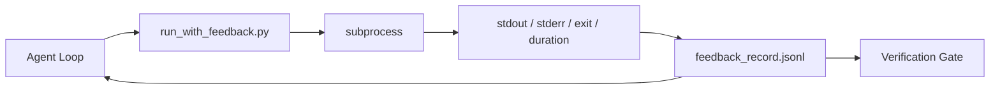

# Runtime Feedback Loops (运行时反馈循环)

> 看不到真实命令输出的智能体只能靠猜测。反馈运行器（feedback runner）将 stdout、stderr、退出码（exit code）和耗时捕获为结构化记录，下一轮可以读取。然后智能体对事实做出反应，而不是对它自己对事实的预测做出反应。

**Type:** Build
**Languages:** Python (stdlib)
**Prerequisites:** Phase 14 · 32 (Minimal Workbench), Phase 14 · 35 (Init Script)
**Time:** ~50 分钟

## Learning Objectives (学习目标)

- 区分运行时反馈（runtime feedback）与可观测性遥测（observability telemetry）。
- 构建一个反馈运行器（feedback runner），包装 shell 命令并持久化结构化记录。
- 以确定性方式截断大输出，使循环保持在 token 预算（token budget）内。
- 当反馈缺失时拒绝推进循环。

## The Problem (问题)

智能体说"正在运行测试"。下一条消息说"所有测试都通过了"。现实是没有测试运行。智能体想象了输出，或者运行了命令但从未读取结果，或者读取了结果但静默截断了失败行。

反馈运行器消除了这个缺口。每个命令都经过运行器。每条记录携带命令、捕获的 stdout 和 stderr、退出码（exit code）、挂钟耗时和一行智能体备注。智能体在下一轮读取记录。验证门（verification gate）在任务结束时读取记录。

## The Concept (概念)



### What goes in a feedback record (反馈记录包含什么)

| Field | Why it matters |
|-------|----------------|
| `command` | 精确的 argv，没有 shell 扩展意外 |
| `stdout_tail` | 最后 N 行，确定性截断（deterministic truncation） |
| `stderr_tail` | 最后 N 行，与 stdout 分开 |
| `exit_code` | 明确的成功信号 |
| `duration_ms` | 暴露缓慢探查和失控进程 |
| `started_at` | 用于回放的时间戳 |
| `agent_note` | 智能体在读取结果前写的一行预期内容 |

### Truncation is deterministic (截断是确定性的)

50 MB 的日志会摧毁循环。运行器截断头部和尾部，并带有 `...truncated N lines...` 标记，是确定性的，因此相同输出总是产生相同记录。不采样；智能体需要看到的部分（最终错误、最终摘要）位于尾部。

### Feedback versus telemetry (反馈与遥测)

遥测（telemetry，Phase 14 · 23，OTel GenAI 约定）是供人工操作员跨时间审查运行的。反馈是供本轮运行的下一轮使用的。它们共享字段，但存在于不同文件中，具有不同的保留策略。

### Refuse to advance without feedback (没有反馈就拒绝推进)

如果运行器在捕获退出码之前出错，记录携带 `exit_code: null` 和 `error: <reason>`。智能体循环必须在 `null` 退出码上拒绝声称成功。没有退出码，没有进展。

## Build It (动手实现)

`code/main.py` 实现：

- `run_with_feedback(command, agent_note)` 包装 `subprocess.run`，捕获 stdout/stderr/exit/duration，确定性截断，追加到 `feedback_record.jsonl`。
- 一个小型加载器，将 JSONL 流式传输到 Python 列表。
- 一个演示，运行三个命令（成功、失败、缓慢）并打印每个命令的最后一条记录。

运行方式：

```
python3 code/main.py
```

输出：三条反馈记录追加到 `feedback_record.jsonl`，每条命令的最后一条记录内联打印。在多次重新运行之间查看文件尾部，观察循环如何累积。

## Production patterns in the wild (生产中的实践模式)

三种模式将运行器硬化到足以发布的程度。

**在写入时脱敏（redact），而非读取时。** 任何接触 stdout 或 stderr 的记录都可能泄漏机密。运行器在 JSONL 追加之前进行脱敏：剥离匹配 `^Bearer `、`password=`、`api[_-]?key=`、`AKIA[0-9A-Z]{16}`（AWS）、`xox[baprs]-`（Slack）的行。读取时脱敏是陷阱；磁盘上的文件才是攻击者能接触到的。每季度根据生产运行时观察到的机密格式审计脱敏模式。

**轮转策略（rotation policy），而非单个文件。** 将 `feedback_record.jsonl` 限制为每个文件 1 MB；溢出时轮转到 `.1`、`.2`，丢弃 `.5`。智能体的循环只读取当前文件，因此运行时成本是有界的。CI 工件存储获得完整的轮转集合。没有轮转，文件会成为每次加载器调用时的瓶颈。

**父命令 ID（parent_command_id）用于重试链。** 每条记录获得 `command_id`；重试携带 `parent_command_id` 指向上一次尝试。审查者的"失败尝试"列表（Phase 14 · 40）和验证门的审计都跟随这条链。没有这个链接，重试看起来像独立的成功，审计隐藏了失败历史。

## Use It (使用它)

生产模式：

- **Claude Code Bash 工具。** 该工具已经捕获 stdout、stderr、exit 和 duration。本课中的运行器是任何智能体产品的框架无关等价物。
- **LangGraph 节点。** 将任何 shell 节点包装在运行器中，以便记录持久存在于图状态之外。
- **CI 日志。** 将 JSONL 管道传输到 CI 工件存储；审查者可以回放任何命令，而无需重新运行会话。

运行器是一个薄包装器，在每次框架迁移中都能幸存，因为它拥有记录的形状。

## Ship It (交付它)

`outputs/skill-feedback-runner.md` 生成一个项目特定的 `run_with_feedback.py`，具有合适的截断预算、连接到工作台的 JSONL 写入器，以及智能体每轮都读取的加载器。

## Exercises (练习)

1. 为每条记录添加一个 `cwd` 字段，以便从不同的目录运行的相同命令可以区分。
2. 添加一个 `redaction` 步骤，剥离匹配 `^Bearer ` 或 `password=` 的行。在固定记录上测试。
3. 通过轮转到 `.1`、`.2` 文件，将 `feedback_record.jsonl` 的总大小限制为 1 MB。为轮转策略辩护。
4. 添加一个 `parent_command_id`，使重试链可见：哪个命令产生了下一个命令消费的输入。
5. 将 JSONL 管道传输到一个微型 TUI，突出显示最新的非零退出码。列出 TUI 在审查中有用必须显示的八个关键功能。

## Key Terms (关键术语)

| Term | What people say | What it actually means |
|------|----------------|------------------------|
| Feedback record (反馈记录) | "Run log" | 包含命令、输出、退出码、耗时的结构化 JSONL 条目 |
| Tail truncation (尾部截断) | "Trim the log" | 确定性的头+尾捕获，使记录适合 token 预算 |
| Refuse-on-null (拒绝 null) | "Block on missing data" | 当 `exit_code` 为 null 时，循环不得推进 |
| Agent note (智能体备注) | "Expectation tag" | 智能体在读取结果前写下的一行预期内容 |
| Telemetry split (遥测分离) | "Two log files" | 反馈供下一轮使用，遥测供操作员使用 |

## Further Reading (延伸阅读)

- [OpenTelemetry GenAI semantic conventions](https://opentelemetry.io/docs/specs/semconv/gen-ai/)
- [Anthropic, Effective harnesses for long-running agents](https://www.anthropic.com/engineering/effective-harnesses-for-long-running-agents)
- [Guardrails AI x MLflow — deterministic safety, PII, quality validators](https://guardrailsai.com/blog/guardrails-mlflow) — redaction patterns as regression tests
- [Aport.io, Best AI Agent Guardrails 2026: Pre-Action Authorization Compared](https://aport.io/blog/best-ai-agent-guardrails-2026-pre-action-authorization-compared/) — pre/post-tool capture
- [Andrii Furmanets, AI Agents in 2026: Practical Architecture for Tools, Memory, Evals, Guardrails](https://andriifurmanets.com/blogs/ai-agents-2026-practical-architecture-tools-memory-evals-guardrails) — observability surfaces
- Phase 14 · 23 — OTel GenAI conventions for the telemetry side
- Phase 14 · 24 — agent observability platforms (Langfuse, Phoenix, Opik)
- Phase 14 · 33 — the rule that demands feedback before declaring done
- Phase 14 · 38 — the verification gate that reads the JSONL
