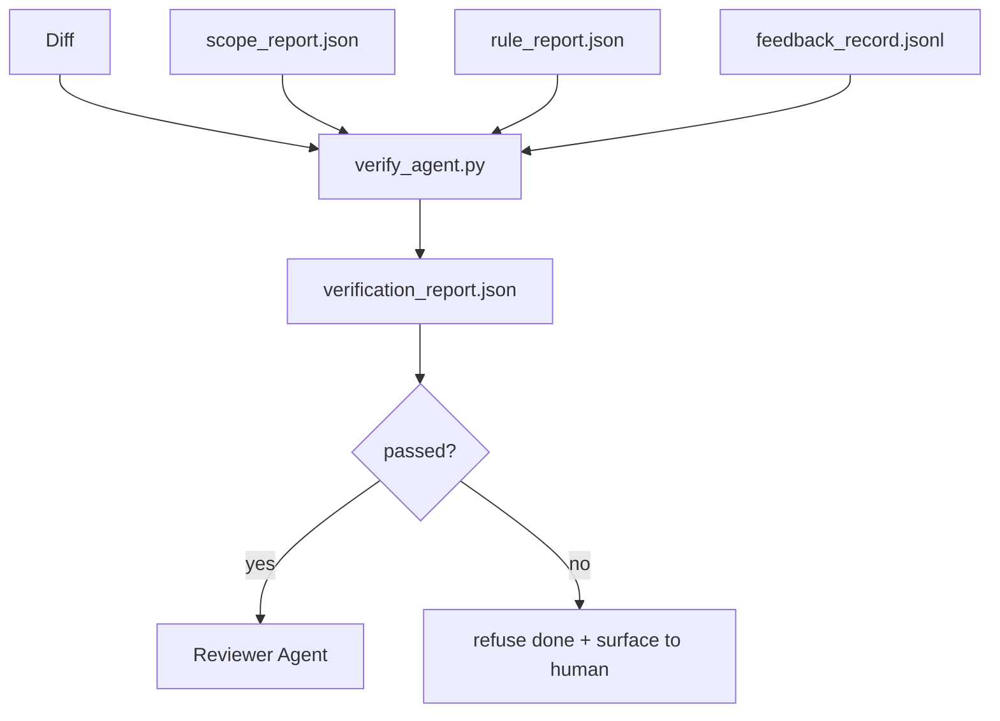

# Verification Gates (验证门)

> 智能体（agent）不能将自己的工作标记为完成。验证门（verification gate）读取范围契约（scope contract）、反馈日志（feedback log）、规则报告（rule report）和差异（diff），并回答一个单一问题：这个任务真的完成了吗？如果门说不，那么任务就没有完成，无论聊天说什么。

**Type:** Build
**Languages:** Python (stdlib)
**Prerequisites:** Phase 14 · 33 (Rules), Phase 14 · 36 (Scope), Phase 14 · 37 (Feedback)
**Time:** ~55 分钟

## Learning Objectives (学习目标)

- 将验证门（verification gate）定义为工作台工件（workbench artifacts）上的确定性函数。
- 将规则报告（rule report）、范围报告（scope report）、反馈记录（feedback records）和差异（diff）组合为单一裁决（verdict）。
- 发出审阅者智能体（reviewer agent）和 CI 都能读取的 `verification_report.json`。
- 在任何阻断严重性（block-severity）的失败上拒绝推进任务，无一例外。

## The Problem (问题)

智能体太容易宣布成功。三种失败形态占主导：

- "Looks good." 模型读取了自己的差异并判定它是正确的。
- "Tests passed." 说得很有信心。没有测试实际运行的记录。
- "Acceptance met." 验收标准被宽松地解释为"任何像完成的东西"。

工作台的解决方案是一个单一的验证门，读取智能体已经产生的工件并做出判断。门是确定性的。门在版本控制中。门接入 CI。智能体无法贿赂它。

## The Concept (概念)



### What the gate checks (门检查什么)

| Check | Source artifact | Severity |
|-------|-----------------|----------|
| All acceptance commands ran | `feedback_record.jsonl` | block |
| All acceptance commands exited zero | `feedback_record.jsonl` | block |
| Scope check has no forbidden writes | `scope_report.json` | block |
| Scope check has no off-scope writes | `scope_report.json` | block or warn |
| All block-severity rules pass | `rule_report.json` | block |
| No `null` exit codes in feedback | `feedback_record.jsonl` | block |
| Touched files match `scope.allowed_files` | both | warn |

一个 `warn` 发现注释裁决；一个 `block` 发现阻止 `passed: true`。

### Deterministic, not probabilistic (确定性的，而非概率性的)

门必须为相同的工件集每次都产生相同的裁决。不使用 LLM 裁判。LLM 裁判属于审查者侧（Phase 14 · 39），那里的目标是定性评估，而非状态。

### One report, one path (一份报告，一条路径)

门在每次任务关闭时发出一份 `verification_report.json`，写入 `outputs/verification/<task_id>.json`。CI 消费相同的路径。多个具有不同路径的门会分叉真相来源。

### Refuse without exception (无一例外地拒绝)

阻断严重性（block-severity）的发现不能被智能体覆盖。它们只能被人类覆盖，并附带记录的 `override_reason` 和 `overridden_by` 用户 ID。覆盖是一项签名变更，而非智能体决策。

## Build It (动手实现)

`code/main.py` 实现：

- 每个输入工件的加载器，全部本地存根以便课程自包含。
- 一个 `verify(task_id, artifacts) -> VerdictReport` 纯函数。
- 一个打印机，显示每项检查结果和最终通过/失败。
- 三个任务场景的演示：干净通过、范围蔓延、缺失验收。

运行方式：

```
python3 code/main.py
```

输出：三份裁决报告，每份保存在脚本旁边。

## Production patterns in the wild (生产中的实践模式)

四种模式将门从"另一个 lint 作业"提升到"决定性的边缘"。

**纵深防御（defense-in-depth），而非单一门。** 预提交钩子（pre-commit hook）→ CI 状态检查 → 预工具授权钩子（pre-tool authz hook）→ 预合并门（pre-merge gate）。每一层都是确定性的，因此一层中的失败会被下一层捕获。microservices.io 的 2026 年 3 月行动手册明确说明：预提交钩子不可绕过，因为与模型侧技能不同，它不依赖智能体遵循指令。验证门位于 CI / 预合并层。

**以确定性检查防御，模型裁判仅用于细微差别。** Anthropic 2026 年的 Hybrid Norm 配对：可验证奖励（单元测试、模式检查、退出码）回答"代码是否解决了问题？"——LLM 评分标准回答"代码是否可读、安全、符合风格？"门运行第一类；审查者（Phase 14 · 39）运行第二类。混合它们会 collapse 信号。

**签名覆盖日志，而非 Slack 线程。** 每次覆盖在 `outputs/verification/overrides.jsonl` 中发出一行，包含：时间戳、发现代码、原因、签名用户、当前 HEAD 提交。运行时拒绝任何缺少签名的覆盖；审计轨迹是 git 追踪的。这是覆盖策略和覆盖表演之间的分界线。

**覆盖率下限（coverage floor）作为一等检查。** 一份 `coverage_report.json` 供给 `coverage_floor`（默认 80%）检查。如果实测覆盖率低于下限或低于上一个合并的下限超过 1 个百分点，门就失败。没有这项检查，智能体会静默删除失败的测试，验证报告保持绿色。

**`--strict` 模式将警告提升为阻断。** 对于发布分支、阻塞发布的 PR 或事件后分类，`--strict` 使每个警告都成为硬失败。该标志按分支选择加入；不是全局默认值，因为到处严格会腐蚀日常流程。

## Use It (使用它)

生产模式：

- **CI 步骤。** `verify_agent` 作业针对智能体的最终工件运行门。合并保护拒绝没有 `passed: true` 的情况。
- **预交接钩子。** 智能体运行时在生成交接文档前调用门。没有绿色裁决，没有交接。
- **手动分类。** 当智能体声称成功而人类怀疑时，操作员读取报告。

门是工作台流程中的决定性边缘。每个其他表面都在它的上游。

## Ship It (交付它)

`outputs/skill-verification-gate.md` 将门接入特定项目：哪些验收命令供给它，哪些规则是阻断严重性，哪些越界写入被容忍，覆盖审计日志如何存储。

## Exercises (练习)

1. 添加一个 `coverage_floor` 检查：测试命令必须产生至少 80% 的覆盖率报告。决定哪个工件携带下限。
2. 支持一个 `--strict` 模式，将每个 `warn` 提升为 `block`。记录严格模式是正确默认值的场景。
3. 使门除了 JSON 外还生成 Markdown 摘要。论证哪些字段属于摘要。
4. 添加一个 `time_since_last_human_touch` 检查：任何在人类按键 60 秒内编辑的文件免除越界标记。
5. 在你的产品上的一个真实智能体差异上运行门。多少发现是真实的，多少是噪音？门需要在何处成长？

## Key Terms (关键术语)

| Term | What people say | What it actually means |
|------|----------------|------------------------|
| Verification gate (验证门) | "The check that stops things" | 工作台工件上的确定性函数，产生通过/失败裁决 |
| Block severity (阻断严重性) | "Hard fail" | 阻止 `passed: true` 并需要签名覆盖的发现 |
| Override log (覆盖日志) | "Why we let it through" | 带有原因和用户 ID 的签名条目，由审查审计 |
| Acceptance command (验收命令) | "The proof" | 零退出意味着 `done` 的 shell 命令 |
| One report path (一份报告路径) | "Source of truth" | `outputs/verification/<task_id>.json`，被 CI 和人类消费 |

## Further Reading (延伸阅读)

- [Anthropic, Harness design for long-running application development](https://www.anthropic.com/engineering/harness-design-long-running-apps)
- [OpenAI Agents SDK guardrails](https://platform.openai.com/docs/guides/agents-sdk/guardrails)
- [microservices.io, GenAI dev platform: guardrails](https://microservices.io/post/architecture/2026/03/09/genai-development-platform-part-1-development-guardrails.html) — defense in depth between pre-commit and CI
- [ICMD, The 2026 Playbook for Agentic AI Ops](https://icmd.app/article/the-2026-playbook-for-agentic-ai-ops-guardrails-costs-and-reliability-at-scale-1776661990431) — approval-gate ladder (draft → approval → auto under thresholds)
- [Type-Checked Compliance: Deterministic Guardrails (arXiv 2604.01483)](https://arxiv.org/pdf/2604.01483) — Lean 4 as the upper bound of deterministic gating
- [logi-cmd/agent-guardrails — merge gate spec](https://github.com/logi-cmd/agent-guardrails) — scope + mutation-testing gates
- [Guardrails AI x MLflow](https://guardrailsai.com/blog/guardrails-mlflow) — deterministic validators as CI scorers
- [Akira, Real-Time Guardrails for Agentic Systems](https://www.akira.ai/blog/real-time-guardrails-agentic-systems) — pre/post-tool gates
- Phase 14 · 27 — prompt injection defenses (the gate's adversarial pair)
- Phase 14 · 36 — the scope contract this gate enforces
- Phase 14 · 37 — the feedback log this gate scores
- Phase 14 · 39 — the reviewer agent the gate hands off to
