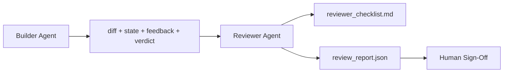

# Reviewer Agent: Separate Builder from Marker (审查者智能体：将构建者与评分者分离)

> 编写代码的智能体不能给代码打分。审查者是一个具有不同系统提示词、不同目标且对构建者产生的一切拥有只读访问权限的第二循环。构建者与审查者之间的差距是大多数可靠性所在之处。

**Type:** Build
**Languages:** Python (stdlib)
**Prerequisites:** Phase 14 · 38 (Verification Gate)
**Time:** ~55 分钟

## Learning Objectives (学习目标)

- 说明为什么同一个智能体不能可靠地审查自己的工作。
- 构建一个审查者智能体循环（reviewer agent loop），消费构建者工件（builder artifacts）并发出结构化审查报告。
- 编写一个审查者评分标准（reviewer rubric），对具体维度进行评分，而非凭感觉。
- 将审查者接入工作台，使人工审查步骤从真实工件开始，而非空白页。

## The Problem (问题)

你让智能体修复一个 bug。它编辑了四个文件，运行了测试，并报告完成。验证门（Phase 14 · 38）确认验收已运行且范围保持。门说 `passed: true`。你合并了。两天后你发现修复只解决了 bug 的一半。

验收是必要的，但不充分。审查者提出了验收无法提出的问题：这是否解决了正确的问题？它是否在未标记的情况下扩大了范围？它是否留下了应该被质疑的假设？它是否将工作台留在了下一个会话可以接续的状态？

## The Concept (概念)



### Reviewer rubric (审查者评分标准)

五个维度，每个维度评分为 0 到 2。

| Dimension | Question |
|-----------|----------|
| Problem fit | 变更是否解决了陈述的任务，而非附近的任务？ |
| Scope discipline | 编辑是否局限于契约，还是契约被故意扩大了？ |
| Assumptions | 所有隐藏假设是否都被写在某个可审查的地方？ |
| Verification quality | 验收命令是否真正证明了目标，还是证明了一个更弱的版本？ |
| Handoff readiness | 下一个会话能否从当前状态干净地接续？ |

满分 10 分。低于 7 分是软失败（soft fail）；低于 5 分是硬失败（hard fail）。

### The reviewer is a separate role, not a separate model (审查者是独立的角色，而非独立的模型)

你可以用与构建者相同的模型运行审查者。纪律在于角色分离：不同的系统提示词，不同的输入，没有对差异（diff）的写入权限。姿态的改变就是信号的改变。

### The reviewer cannot edit the diff (审查者不能编辑差异)

审查者读取差异、状态、反馈、裁决。它写报告。它不修补差异。如果报告说"修复这个"，下一个构建者回合执行修复；审查者回去审查。混合角色会 defeat 差距。

### Reviewer rubric versus verification gate (审查者评分标准与验证门)

门（Phase 14 · 38）检查确定性事实：验收是否运行，规则是否通过，范围是否保持。审查者做出定性判断：这是否是正确的工作，是否有文档，交接是否可用。两者都是必需的。

## Build It (动手实现)

`code/main.py` 实现：

- 一个 `ReviewerInputs` 数据类，捆绑审查者读取的工件。
- 一个评分标准评分器，每个维度一个函数。每个函数在本课中是确定性的存根评分；真实实现会调用 LLM。
- 一个 `review_report.json` 写入器，包含五个分数、总分和裁决（`pass`、`soft_fail`、`hard_fail`）。
- 两个演示案例：一次干净的变更和一次"测试对了，但问题错了"的变更。

运行方式：

```
python3 code/main.py
```

输出：两份审查报告写入磁盘，以及维度分数的控制台表格。

## Production patterns in the wild (生产中的实践模式)

收据：Cloudflare 的 2026 年 4 月 AI 代码审查系统在 30 天内跨 5,169 个仓库的 48,095 个合并请求中运行了 131,246 次审查运行。中位审查在 3 分钟 39 秒内完成。多达七名专家审查者（安全、性能、代码质量、文档、发布管理、合规、工程法典）在审查协调器（Review Coordinator）下并行运行，该协调器去重发现并判断严重性。顶级模型专门保留给协调器；专家在更便宜的层级上运行。

四种模式使其在规模上工作。

**专家池，而非一个巨大的审查者。** 一个具有 5 维度评分标准的审查者对单人仓库有效。一旦代码库具有安全关键、性能关键和文档表面，就拆分为具有更小提示词的专家。协调器执行去重；专家从不运行完整评分标准。模型层级分离随之而来：便宜的专家，昂贵的协调器。

**偏差缓解（bias mitigation）作为设计要求，而非优化。** LLM 裁判显示四种可靠偏差（Adnan Masood，2026 年 4 月）：位置偏差（GPT-4 在 (A,B) 与 (B,A) 排序上约 40% 不一致）、冗长偏差（~15% 分数膨胀倾向于更长输出）、自我偏好（裁判更喜欢同一模型家族的输出）、权威（裁判高估对已知作者的引用）。缓解措施：评估两种排序，只计算一致的获胜；使用明确奖励简洁的 1-4 量表；跨模型家族轮换裁判；在评分前剥离作者姓名。

**校准集（calibration set），而非凭感觉。** 10-20 个具有已知正确裁决的历史任务集。每次提示词更改时在其上运行审查者。如果与历史记录的一致性低于 80%，评分标准需要修订，然后审查者才能发布。这是每个团队最终都会重新发现的东西；最好从一开始就拥有它。

**与门的混合规范。** 验证门（Phase 14 · 38）处理确定性检查（验收是否运行，测试是否通过，范围是否保持）。审查者处理语义检查（这是否是正确的工作，假设是否有文档，交接是否可用）。Anthropic 的 2026 年指导明确说明了这种分割：不要让审查者重做门已经证明的事情。

## Use It (使用它)

生产模式：

- **Claude Code 子智能体。** 构建者关闭任务后，审查者子智能体运行。它以评分标准分数在 PR 上发布评论。
- **OpenAI Agents SDK 交接。** 构建者在任务完成时交接给审查者。审查者可以带着发现列表交接回去，或上报给人类。
- **双模型配对。** 构建者在更快更便宜的模型上运行。审查者在更小的上下文上使用更强的模型，专注于判断。

审查者是工作台在人类无法完成每次审查时成长的第二双眼睛。

## Ship It (交付它)

`outputs/skill-reviewer-agent.md` 生成一个项目特定的审查者评分标准、一个连接到构建者工件的审查者智能体存根，以及与验证门的集成，使人工审查从书面报告而非空白页开始。

## Exercises (练习)

1. 添加一个特定于你的产品领域的第六维度。论证为什么它不能被现有的五个吸收。
2. 用两个不同的系统提示词（简洁、冗长）运行审查者。哪个产生的报告人类更可能阅读？
3. 为每个维度添加一个 `confidence` 字段。当最低维度的置信度低于 0.6 时拒绝发布报告。
4. 构建一个校准集：10 个具有已知正确裁决的历史任务关闭。在其上运行审查者。它在何处与历史记录不一致？
5. 添加一个"请求更多证据"的功能：审查者可以在评分前要求构建者运行特定测试。什么是正确的退避机制，以防止这无限循环？

## Key Terms (关键术语)

| Term | What people say | What it actually means |
|------|----------------|------------------------|
| Reviewer rubric (审查者评分标准) | "Checklist" | 每个维度一个书面问题的五维度 0-2 评分 |
| Soft fail (软失败) | "Needs revisions" | 总分低于 7；构建者获得要处理的发现 |
| Hard fail (硬失败) | "Reject" | 总分低于 5 或任何维度为 0；停止并上报给人类 |
| Role separation (角色分离) | "Different prompt" | 同一模型可以是两个角色；纪律在于输入和姿态 |
| Confidence floor (置信度下限) | "Don't ship low-signal reports" | 当评分标准不确定时拒绝发出裁决 |

## Further Reading (延伸阅读)

- [OpenAI Agents SDK handoffs](https://platform.openai.com/docs/guides/agents-sdk/handoffs)
- [Anthropic Claude Code subagents](https://docs.anthropic.com/en/docs/agents-and-tools/claude-code/sub-agents)
- [Cloudflare, Orchestrating AI Code Review at Scale](https://blog.cloudflare.com/ai-code-review/) — 7-specialist + coordinator architecture, 131k runs / 30 days
- [Agent-as-a-Judge: Evaluating Agents with Agents (OpenReview / ICLR)](https://openreview.net/forum?id=DeVm3YUnpj) — DevAI benchmark, 366 hierarchical solution requirements
- [Adnan Masood, Rubric-Based Evaluations and LLM-as-a-Judge: Methodologies, Biases, Empirical Validation](https://medium.com/@adnanmasood/rubric-based-evals-llm-as-a-judge-methodologies-and-empirical-validation-in-domain-context-71936b989e80) — the 4 biases and mitigations
- [MLflow, LLM-as-a-Judge Evaluation](https://mlflow.org/llm-as-a-judge) — production tooling for separated builder/evaluator
- [LangChain, How to Calibrate LLM-as-a-Judge with Human Corrections](https://www.langchain.com/articles/llm-as-a-judge) — calibration-set workflow
- [Evidently AI, LLM-as-a-judge: a complete guide](https://www.evidentlyai.com/llm-guide/llm-as-a-judge)
- [Arize, LLM as a Judge — Primer and Pre-Built Evaluators](https://arize.com/llm-as-a-judge/)
- Phase 14 · 05 — Self-Refine and CRITIC (single-agent self-review baseline)
- Phase 14 · 30 — Eval-driven agent development (calibration set generator)
- Phase 14 · 38 — the verification gate the reviewer reads
- Phase 14 · 40 — the handoff packet the reviewer report feeds
