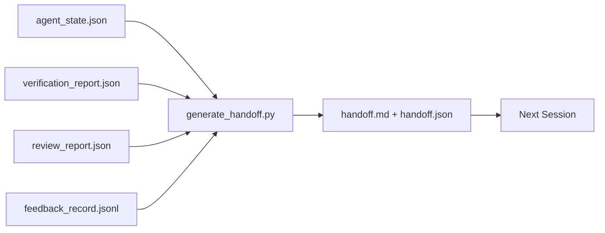

# Multi-Session Handoff (多会话交接)

> 会话即将结束。工作还没有。交接包（handoff packet）是将"智能体工作了一个小时"转变为"下一个会话在第一分钟就富有成效"的工件。有目的地构建它，而非作为事后思考。

**Type:** Build
**Languages:** Python (stdlib)
**Prerequisites:** Phase 14 · 34 (Repo Memory), Phase 14 · 38 (Verification), Phase 14 · 39 (Reviewer)
**Time:** ~50 分钟

## Learning Objectives (学习目标)

- 识别每个交接包需要的七个字段。
- 从工作台工件（workbench artifacts）生成交接包，而无需手写散文。
- 将大型反馈日志修剪为交接包大小的小结。
- 使下一个会话的第一个动作是确定性的。

## The Problem (问题)

会话结束了。智能体说"很好，我们取得了进展。"下一个会话打开了。下一个智能体问"我们上次停在哪里了？"第一个智能体的答案已经消失。下一个智能体重新发现、重新运行相同的命令、重新询问人类相同的问题，并花费三十分钟恢复上一个会话的最后三十秒。

糟糕交接的成本在任务的整个生命周期中的每个会话都会支付。修复方案是在会话结束时自动生成的包：什么改变了、为什么、尝试了什么、什么失败了、什么还剩下、下次首先要做什么。

## The Concept (概念)



### Seven fields every handoff carries (每个交接包携带的七个字段)

| Field | Question it answers |
|-------|---------------------|
| `summary` | 一段文字说明做了什么 |
| `changed_files` | 差异概览 |
| `commands_run` | 实际执行了什么 |
| `failed_attempts` | 尝试了什么以及为什么没成功 |
| `open_risks` | 什么可能在下一个会话中造成问题，附带严重性 |
| `next_action` | 下一个会话采取的第一个具体步骤 |
| `verdict_pointer` | 验证 + 审查报告的路径 |

`next_action` 字段是承载力的那个。缺少 `next_action` 的交接包是状态报告，不是交接包。

### Handoffs are generated, not written (交接包是生成的，不是手写的)

手写的交接包是在困难的日子会被跳过的交接包。生成器读取工作台工件并发出包。智能体的工作是将工作台留在生成器可以总结的状态，而非写小结。

### Two forms: human-readable and machine-readable (两种形式：人类可读和机器可读)

`handoff.md` 是人类阅读的。`handoff.json` 是下一个智能体加载的。两者来自相同的源工件。如果它们分叉，JSON 获胜。

### Feedback log trimming (反馈日志修剪)

完整的 `feedback_record.jsonl` 可能有数百条条目。交接包只携带最后 K 条加上每次非零退出的条目。下一个会话如果需要可以加载完整日志，但包保持小巧。

### Leave a clean state (留下干净状态)

交接包描述工作。干净状态使工作可恢复。它们不是同一件事。如果下一个会话打开到一个半应用的差异、一个智能体忘记的临时文件、一个孤立分支，以及甚至运行前就报错的测试，那么完美的 `handoff.md` 也毫无价值。然后下一个智能体花费前十分钟清理上一个的烂摊子而非构建，并且成本在任务的每个会话中都会复合。

因此会话不是在功能正常工作时结束。它在工作台处于生成器可以总结且下一个会话可以信任的状态时结束。清理是它自己的阶段，在交接前运行，并且它是一个检查而非习惯，因为习惯是在困难的日子会被跳过的那件事。

| Check | Clean means | Dirty blocks because |
|-------|-------------|----------------------|
| Working tree | 每个更改都已提交或明确带注释 stash | 半应用的差异对下一个智能体看起来像是有意的工作 |
| Temp artifacts | 没有 `*.tmp`、临时目录、调试打印或注释掉的块残留 | 杂散文件污染差异和下一个智能体的心理模型 |
| Tests | 绿色，或红色并在 `open_risks` 中命名了失败 | 静默的红色测试是下一个会话踩进去的陷阱 |
| Feature board | `feature_list.json` 状态反映现实（Phase 14 · 36） | 过时的看板将下一个会话发送到已经完成的工作 |
| Branch | 在预期分支上，没有 detached HEAD，没有孤立分支 | 错误的分支意味着下一个会话的第一个提交落在了错误的地方 |

清理阶段发出一个 `clean_state.json` 的阻塞问题列表；空列表是交接生成器在写入包之前断言的前置条件。建立在脏树上的交接不是交接，它是转发的烂摊子。两个工件配对：清理证明工作台可以安全离开，交接证明下一个会话知道从哪里开始。

## Build It (动手实现)

`code/main.py` 实现：

- 一个加载器，将状态、裁决、审查和反馈收集到单个 `WorkbenchSnapshot`。
- 一个 `generate_handoff(snapshot) -> (markdown, payload)` 函数。
- 一个过滤器，选择最后 K 条反馈条目加上所有非零退出。
- 一个写入 `handoff.md` 和 `handoff.json` 的演示运行。

运行方式：

```
python3 code/main.py
```

输出：打印的交接包正文，加上磁盘上的两个文件。

## Production patterns in the wild (生产中的实践模式)

Codex CLI、Claude Code 和 OpenCode 各自提供不同的压缩（compaction）故事；结构化交接包位于所有三者之上。

**压缩策略各异；包模式不变。** Codex CLI 的 POST /v1/responses/compact 是一个服务器端不透明 AES blob（OpenAI 模型的快速路径）；回退是本地"交接小结"作为 `_summary` user-role 消息追加。Claude Code 在 95% 上下文处运行五阶段渐进压缩。OpenCode 做基于时间戳的消息隐藏加上 5 标题 LLM 小结。三种不同的机制，同一种需求：将压缩中存活的内容序列化为可移植工件。交接包就是那个工件。

**新会话交接不是压缩。** 压缩扩展会话；交接干净地关闭一个会话并启动下一个。Hermes Issue #20372 框架（2026 年 4 月）是正确的：当原地压缩开始降级时，智能体应该写一个紧凑的交接包，结束会话，并在新鲜上下文中恢复。包是使这种转换便宜的东西。错误是持续压缩直到质量崩溃；修复是为早期、干净的交接做预算。

**每个分支和主题一个活跃交接包。** 多智能体协调在过期交接（stale handoff）上比在糟糕的模型输出上更容易崩溃。始终包含 `branch`、`last_known_good_commit` 和 `active | superseded | archived` 的 `status`。过期交接被归档；只有活跃的驱动下一个会话。这是交接作为笔记和交接作为状态之间的区别。

**在 50-75% 上下文处收尾，而非在墙边。** 手写模式行动手册（CLAUDE.md + HANDOVER.md）报告最佳结果是在 50-75% 上下文预算处结束会话，而不是 95%。包生成器在压缩工件污染源状态之前干净运行。在上下文完好时写它很便宜；当模型已经在丢失位置时就很贵。

## Use It (使用它)

生产模式：

- **会话结束钩子。** 运行时当用户关闭聊天时触发生成器。包进入 `outputs/handoff/<session_id>/`。
- **PR 模板。** 生成器的 Markdown 也是 PR 正文。审查者无需打开五个其他文件即可阅读它。
- **跨智能体交接。** 用一个产品（Claude Code）构建，用另一个（Codex）继续。包是通用语。

包小巧、规则且便宜。每次会话节省的成本都会复合。

## Ship It (交付它)

`outputs/skill-handoff-generator.md` 生成一个针对项目的交接生成器，其工件路径、运行它的会话结束钩子，以及下一个智能体在启动时读取的 `handoff.json` 模式。

## Exercises (练习)

1. 添加一个 `assumptions_to_validate` 字段，显示构建者记录但审查者评分未超过 1 的每个假设。
2. 对失败运行和通过运行不同地修剪反馈小结。为这种不对称性辩护。
3. 包含一个"给人类的问题"列表。问题进入包与进入聊天消息的阈值是什么？
4. 使生成器幂等：运行两次产生相同的包。为此需要稳定什么？
5. 添加一个"下一个会话前置条件"部分，精确列出下一个会话在行动前必须加载的工件。

## Key Terms (关键术语)

| Term | What people say | What it actually means |
|------|----------------|------------------------|
| Handoff packet (交接包) | "Session summary" | 携带七个字段的生成工件，Markdown 和 JSON 两种形式 |
| Next action (下一步行动) | "What to do first" | 启动下一个会话的那个具体步骤 |
| Feedback trim (反馈修剪) | "Log summary" | 最后 K 条记录加上每次非零退出 |
| Status report (状态报告) | "What we did" | 缺少 `next_action` 的文档；有用，但不是交接包 |
| Verdict pointer (裁决指针) | "Receipt" | 验证 + 审查报告的路径，用于可追溯性 |

## Further Reading (延伸阅读)

- [Anthropic, Effective harnesses for long-running agents](https://www.anthropic.com/engineering/effective-harnesses-for-long-running-agents)
- [OpenAI Agents SDK handoffs](https://platform.openai.com/docs/guides/agents-sdk/handoffs)
- [Codex Blog, Codex CLI Context Compaction: Architecture, Configuration, Managing Long Sessions](https://codex.danielvaughan.com/2026/03/31/codex-cli-context-compaction-architecture/) — POST /v1/responses/compact and local fallback
- [Justin3go, Shedding Heavy Memories: Context Compaction in Codex, Claude Code, OpenCode](https://justin3go.com/en/posts/2026/04/09-context-compaction-in-codex-claude-code-and-opencode) — three-vendor compaction comparison
- [JD Hodges, Claude Handoff Prompt: How to Keep Context Across Sessions (2026)](https://www.jdhodges.com/blog/ai-session-handoffs-keep-context-across-conversations/) — CLAUDE.md + HANDOVER.md, 50-75% context budget
- [Mervin Praison, Managing Handoffs in Multi-Agent Coding Sessions: Fresh Context Without Losing Continuity](https://mer.vin/2026/04/managing-handoffs-in-multi-agent-coding-sessions/) — distributed-systems framing
- [Hermes Issue #20372 — automatic fresh-session handoff when compression becomes risky](https://github.com/NousResearch/hermes-agent/issues/20372)
- [Hermes Issue #499 — Context Compaction Quality Overhaul](https://github.com/NousResearch/hermes-agent/issues/499) — handoff-oriented prompts in Codex CLI
- [Microsoft Agent Framework, Compaction](https://learn.microsoft.com/en-us/agent-framework/agents/conversations/compaction)
- [OpenCode, Context Management and Compaction](https://deepwiki.com/sst/opencode/2.4-context-management-and-compaction)
- [LangChain, Context Engineering for Agents](https://www.langchain.com/blog/context-engineering-for-agents)
- Phase 14 · 34 — the state file the generator reads
- Phase 14 · 38 — the verification verdict the packet points at
- Phase 14 · 39 — the reviewer report bundled into the packet
