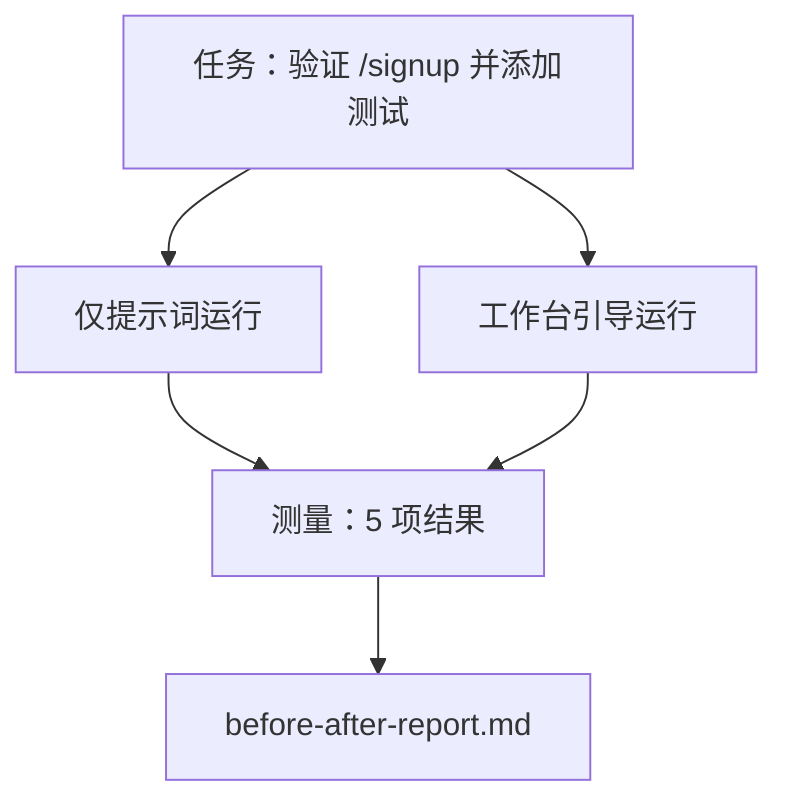

# The Workbench on a Real Repo

> 十一节课的 surface（工作面）如果无法在真实代码库上经受检验，就一文不值。本节课在同一个小型示例应用上把同一项任务跑两遍：仅提示词 vs 工作台引导。让数字来说话。

**Type:** Build
**Languages:** Python (stdlib)
**Prerequisites:** Phases 14 · 32 至 14 · 40
**Time:** ~60 分钟

## Learning Objectives

- 在一个小型应用上把七个工作台 surface（工作面）整合起来。
- 把同一项任务跑两遍（仅提示词和工作台引导）并测量五项结果。
- 阅读前后对比报告，判断哪些 surface（工作面）带来了最大的杠杆效应。
- 回应 "但我的模型已经足够好了" 的质疑，为工作台辩护。

## The Problem

在玩具任务上的演示说服不了任何人。工作台的真正价值体现在：当一项贴近真实的任务落在一个贴近真实的代码库上时，它能减少失败、减少回滚，并为下一届会话留下一份可用的资料包。

本节课就提供了这样一个贴近真实的代码库，并让同一项任务走过两条流水线。结果是一份可以交给怀疑论者的前后对比报告。

## The Concept



### 示例应用 sample app（示例应用）

`sample_app/` 中的一个极简 FastAPI 风格处理器：

- `app.py` 带有 `/signup`（尚无验证）。
- `test_app.py` 只有一条 happy-path（正常路径）测试。
- `README.md` 和 `scripts/release.sh` 作为禁区诱饵。

### 任务

> 为 `/signup` 添加输入验证：拒绝短于 8 个字符的密码，返回 422 并附带类型化的错误 envelope（信封/封装）。添加一条能证明新行为的测试。

### 两条流水线 pipeline（流水线）

仅提示词 prompt-only（仅提示词）：

1. 阅读 README。
2. 阅读 `app.py`。
3. 编辑文件。
4. 声称完成。

工作台引导 workbench-guided（工作台引导）：

1. 运行 init 脚本（第 35 课）。
2. 阅读 scope contract（范围合约）（第 36 课）。
3. 阅读 state（状态）（第 34 课）。
4. 只编辑允许的文件。
5. 通过 feedback runner（反馈运行器）运行验收命令（第 37 课）。
6. 运行 verification gate（验证门）（第 38 课）。
7. 运行 reviewer（审查器）（第 39 课）。
8. 生成 handoff（交接包）（第 40 课）。

### 测量的五项 outcome（结果）

| Outcome（结果） | 为什么重要 |
|---------|----------------|
| `tests_actually_run` | 大多数"测试通过"的说法都无从验证 |
| `acceptance_met` | 证明目标的测试必须是真正跑过的那条 |
| `files_outside_scope` | 范围蔓延 scope creep（范围蔓延）是最主要的隐性故障 |
| `handoff_quality` | 下一届会话为此买单或受益 |
| `reviewer_total` | 在 gate（门控）之上的定性判断 |

## Build It

`code/main.py` 编排两条流水线，针对同一个示例应用 fixture（固定装置）运行。两条流水线都是脚本化的（循环中没有 LLM），因此测量是可复现的。脚本将对比结果写入 `before-after-report.md` 和 `comparison.json`。

运行方式：

```
python3 code/main.py
```

输出：每条流水线的结果控制台表格、保存在脚本旁边的 markdown 报告，以及供需要制图的人使用的 JSON。

## Production patterns in the wild

怀疑者的问题是 "工作台到底能帮多少忙？"2026 年的数字比任何解释都更有说服力。

**Terminal Bench 从前 30 冲进前 5，模型不变。** LangChain 的 *Anatomy of an Agent Harness*（2026 年 4 月）：一个编码智能体仅仅通过更换 harness（执行框架/约束装置），就在 Terminal Bench 2.0 上从 30 名开外冲到了第 5 名。同一个模型。不同的 surface（工作面）。25 名的落差。

**Vercel 从 80% 提升到 100%，靠的是删除工具。** Vercel 报告称删除了 80% 的智能体工具后，成功率从 80% 提升到了 100%。更小的工具面、更清晰的范围、更少的失败路径。负空间赢了。

**Harvey 通过 harness（执行框架） alone 让准确率翻倍。** 法律智能体仅通过优化 harness（执行框架），准确率就提升了一倍以上，没有更换模型。

**88% 的企业 AI 智能体项目未能投产。** preprints.org 的 *Harness Engineering for Language Agents* 论文（2026 年 3 月）将这些失败归因于运行时，而非推理：状态陈旧、重试脆弱、上下文膨胀、对中间错误的恢复能力差。

**长上下文崩塌 long-context collapse（长上下文崩塌）。** WebAgent 基线 40-50% 的成功率在长上下文条件下暴跌到不足 10%，主要原因是无限循环和目标丢失。Ralph Loop 和 handoff packet（交接包）的存在就是为了吸收这种崩塌。

**False negatives（假阴性）依然存在。** 单步事实性任务、单行 lint、格式化运行、任何模型已经逐字背下来的内容 —— 这些用仅提示词跑得更快。基准应该诚实地列举它们，这样工作台才不会被包装成过度设计。

结论不是 "harness（执行框架）永远赢"。模型确实会随着时间的推移吸收 harness（执行框架）的技巧。结论是：在今天，工程负载落在七个 surface（工作面）上，而数字证明了这一点。

## Use It

本节课就是你在以下场景援引的案例档案：

- 有人问为什么每个 PR 都要带一份 `agent-rules.md` 和一份 scope contract（范围合约）。
- 某个团队想 "就这个冲刺" 放弃 verification gate（验证门）。
- 一个新的智能体产品发布，你需要一个可移植的基准来验证它是否真的省时间。

数字比解释走得更远。

## Ship It

`outputs/skill-workbench-benchmark.md` 是一个可移植的评估 harness（框架），它可以在任何项目的自有示例应用上运行任意智能体产品，对比两条流水线，并报告五项 outcome（结果）。

## Exercises

1. 添加第六项 outcome（结果）：time-to-first-meaningful-edit（首次有意义编辑时间）。如何干净地测量它？
2. 在你的代码库上找一个真实的第二天任务来跑对比。工作台的数据在哪里下滑了？
3. 添加一条 "false negative（假阴性）" 通道：仅提示词更快、而工作台开销是真实成本的任务。论证即使如此也要保留工作台。
4. 把脚本化的 "智能体" 换成真正的 LLM 调用。哪些 outcome（结果）变得更嘈杂了？
5. 写一份面向非工程师的一页总结。什么内容能幸存到最终版本？

## Key Terms

| Term | 人们怎么说 | 实际含义 |
|------|----------------|------------------------|
| Sample app（示例应用） | "玩具仓库" | 小到足以锻炼所有七个 surface（工作面），但足够真实 |
| Pipeline（流水线） | "工作流" | 智能体遵循的有序 surface（工作面）读写序列 |
| Before/after report（前后对比报告） | "证据" | 你递给怀疑者的那张纸 |
| False negative（假阴性） | "工作台过度设计" | 仅提示词更快的任务；诚实地列举它们很有用 |
| Workbench benchmark（工作台基准） | "可靠性评分" | 可移植的 harness（框架），在你的代码库上运行对比 |

## Further Reading

- [LangChain, The Anatomy of an Agent Harness](https://blog.langchain.com/the-anatomy-of-an-agent-harness/) — Terminal Bench 前 30 到前 5 的证据
- [MongoDB, The Agent Harness: Why the LLM Is the Smallest Part of Your Agent System](https://www.mongodb.com/company/blog/technical/agent-harness-why-llm-is-smallest-part-of-your-agent-system) — Vercel + Harvey 的数据
- [preprints.org, Harness Engineering for Language Agents](https://www.preprints.org/manuscript/202603.1756) — 88% 企业失败率，运行时根因
- [HN: Improving 15 LLMs at Coding in One Afternoon. Only the Harness Changed](https://news.ycombinator.com/item?id=46988596) — 在 15 个模型上复现
- [Cloudflare, Orchestrating AI Code Review at Scale](https://blog.cloudflare.com/ai-code-review/) — 30 天内 13.1 万次审查运行
- [Anthropic, Building Effective Agents](https://www.anthropic.com/research/building-effective-agents)
- Phases 14 · 32 至 14 · 40 — 本节课端到端锻炼的 surface（工作面）
- Phase 14 · 19 — SWE-bench、GAIA、AgentBench 等宏观基准，本节课是对它们的补充
- Phase 14 · 30 — 评估驱动的智能体开发，同一个 harness（框架）可以接入
