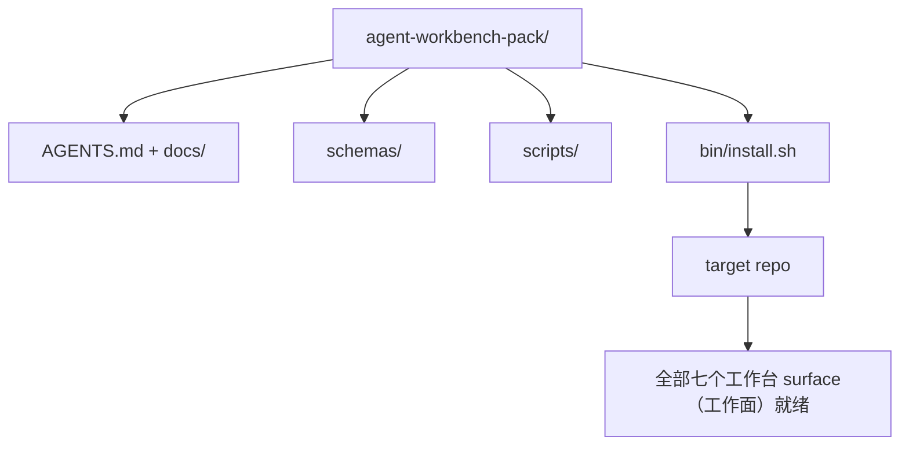

# Capstone: Ship a Reusable Agent Workbench Pack

> 迷你课程以一份可以丢进任何仓库的 pack（包）收尾。十一节课的 surface（工作面）压缩进一个目录，你 `cp -r` 进去，第二天早晨智能体就能稳定工作。这份 capstone（结业项目）是这个课程的核心交易品。

**Type:** Build
**Languages:** Python (stdlib)
**Prerequisites:** Phases 14 · 31 至 14 · 41
**Time:** ~75 分钟

## Learning Objectives

- 把七个工作台 surface（工作面）打包进一个即插即用的 drop-in（即插即用）目录。
- 锁定 schema（模式）、脚本和模板，让新仓库获得一个已知良好的基线。
- 添加一条单命令 installer（安装器）脚本，幂等地 idempotently（幂等地）铺开 pack（包）。
- 决定什么进 pack（包）、什么留在 pack（包）外，并为每一项切割辩护。

## The Problem

一个活在 Google 文档、聊天记录和三段半熟脚本里的工作台，每个季度都会重建一次。解药是一个带版本号的 pack（包）：一个包含 surface（工作面）、schema（模式）、脚本和单命令安装器的仓库或目录。

你将在这节课结束时把 `outputs/agent-workbench-pack/` 交付到磁盘上，并附上一份 `bin/install.sh`，它可以将其丢进任意目标仓库。

## The Concept



### pack（包）布局

```
outputs/agent-workbench-pack/
├── AGENTS.md
├── docs/
│   ├── agent-rules.md
│   ├── reliability-policy.md
│   ├── handoff-protocol.md
│   └── reviewer-rubric.md
├── schemas/
│   ├── agent_state.schema.json
│   ├── task_board.schema.json
│   └── scope_contract.schema.json
├── scripts/
│   ├── init_agent.py
│   ├── run_with_feedback.py
│   ├── verify_agent.py
│   └── generate_handoff.py
├── bin/
│   └── install.sh
└── README.md
```

### 什么进 pack（包），什么出 pack（包）

进：

- Surface schema（工作面模式）。它们是合约。
- 上面的四个脚本。它们是运行时。
- 上面的四份文档。它们是规则与评分标准。

出：

- 项目专属任务。任务属于目标仓库的任务板，不属于 pack（包）。
- 厂商 SDK 调用。pack（包）是框架无关的。
- 入门散文。pack（包）活在团队现有入门文档旁边，而非里面。

### 安装器 installer（安装器）

一份简短的 `bin/install.sh`（或 `bin/install.py`）：

1. 如果已存在 pack（包）且没有 `--force`，则拒绝安装。
2. 将 pack（包）复制进目标仓库。
3. 如果存在 `.github/workflows/`，则接入 CI。
4. 打印后续步骤：填写任务板、设置验收命令、运行 init 脚本。

### 版本控制

pack（包）携带一份 `VERSION` 文件。需要迁移的 schema（模式）和脚本改动提升 major（主版本）。仅文档改动提升 patch（补丁版本）。目标仓库的 `agent_state.json` 记录它是在哪个 pack（包）版本下初始化的。

## Build It

`code/main.py` 将 pack（包）组装到 `outputs/agent-workbench-pack/` 中，用本迷你课程前几节课的 schema（模式）和脚本以及你已经写好的文档作为种子。

运行方式：

```
python3 code/main.py
```

脚本复制并锁定 surface（工作面），写入 README，打印目录树，然后以零退出码结束。重复运行是幂等 idempotent（幂等）的。

## Production patterns in the wild

pack（包）只有在能挺过 fork、更新和不友好的上游时才有价值。四种模式让它存活。

**`VERSION` 是合约，不是营销。** Major（主版本）升级需要状态迁移。Minor（次版本）升级需要重新运行检查器。Patch（补丁）升级仅限文档。安装器每次安装都会把 `.workbench-version` 写入目标仓库；`lint_pack.py` 会在目标锁与 pack（包）的 `VERSION` 不一致时拒绝发布。这就是 `npm`、`Cargo` 和 `pyproject.toml` 能在 10 年动荡中存活下来的方式；智能体没有改变任何规则。

**单一来源的跨工具分发 cross-tool distribution（跨工具分发）。** Nx 的 `nx ai-setup` 从单一配置中同时下发 `AGENTS.md`、`CLAUDE.md`、`.cursor/rules/`、`.github/copilot-instructions.md` 和一个 MCP 服务器。pack（包）也应该这样做；安装器发出 symlink（符号链接）（`ln -s AGENTS.md CLAUDE.md`），让单一真相来源扇出到每一个编码智能体。为了支持某个工具而把 pack（包）fork 出去是一种失败模式。

**`uninstall.sh` 在非平凡状态下拒绝执行。** 卸载 pack（包）时绝不能删除用户的 `agent_state.json`、`task_board.json` 或 `outputs/`。卸载器只移除 schema（模式）、脚本、文档和 `AGENTS.md`（可通过 `--keep-agents-md` 选择保留），并且如果状态文件有任何未提交的改动，就拒绝继续。状态属于用户；pack（包）不拥有它。

**Skill-as-publishable. SkillKit-style distribution（SkillKit 风格分发）。** pack（包）以 SkillKit skill 的形式发布：`skillkit install agent-workbench-pack` 把它从单一来源铺到 32 个 AI 智能体上。pack（包）仓库是真相来源；SkillKit 是分发渠道。厂商锁定被消解；七个 surface（工作面）保持不变。

## Use It

pack（包）在三处交付：

- **作为丢进仓库的一个目录。** `cp -r outputs/agent-workbench-pack /path/to/repo`。
- **作为公开的模板仓库。** Fork 并自定义，`VERSION` 控制漂移。
- **作为 SkillKit skill。** 接入你的智能体产品，让单条命令就能铺开。

pack（包）是菜谱。每次安装都是一份成品。

## Ship It

`outputs/skill-workbench-pack.md` 生成一个经过项目调优的 pack（包）：规则根据团队历史打磨得更锋利，范围 glob 匹配仓库结构，评分维度增加了一条领域专属条目。

## Exercises

1. 决定哪份可选的第五份文档值得晋升为正典 pack（包）的一员。为切割辩护。
2. 用 Python 重写安装器，并加上 `--dry-run` 标志。与 bash 对比人体工程学。
3. 添加一条 `bin/uninstall.sh`，安全地移除 pack（包），并在状态文件有非平凡历史时拒绝执行。什么算非平凡？
4. 添加一条 `lint_pack.py`，在 pack（包）偏离 `VERSION` 时失败。把它接入 pack（包）自有仓库的 CI。
5. 撰写从手搓工作台迁移到本 pack（包）的 runbook（操作手册）。最小化停机的操作顺序是什么？

## Key Terms

| Term | 人们怎么说 | 实际含义 |
|------|----------------|------------------------|
| Workbench pack（工作台包） | "入门套件" | 一个带版本号的目录，携带全部七个 surface（工作面） |
| Installer（安装器） | "安装脚本" | `bin/install.sh`，幂等地铺开 pack（包） |
| Pack version（包版本） | "VERSION" | Major（主版本）用于 schema（模式）/脚本改动，patch（补丁）用于仅文档改动 |
| Drop-in pack（即插即用包） | "cp -r 就能跑" | 第一天无需按仓库定制就能工作 |
| Forkable template（可 fork 模板） | "GitHub 模板" | 公开仓库，可被 GitHub 的 "Use this template" 克隆 |

## Further Reading

- Phases 14 · 31 至 14 · 41 — 本 pack（包）所打包的每一个 surface（工作面）
- [SkillKit](https://github.com/rohitg00/skillkit) — 在 32 个 AI 智能体上安装本 skill
- [Nx Blog, Teach Your AI Agent How to Work in a Monorepo](https://nx.dev/blog/nx-ai-agent-skills) — 单一来源生成器覆盖六种工具
- [agents.md — the open spec](https://agents.md/) — 你的 pack（包）路由器必须实现的开放规范
- [HKUDS/OpenHarness](https://github.com/HKUDS/OpenHarness) — pack（包）等效物的参考实现
- [andrewgarst/agentic_harness](https://github.com/andrewgarst/agentic_harness) — 带评估套件的 Redis 后端参考实现
- [Augment Code, A good AGENTS.md is a model upgrade](https://www.augmentcode.com/blog/how-to-write-good-agents-dot-md-files) — pack（包）文档质量基准
- [Anthropic, Effective harnesses for long-running agents](https://www.anthropic.com/engineering/effective-harnesses-for-long-running-agents)
- [Anthropic, Harness design for long-running application development](https://www.anthropic.com/engineering/harness-design-long-running-apps)
- Phase 14 · 30 — 消耗 pack（包）验证门的评估驱动智能体开发
- Phase 14 · 41 — 本 pack（包）所改进的前后对比基准
